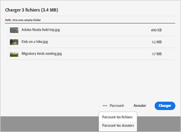
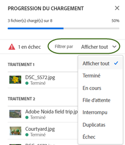
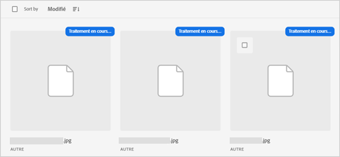
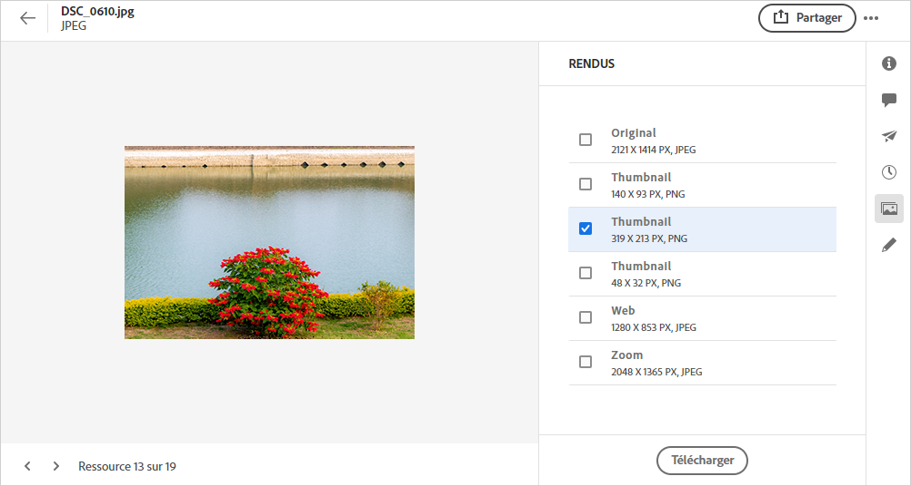
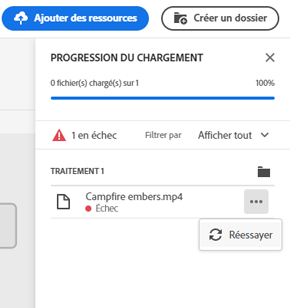

# Charger des ressources {#add-assets}

Pour ajouter de nouvelles ressources à utiliser, téléchargez quelques ressources à partir de votre système de fichiers local. <!-- TBD: Many of the [common file formats are supported](/help/supported-file-formats.md). -->

Vous pouvez utiliser les méthodes suivantes pour charger une ou plusieurs ressources ou un dossier contenant des ressources :

* Faites glisser des ressources ou des dossiers sur l’interface utilisateur et suivez les instructions à l’écran.
* Cliquez sur l’option **[!UICONTROL Ajouter les ressources]** dans la barre d’outils et ajoutez des fichiers à la boîte de dialogue de téléchargement.

<!-- TBD: Update this GIF
 -->

Vous pouvez utiliser l’une de ces méthodes pour charger des ressources après avoir créé un dossier. Pour créer un dossier vide, cliquez sur **[!UICONTROL Créer un dossier]** dans la barre d’outils. [!DNL Assets Essentials] offre une puissante fonctionnalité de recherche de texte intégral, mais vous pouvez également utiliser des dossiers pour mieux organiser vos ressources.

Une fois les fichiers sélectionnés, une boîte de dialogue de confirmation s’affiche pour vous permettre d’ajouter d’autres fichiers ou de supprimer les fichiers déjà sélectionnés. Pour ajouter d’autres fichiers à une sélection, cliquez sur **[!UICONTROL Parcourir]** et sélectionnez **[!UICONTROL Parcourir les fichiers]** ou **[!UICONTROL Parcourir les dossiers]**. Ajoutez d’autres fichiers ou dossiers du même dossier ou d’un autre dossier.

Une fois tous les fichiers placés en file d’attente, cliquez sur **[!UICONTROL Télécharger]**.

*Figure : Avant de charger les ressources sélectionnées, vous pouvez ajouter ou supprimer des ressources de la file d’attente.*

>[!CAUTION]
>
>Utilisez des ressources dont les noms de fichier ne contiennent pas d’espace blanc. Les réponses aux commentaires ne fonctionnent pas pour ces ressources.

## Afficher la progression et l’état du chargement {#upload-progress}

Lorsque vous chargez de nombreuses ressources ou des dossiers imbriqués vers [!DNL Assets Essentials], le chargement de certaines ressources peut échouer pour diverses raisons, telles que des problèmes de ressources et de réseau en double.

Pour suivre la progression du chargement, cliquez sur l’option **[!UICONTROL Progression du chargement]** de la barre d’outils. Un panneau affiche la progression du chargement de toutes les ressources.

Pour afficher un sous-ensemble de ressources en fonction de la progression ou de l’état du chargement, utilisez le filtre dans la barre latérale **[!UICONTROL Progression du chargement]**. Les différents filtres sont destinés à afficher toutes les ressources, les chargements terminés, les chargements en cours, les ressources mises en file d’attente à charger, les chargements suspendus, les ressources en double et les ressources dont le chargement a échoué.

*Figure : Filtrez les ressources que vous avez tenté de charger en fonction de leur état de chargement ou de la progression du chargement.*

Immédiatement après le chargement des ressources, [!DNL Assets Essentials] traite les ressources pour générer des miniatures et traiter les métadonnées. Pour de nombreuses ressources, le traitement prend du temps. Si aucune miniature n’apparaît et qu’un message de traitement s’affiche sur la miniature de l’espace réservé, vérifiez à nouveau le dossier au bout de quelques minutes. Pendant le traitement, [!DNL Assets Essentials] génère les rendus, ajoute des balises intelligentes et indexe les détails de la ressource pour la recherche.

*Figure : Les ressources chargées affichent le traitement sur la mosaïque qui est traitée.*

## Rendus de ressources {#renditions}

[!DNL Assets Essentials] traite les ressources chargées en temps quasi réel et, pour de nombreux types de fichiers pris en charge, génère des rendus. Créés pour les images, les rendus sont des versions redimensionnées de l’image téléchargée. Vous pouvez télécharger non seulement la ressource, mais également les rendus pour utiliser une version appropriée. Vous pouvez afficher tous les rendus d’une ressource lorsque vous [prévisualisez une ressource](/help/navigate-view.md#preview-assets).

*Figure : Affichez et téléchargez les rendus.*

## Gestion des chargements ayant échoué {#resolve-upload-fails}

Si le chargement d’une ressource prise en charge échoue pour une raison quelconque, cliquez sur **[!UICONTROL Réessayer]** dans le volet [!UICONTROL Progression du chargement].

*Figure : Réessayez si le chargement d’un fichier pris en charge échoue pour une raison quelconque.*

Si vous tentez de charger des ressources en double, elles ne sont pas chargées tant que vous n’avez pas explicitement confirmé le chargement. Dans un premier temps, les ressources en double sont marquées comme des chargements ayant échoué. Pour résoudre ce problème, vous pouvez simplement créer une version, supprimer et remplacer les ressources existantes ou créer une copie en double en renommant la ressource. Vous pouvez résoudre de tels échecs une ressource à la fois ou le faire en bloc pour tous les doublons ayant échoué en une seule fois.

*Figure : Pour les ressources en double dont le chargement échoue par défaut, résolvez le problème une par une.*

*Figure : Pour les ressources en double qui ne parviennent pas à se charger par défaut, résolvez simultanément des problèmes pour toutes les ressources.*

>[!TIP]
>
>Vous pouvez charger des ressources vers le référentiel DAM directement depuis vos applications de bureau [!DNL Creative Cloud]. Voir comment [[!DNL Assets Essentials] s’intègre à [!DNL Adobe Asset Link]](/help/integration.md).

## Suppression de ressources ou de dossiers {#delete-assets}

Les utilisateurs peuvent supprimer des ressources ou des dossiers individuels qui ne sont plus requis. Pour supprimer une ressource ou un dossier, effectuez l’une des opérations suivantes :

* Utilisez l’option disponible sur la miniature d’une ressource ou d’un dossier.

   

   *Figure : Les actions relatives aux fichiers et aux dossiers sont disponibles sur la mosaïque de la ressource ou du dossier.*

* Sélectionnez une ressource ou un dossier et cliquez sur **[!UICONTROL Supprimer]**  dans la barre d’outils.
