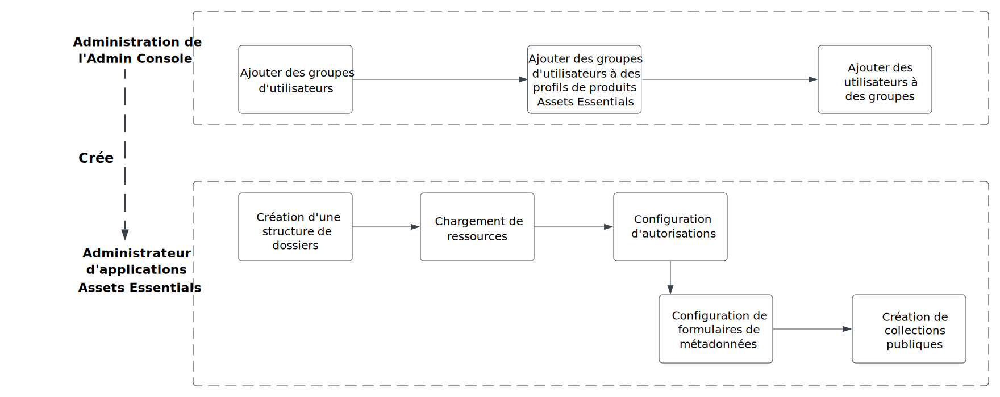
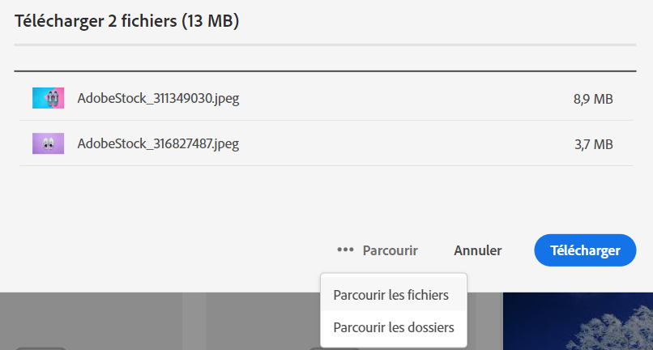
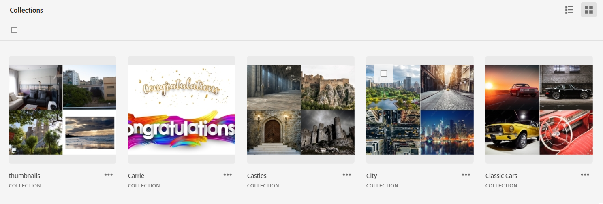

# Administrer [!DNL Assets Essentials] et ajouter des utilisateurs {#administer}

[!DNL Adobe Experience Manager Assets Essentials] est configuré par Adobe pour ses clients. Dans le cadre de la mise en service, [!DNL Assets Essentials] est ajouté à l’organisation d’un client dans [!DNL Adobe Admin Console]. Les administrateurs utilisent [!DNL Admin Console] pour gérer les droits d’accès des utilisateurs à la solution [!DNL Assets Essentials] et affecter des administrateurs d’applications à la configuration d’autorisations et de formulaires de métadonnées dans [!DNL Assets Essentials].

Le diagramme de flux de données suivant illustre la séquence des tâches qu’un administrateur doit effectuer pour configurer et gérer Assets Essentials :

## Accéder à Admin Console {#access-admin-console}

Une fois la solution Assets Essentials configurée, l’administrateur reçoit un e-mail d’Adobe. L’e-mail contient un message de bienvenue et un lien permettant de commencer. De plus, Adobe lance automatiquement le processus de déploiement d’Assets Essentials. Le processus de déploiement dure une heure.

À partir du lien dans l’e-mail, accédez à l’[Admin Console](https://adminconsole.adobe.com) et connectez-vous. Si vous disposez d’un accès administrateur à plusieurs comptes d’organisation, alors sélectionnez l’organisation appropriée ou accédez à celle-ci à l’aide du [sélecteur d’organisation](https://helpx.adobe.com/fr/enterprise/using/admin-console.html). Une fois le processus de déploiement automatique terminé, la fiche produit dʼ[!DNL AEM Assets Essentials] est visible dans [!DNL Admin Console].

Effectuez les tâches de droits d’utilisateur suivantes à l’aide d’Admin Console :

* [Créer un administrateur de l’application Assets Essentials](#create-assets-essentials-administrator)

* [Ajouter des groupes d’utilisateurs](#add-user-groups)

* [Ajouter des groupes d’utilisateurs aux profils de produits](#add-users-to-product-profiles)

### Créer un administrateur de l’application Assets Essentials {#create-assets-essentials-administrator}

Un administrateur de Admin Console doit ajouter le profil de produit administrateur Assets Essentials à un utilisateur et non à un groupe d’utilisateurs. L’administrateur de l’application Assets Essentials peut ensuite gérer des tâches telles que la création d’une structure de dossiers, le chargement de ressources, la configuration des autorisations, la configuration de formulaires de métadonnées et la création de collections publiques. Pour plus d’informations sur l’affectation d’un utilisateur à un profil d’administrateur d’application Assets Essentials, voir [ajouter des utilisateurs à des profils de produit ;](#add-users-to-product-profiles).

### Ajouter des groupes d’utilisateurs {#add-user-groups}

Créez des groupes d’utilisateurs, puis affectez vos utilisateurs à ces groupes. Ces groupes d’utilisateurs seront disponibles dans l’application Assets Essentials pour définir les autorisations des dossiers.

Pour plus d’informations sur la gestion des groupes d’utilisateurs, consultez les sections `Create user groups` et `Edit user groups` sur la page [Gérer les groupes d’utilisateurs](https://helpx.adobe.com/fr/enterprise/using/user-groups.html).

>[!NOTE]
>
>Si Admin Console est configuré pour faire appel à un système de gestion externe des affectations des utilisateurs/groupes, tel que les connecteurs Azure ou Google, l’outil de synchronisation des utilisateurs ou l’API REST User Management, vos affectations de groupes et d’utilisateurs sont configurées automatiquement. Pour plus d’informations, consultez la section [Utilisateurs Adobe Admin Console](https://helpx.adobe.com/fr/enterprise/using/users.html).

Pour plus d’informations sur la gestion de l’ajout d’utilisateurs aux groupes d’utilisateurs, consultez la section `Add users to groups` de la page [Gérer les groupes d’utilisateurs](https://helpx.adobe.com/fr/enterprise/using/user-groups.html#add-users-to-groups).

### Ajout de profils de produit à des groupes d’utilisateurs {#add-product-profiles-to-user-groups}

Ajoutez des profils de produit aux groupes d’utilisateurs afin qu’ils aient accès à l’application Assets Essentials.

Pour ajouter des profils de produit aux groupes d’utilisateurs :

1. Accédez à [Admin Console](https://adminconsole.adobe.com) de votre organisation, cliquez sur **[!UICONTROL Produits]** dans la barre supérieure, puis sur **[!UICONTROL AEM Assets Essentials]**, et enfin sur l’instance de [!DNL Assets Essentials]. Le nom de l’instance peut être différent de celui de la capture d’écran ci-dessous.
   >[!NOTE]
   >
   >L’instance de [!DNL Cloud Manager] est réservée à un usage administratif spécial, comme la vérification du statut des services et l’accès aux journaux des services. Elle ne peut pas être utilisée pour ajouter des utilisateurs au produit. 

   

   [!DNL Assets Essentials] possède trois profils de produits qui représentent l’accès pour les administrateurs, les utilisateurs réguliers et les consommateurs.

   * Les **[!DNL Assets Essentials] administrateurs** : ont un accès administratif à l’application. En plus de toutes les fonctionnalités de l’utilisateur final, les administrateurs d’applications de ce groupe peuvent gérer les autorisations de n’importe quel dossier et groupe/utilisateur dans l’ensemble du référentiel de l’application.

   * Les **[!DNL Assets Essentials] utilisateurs** : ont accès à l’interface utilisateur complète. Ces utilisateurs peuvent charger, organiser, baliser et rechercher des ressources numériques.

   * Les **[!DNL Assets Essentials] utilisateurs consommateurs** : disposent d’un accès à l’expérience de sélection de ressources incorporée dans l’éditeur de modèles d’e-mail [!DNL Adobe Journey Optimizer]. Consultez [Utiliser  [!DNL Assets Essentials]  dans  [!DNL Journey Optimizer]](https://experienceleague.adobe.com/docs/journey-optimizer/using/create-messages/assets-essentials.html?lang=fr) pour plus d’informations.

   

1. Pour ajouter un groupe d’utilisateurs au produit, cliquez sur l’un des trois profils de produit Assets Essentials, puis sélectionnez **[!UICONTROL Ajouter un utilisateur]**, fournissez les informations sur l’utilisateur et cliquez sur **[!UICONTROL Enregistrer]**.

   

   Lorsque vous ajoutez un utilisateur, celui-ci reçoit une invitation par courrier électronique qui lui permet de commencer à l’utilisateur. Vous pouvez désactiver les invitations par e-mail dans les paramètres du profil de produit dans l’[!DNL Admin Console].

   >[!NOTE]
   >
   >Vous devez ajouter un utilisateur au profil Administrateur du produit Assets Essentials dans Admin Console, afin qu’il puisse effectuer des tâches administratives dans l’application Assets Essentials. Ces tâches comprennent : [Créer une structure de dossiers](#create-folder-structure), [Gérer les autorisations pour les dossiers](#manage-permissions-for-folders) et [Configurer des formulaires de métadonnées](#metadata-forms).

## Accéder à l’application Assets Essentials {#access-assets-essentials-application}

Après avoir appliqué les droits d’utilisateur dans Admin Console, vous pouvez accéder à l’application Assets Essentials pour effectuer les tâches suivantes :

* [Créer une structure de dossiers](#create-folder-structure)

* [Charger des ressources](#upload-assets)

* [Gérer les autorisations des dossiers](#manage-permissions-for-folders)

* [Configurer les formulaires de métadonnées](#metadata-forms)

* [Créer des collections publiques](#create-public-collections)

### Créer une structure de dossiers {#create-folder-structure}

Pour créer une structure de dossiers dans le référentiel Assets Essentials, utilisez les méthodes suivantes :

* Cliquez sur lʼoption **[!UICONTROL Créer un dossier]** disponible dans la barre d’outils pour créer un dossier vide.

* Cliquez sur lʼoption **[!UICONTROL Ajouter des ressources]** disponible dans la barre d’outils pour [télécharger une structure de dossiers présente sur votre ordinateur local](add-delete.md).

Créez une structure de dossiers qui correspond aux objectifs commerciaux de lʼorganisation. Si vous téléchargez une structure de dossiers existante vers le référentiel Assets Essentials, vous devez vérifier la structure. Pour plus d’informations, consultez la section [Bonnes pratiques relatives à la structure des dossiers pour la gestion efficace des autorisations](permission-management-best-practices.md##folder-structure-assets-essentials).

Il existe plusieurs types de structure de dossiers que vous pouvez utiliser pour votre organisation. Voici quelques exemples de structures de dossiers typiques :

>[!NOTE]
>
>Pour être en mesure de gérer ces tâches, notamment la gestion des autorisations, votre utilisateur doit avoir des droits d’administration de l’application. Il doit être ajouté au [profil de produit Administrateur Assets Essentials](#add-users-to-product-profiles).

### Charger des ressources {#upload-assets}

Pour ajouter de nouvelles ressources à utiliser, chargez des ressources à partir de votre système de fichiers local. Vous pouvez faire glisser des ressources ou des dossiers sur l’interface utilisateur et suivre les instructions à l’écran ou cliquer sur l’option **[!UICONTROL Ajouter des ressources]** dans la barre d’outils et ajouter des fichiers à la boîte de dialogue de téléchargement. [!DNL Assets Essentials] offre de puissantes fonctionnalités de recherche en texte intégral, mais vous pouvez également utiliser des dossiers pour mieux organiser vos ressources. Pour plus d’informations, consultez la section [Charger des ressources](add-delete.md).

### Gérer les autorisations des dossiers {#manage-permissions-for-folders}

Grâce à Assets Essentials, les administrateurs peuvent gérer les niveaux d’accès aux dossiers disponibles dans le référentiel. En tant qu’administrateur, vous pouvez créer des groupes d’utilisateurs et leur attribuer des autorisations afin de gérer les niveaux d’accès. Vous pouvez également déléguer les privilèges de gestion des autorisations aux groupes d’utilisateurs au niveau du dossier.

>[!VIDEO](https://video.tv.adobe.com/v/341104)

Pour plus d’informations, voir [Gérer les autorisations pour les dossiers](manage-permissions.md).

### Configurer les formulaires de métadonnées (Facultatif) {#metadata-forms}

Assets Essentials fournit par défaut de nombreux champs de métadonnées standard. Les entreprises ont d’autres besoins en métadonnées et ont besoin de davantage de champs de métadonnées pour ajouter des métadonnées spécifiques à leur entreprise. Les formulaires de métadonnées permettent aux entreprises d’ajouter des champs de métadonnées personnalisés à la page [!UICONTROL Détails] d’une ressource. Les métadonnées spécifiques à l’entreprise améliorent la gouvernance et la découverte de ses ressources. Vous pouvez créer des formulaires entièrement ou réutiliser un formulaire existant.

Vous pouvez configurer des formulaires de métadonnées pour différents types de ressources (différents types MIME). Utilisez le même nom de formulaire que le type MIME du fichier. Essentials fait automatiquement correspondre le type MIME des ressources chargées au nom du formulaire et met à jour les métadonnées des ressources chargées en fonction des champs du formulaire.

Par exemple, s’il existe un formulaire de métadonnées portant le nom `PDF` ou `pdf`, les documents PDF chargés contiennent les champs de métadonnées définis dans le formulaire.

Pour plus d’informations, consultez la section [Formulaires de métadonnées](metadata.md#metadata-forms).

>[!VIDEO](https://video.tv.adobe.com/v/341275)

Pour plus d’informations sur le formulaires de métadonnées, voir [Formulaires de métadonnées dans Assets Essentials](metadata.md#metadata-forms).

### Créer des collections publiques (facultatif) {#create-public-collections}

Une collection est un ensemble de ressources dans Experience Manager Assets Essentials. Vous pouvez utiliser des collections pour partager des ressources entre utilisateurs.

Contrairement aux dossiers, une collection peut comporter des ressources provenant de différents emplacements. Vous pouvez partager plusieurs collections avec un utilisateur. Chaque collection contient des références aux ressources. L’intégrité du référentiel des ressources est préservée dans les collections. Pour plus d’informations, consultez la section [Gérer des collections](manage-collections.md).

## Étapes suivantes {#next-steps}

* [Regardez une vidéo pour déployer Assets Essentials](https://experienceleague.adobe.com/docs/experience-manager-learn/assets-essentials/provisioning.html?lang=fr).

* Faites des commentaires sur le produit en utilisant l’option [!UICONTROL Commentaires] disponible dans l’interface utilisateur d’Assets Essentials.

* Faites des commentaires sur la documentation en utilisant l’option [!UICONTROL Modifier cette page]  ou [!UICONTROL Enregistrer un problème]  disponible dans la barre latérale droite.

* Contactez l’[assistance clientèle](https://experienceleague.adobe.com/?support-solution=General&amp;lang=fr#support).

>[!MORELIKETHIS]
>
>* [[!DNL Admin Console] help](https://helpx.adobe.com/fr/enterprise/using/admin-console.html)
>* [[!DNL Cloud Manager] help](https://experienceleague.adobe.com/docs/experience-manager-cloud-manager/using/introduction-to-cloud-manager.html?lang=fr)
>* [Documentation Adobe Journey Optimizer](https://experienceleague.adobe.com/docs/journey-optimizer/using/ajo-home.html?lang=fr)
>* [Notes de mise à jour](release-notes.md)
>* [Prise en main d’ [!DNL Assets Essentials]](get-started.md)

