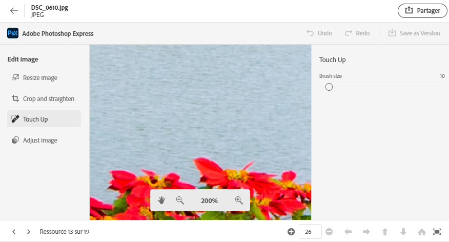
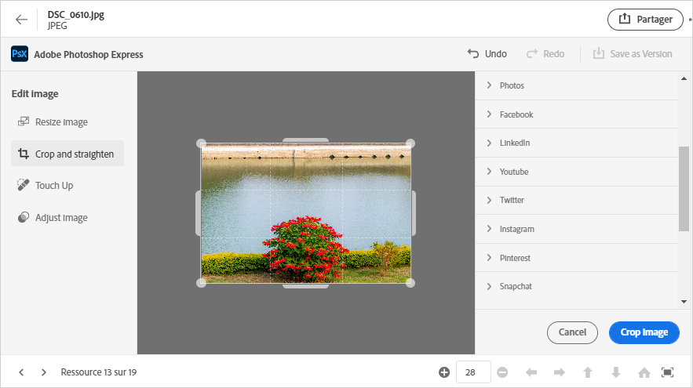
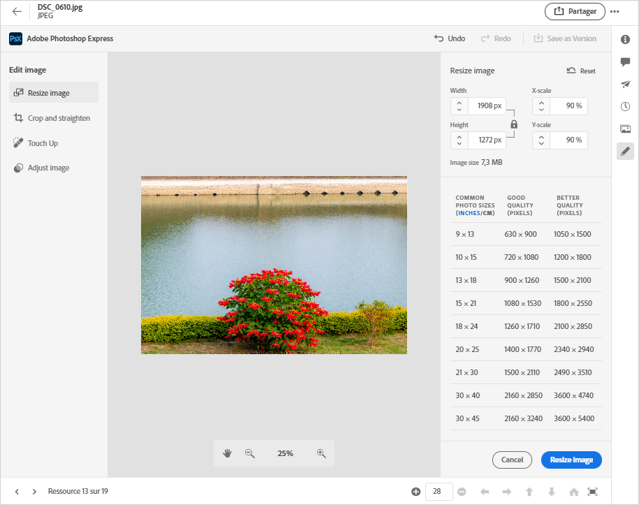

# Modifier des images dans [!DNL Assets Essentials] {#edit-images}

[!DNL Assets Essentials] fournit des options de modification conviviales, optimisées par  [!DNL Adobe Photoshop Express]. Les actions de modification disponibles sont Correction des points, Recadrer et redresser, Redimensionner l’image et Ajuster l’image.

Après avoir modifié une image, vous pouvez enregistrer la nouvelle image en tant que nouvelle version. Le contrôle de version vous permet de revenir à la ressource d’origine ultérieurement, si nécessaire. Pour modifier une image, [ouvrez son aperçu](/help/navigate-view.md#preview-assets) et cliquez sur **[!UICONTROL Modifier l’image]**  dans le rail de droite.

*Figure : Les options de modification des images sont optimisées par  [!DNL Adobe Photoshop Express].*

## Afficher les images de guérison {#spot-heal-images}

S’il existe des zones mineures ou de petits objets sur une image, vous pouvez modifier et supprimer les zones grâce à la fonction de correction des points fournie par Adobe Photoshop.

La brosse échantillonne la zone retouchée et fait en sorte que les pixels réparés se fondent facilement dans le reste de l’image. Utilisez une taille de brosse légèrement supérieure à la zone à corriger.

<!-- TBD: See if we should give backlinks to PS docs for these concepts.
For more information about how Spot Healing works in Photoshop, see [retouching and repairing photos](https://helpx.adobe.com/photoshop/using/retouching-repairing-images.html). -->

## Recadrer et redresser des images {#crop-straighten-images}

Grâce à l’option de recadrage et de lissage, vous pouvez effectuer un recadrage de base, faire pivoter l’image, la retourner horizontalement ou verticalement, puis la recadrer sur des dimensions adaptées aux sites Web de médias sociaux populaires.

Pour enregistrer vos modifications, cliquez sur **[!UICONTROL Recadrer l’image]**. Après modification, vous pouvez enregistrer la nouvelle image en tant que version.

De nombreuses options par défaut vous permettent de recadrer votre image selon les meilleures proportions qui conviennent aux différents profils et publications de médias sociaux.

## Redimensionner l’image {#resize-image}

Le redimensionnement d’une image à une taille spécifique est un cas d’utilisation courant. [!DNL Assets Essentials] permet de redimensionner rapidement l’image pour l’adapter aux tailles de photo courantes en fournissant de nouvelles résolutions précalculées pour des tailles de photo spécifiques. Vous pouvez afficher les tailles de photo courantes en centimètres ou pouces pour connaître les dimensions. Par défaut, la méthode redimensionnement conserve les proportions. Pour remplacer manuellement les proportions, cliquez sur .

Saisissez les dimensions et cliquez sur **[!UICONTROL Redimensionner l’image]** pour la redimensionner. Avant d’enregistrer les modifications en tant que version, vous pouvez annuler toutes les modifications effectuées avant de les enregistrer en cliquant sur [!UICONTROL Annuler] ou modifier l’étape spécifique du processus de modification en cliquant sur [!UICONTROL Rétablir].

## Réglage de l’image {#adjust-image}

[!DNL Assets Essentials] permet d’ajuster la couleur, le ton, le contraste, etc. en quelques clics seulement. Cliquez sur **[!UICONTROL Ajuster l’image]** dans la fenêtre d’édition. Les options suivantes sont disponibles dans la barre latérale droite :

* **Populaire** :  [!UICONTROL Contraste et détails élevés],  [!UICONTROL Contraste désaturé],  [!UICONTROL Photo âgée],  [!UICONTROL Soft B&amp;W] et  [!UICONTROL Tone sépia B&amp;W].
* **Couleur** :  [!UICONTROL Naturelle],  [!UICONTROL Lumineux],  [!UICONTROL Contraste élevé],  [!UICONTROL Contraste et détail élevé],  [!UICONTROL Vivid] et  [!UICONTROL Matte].
* **Creative** :  [!UICONTROL Contraste] désaturé,  [!UICONTROL Luminosité froide],  [!UICONTROL Turquoise &amp; Rouge],  [!UICONTROL Poignée molle],  [!UICONTROL Vintage Instant],  [!UICONTROL Contraste chaud],  [!UICONTROL Plat &amp; Vert],  [!UICONTROL Effet élévateur rouge],  [!UICONTROL Ombres chaudes] et  [!UICONTROL Photo Agitée].
* **B&amp;W** :  [!UICONTROL B&amp;W Landscape],  [!UICONTROL B&amp;W High Contrast],  [!UICONTROL B&amp;W Punch],  [!UICONTROL B&amp;W Low Contrast],  [!UICONTROL B&amp;W Flat],  [!UICONTROL B&amp;W Soft],  [!UICONTROL B&amp;W infrarouge],  [!UICONTROL B&amp;W Selenium Tone],  [!UICONTROL B&amp;W Sepia Tone] et  [!UICONTROL  Division B&amp;W].
* **Vignettage** :  [!UICONTROL Aucun],  [!UICONTROL Clair],  [!UICONTROL Moyen] et  [!UICONTROL Lourd].

<!--
TBD: Insert a video of the available social media options.
-->

>[!MORELIKETHIS]
>
>* [Affichage de l’historique des versions d’une ressource](/help/navigate-view.md)

