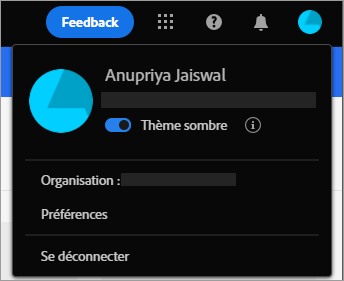
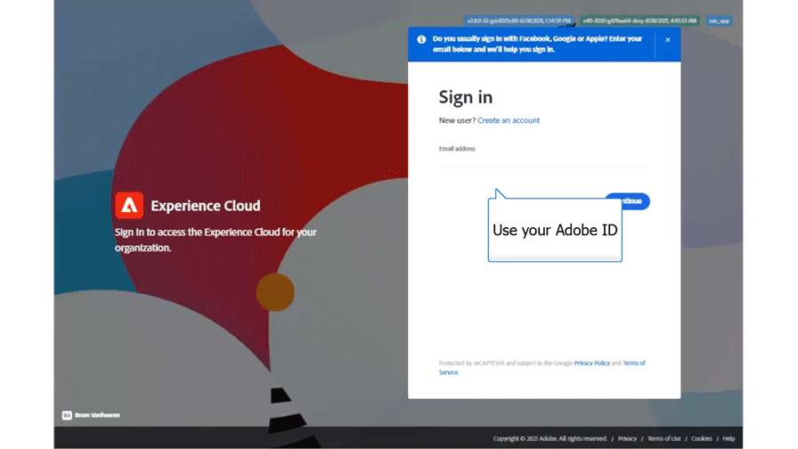
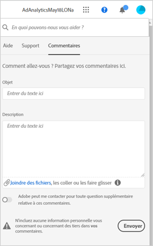

# Prise en main d’[!DNL Experience Manager Assets Essentials] {#assets-essentials-get-started}

<!-- TBD: Make links for these steps. -->

La gestion de vos ressources numériques à l’aide d’[!DNL Assets Essentials] ne nécessite que trois étapes simples :

* **Étape 1** : [Charger](/help/add-delete.md) et [afficher](/help/navigate-view.md) des ressources.
* **Étape 2** : [Rechercher](/help/search.md) et [télécharger](/help/manage-organize.md#download) des ressources.
* **Étape 3** :  [Gérez et ](/help/manage-organize.md) organisez les ressources.

Pour utiliser [!DNL Assets Essentials], connectez-vous à l’adresse [https://experience.adobe.com/#/assets](https://experience.adobe.com/#/assets). Lors de la connexion, sélectionnez `Company or School Account`. Pour recevoir un accès, contactez l’administrateur de votre entreprise.

En outre, des informations de référence supplémentaires qui peuvent s’avérer utiles sont la [compréhension de l’interface utilisateur](/help/navigate-view.md) et la [liste des cas d’utilisation](#use-cases) <!-- TBD: [supported file types](/help/supported-file-formats.md), --> et des [problèmes connus](/help/release-notes.md#known-issues).

## Recevoir un accès à [!DNL Assets Essentials] {#get-access}

Adobe fournit la solution et ajoute la personne désignée de votre organisation en lui donnant le statut d’administrateur. Les administrateurs peuvent fournir l’accès à divers utilisateurs de l’organisation en utilisant l’[[!DNL Admin Console]](https://helpx.adobe.com/fr/enterprise/using/admin-console.html). Pour toute demande relative à votre accès, contactez l’administrateur de votre entreprise.

## Configuration d’[!DNL Assets Essentials] {#configuration}

Pour ouvrir les préférences, cliquez sur votre avatar dans le coin supérieur droit de l’interface utilisateur. Vous pouvez basculer entre les thèmes clairs et sombres dans les préférences de la solution.

Si vous faites partie de différentes organisations, vous pouvez également changer d’organisation et accéder à vos comptes de différentes organisations.

Pour modifier vos [!UICONTROL préférences Experience Cloud], cliquez sur [!UICONTROL Préférences].

<!-- TBD: What can admins configure? What more can users configure? Any doc that describes Exp Cloud preferences? 
Metadata forms is out of the scope of 6/17 GA. When the functionality is added, link to it from here. It is about configuring metadata UI. -->

<!-- TBD: This section contains beta-specific video that will be updated post-GA.

## Login experience {#login-experience}

When logging in, after providing the credentials, you can be prompted to select an account. In this case, select `Company or School Account` to proceed.

-->

## Scénarios d’utilisation d’[!DNL Assets Essentials]  {#use-cases}

Vous trouverez ci-dessous les différentes tâches de gestion des actifs numériques (DAM) que vous pouvez réaliser en utilisant [!DNL Assets Essentials].

| Tâches utilisateur | Fonctionnalités et informations pratiques |
|-----|------|
| Exploration et affichage des ressources | <ul> <li>[Parcourir le référentiel](/help/navigate-view.md#view-assets-and-details) </li> <li> [Aperçu d’une ressource](/help/navigate-view.md#preview-assets) <li> [Affichage des rendus d’une ressource](/help/add-delete.md#renditions) </li> <li>[Affichage des versions d’une ressource](/help/manage-organize.md#view-versions)</li></ul> |
| Ajout de nouvelles ressources | <ul> <li>[Chargement de nouvelles ressources et de nouveaux dossiers](/help/add-delete.md#add-assets)</li> <li>[Surveillance de la progression du chargement et gestion des chargements](/help/add-delete.md#upload-progress)</li> <li>[Résoudre les problèmes de doublons](/help/add-delete.md#resolve-upload-fails)</li> </ul> |
| Mise à jour de ressources ou d’informations connexes | <ul> <li>[Modification des images](/help/edit-images.md)</li> <li>[Création de versions](/help/manage-organize.md#create-versions) et [affichage de versions](/help/manage-organize.md#view-versions)</li> <li>[Modification des images](/help/edit-images.md)</li> </ul> |
| Modification de ressources | <ul> <li>[Modifications dans le navigateur à l’aide d’Adobe Photoshop Express](/help/edit-images.md)</li> <li>[Recadrage d’un profil de réseaux sociaux](/help/edit-images.md#crop-straighten-images)</li> <li>[Affichage et gestion des versions](/help/manage-organize.md#view-versions)</li> <li>[Utilisez [!DNL Adobe Asset Link]](/help/integration.md#integrations)</ul></ul> |
| Recherche de ressources dans le référentiel | <ul> <li>[Recherche dans un dossier spécifique](/help/search.md#refine-search-results)</li> <li>[Recherches enregistrées](/help/search.md#saved-search)</li> <li>[Recherche de ressources récemment consultées](/help/search.md)</li> <li>[Recherche du texte intégral](/help/search.md) |
| Téléchargement de ressources | <ul> <li> [Aperçu de la ressource](/help/navigate-view.md#preview-assets) </li> <li> [Téléchargement de ressources](/help/manage-organize.md#download) <li> [Téléchargement de rendus](/help/add-delete.md#renditions) </li></ul> |
| Opérations de métadonnées | <ul> <li>[Affichage des métadonnées détaillées](/help/metadata.md) </li> <li> [Mettre à jour les métadonnées](/help/metadata.md#update-metadata)</li> <li> [Création d’un formulaire de métadonnées](/help/metadata.md#metadata-forms) </li> </ul> |
| Intégration à d’autres solutions | <ul> <li>[Utilisation du sélecteur de ressources dans  [!DNL Adobe Journey Optimizer]](/help/integration.md)</li> <li>[[!DNL Adobe Asset Link] pour [!DNL Creative Cloud]](/help/integration.md)</li> <li>[Intégration à [!DNL Adobe Workfront]](/help/integration.md)</li> </ul> |

<!--TBD: Merge the below rows in the table when the use cases are documented/available.

| How do I delete assets? | <ul> <li>[Delete assets](/help/manage-organize.md)</li> <li>Recover deleted assets</li> <li>Permanently delete assets</li> </ul> |
| How do I share assets or find shared assets? | <ul> <li>Shared by me</li> <li>Shared with me</li> <li>Share for comments and review</li> <li>Unshare assets</li> </ul> |
| How do I collaborate with others and get my assets reviewed | <ul> <li>Share for review</li> <li>Provide comments. Resolve and filter comments</li> <li>Annotations on images</li> <li>Assign tasks to specific users and prioritize</li> </ul> |

-->

##  Donnez votre avis sur des produits {#provide-feedback}

Adobe se réjouit de recevoir tous vos commentaires sur la solution. Pour partager vos commentaires en restant dans votre application, utilisez l’option [!UICONTROL Commentaires] dans l’interface utilisateur. Il vous permet également de joindre des fichiers tels que des captures d’écran ou des enregistrements vidéo d’un problème.

Pour fournir des commentaires pour la documentation, cliquez sur [!UICONTROL Modifier cette page]  ou [!UICONTROL Soumettre un problème]  dans la barre latérale droite. Vous pouvez effectuer l’une des opérations suivantes :

* Effectuez les mises à jour du contenu et envoyez une demande d’extraction GitHub.
* Créez un problème ou un ticket dans GitHub. Conservez le nom d’article automatiquement renseigné lors de la création d’un problème.

>[!MORELIKETHIS]
>
>* [Comprendre l’interface utilisateur](/help/navigate-view.md).
>* [Notes de mise à jour et problèmes connus](/help/release-notes.md).

<!-- TBD: 
>* [Supported file types](/help/supported-file-formats.md).
-->
