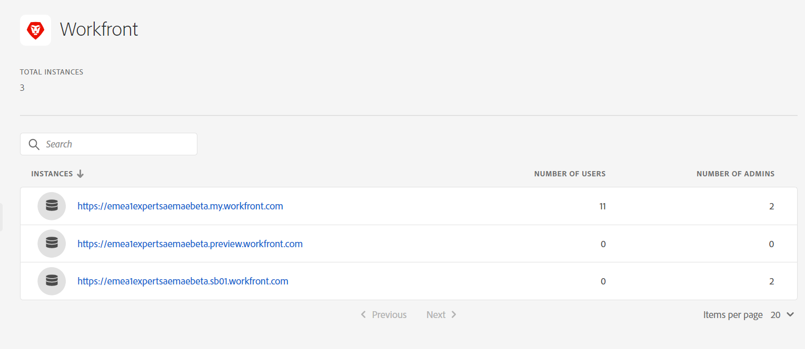

# Intégration d’Assets Essentials à Adobe Workfront {#integrate-assets-essentials-workfront}

## L&#39;histoire jusqu&#39;à présent

Après [configuration de Experience Manager Assets Essentials](adminster-aem-assets-essentials.md) et [intégration des applications Creative Cloud avec Assets Essentials](integrate-assets-essentials-creative-cloud.md), vous pouvez créer sur pour intégrer l’application Adobe Workfront à Assets Essentials.

## Objectif

* **Audience**: Administrateurs Adobe Workfront

* **Objectif**: Intégrez Assets Essentials à l’application Adobe Workfront afin d’accéder au référentiel Assets Essentials dans l’application Workfront.

## Présentation

[[!DNL Adobe Workfront]](https://www.workfront.com/) est une application de gestion du travail qui vous permet de gérer l’ensemble du cycle de vie du travail en un seul endroit. L’intégration native entre [!DNL Adobe Workfront] et [!DNL Assets Essentials] permet aux entreprises d’améliorer la vitesse du contenu et le temps de mise sur le marché en établissant des liens intrinsèques entre le travail et la gestion des ressources. Dans le cadre de la gestion de leur travail, les utilisateurs ont accès aux documents et images requis dans la même solution.

Exécutez les tâches suivantes pour intégrer Workfront à Experience Manager Assets Essentials :

* [Ajout d’utilisateurs aux profils de produit Workfront](#add-users-to-product-profiles)

* [Ajout d’utilisateurs à des profils de produit Assets Essentials](#add-workfront-users-assets-essentials-product-profiles)

* [Configuration de l’intégration Experience Manager Assets Essentials](#configure-assets-essentials-integration)

## Ajout d’utilisateurs aux profils de produit Workfront {#add-users-to-product-profiles}

Pour ajouter des utilisateurs à des profils de produit Workfront :

1. Accès [Admin Console](https://adminconsole.adobe.com) pour votre organisation, cliquez sur **[!UICONTROL Produits]** dans la barre supérieure, cliquez sur **[!UICONTROL Workfront]**, puis cliquez sur la première instance de la liste. Ne cliquez pas sur les deuxième et troisième instances de la liste.

   

   Admin Console affiche le seul profil de produit disponible.

1. Pour ajouter un utilisateur à un profil de produit, cliquez sur le profil, puis sur **[!UICONTROL Ajouter un utilisateur]**, fournissez les détails de l’utilisateur, puis cliquez sur **[!UICONTROL Enregistrer]**.

   

   Lorsque vous ajoutez un utilisateur, celui-ci reçoit une invitation par courrier électronique qui lui permet de commencer à l’utilisateur. Vous pouvez désactiver les invitations par e-mail dans les paramètres du profil de produit dans l’[!DNL Admin Console].

1. Pour supprimer un utilisateur d’un groupe, cliquez sur le groupe, sélectionnez un utilisateur existant, puis **[!UICONTROL Supprimer l’utilisateur]**.

Pour plus d’informations sur la création d’utilisateurs et d’administrateurs système dans Workfront avec Adobe Admin Console, voir [Gestion des utilisateurs dans Adobe Admin Console](https://one.workfront.com/s/document-item?bundleId=the-new-workfront-experience&amp;topicId=Content%2FAdministration_and_Setup%2FAdd_users%2FCreate_and_manage_users%2Fadmin-console.htm&amp;_LANG=enus).

## Ajout d’utilisateurs à des profils de produit Assets Essentials {#add-workfront-users-assets-essentials-product-profiles}

Affectez les utilisateurs Workfront à l’un des profils de produit Assets Essentials suivants :

* **[!DNL Assets Essentials]Utilisateurs** ont accès à l’interface utilisateur complète d’Assets Essentials. Ces utilisateurs peuvent charger, organiser, baliser et rechercher des ressources numériques dans l’application Assets Essentials. En outre, les utilisateurs ont accès à l’expérience de sélection de ressources incorporée dans [!DNL Adobe Workfront] application.
* **[!DNL Assets Essentials]Utilisateurs clients**: ont accès à l’expérience de sélection de ressources incorporées dans [!DNL Adobe Workfront] application.

De plus, il y a **[!DNL Assets Essentials]Administrateurs** profil de produit qui permet l’accès administratif à l’application.

Pour plus d’informations sur l’affectation d’utilisateurs à des profils de produit Assets Essentials, voir [Affecter des utilisateurs à des profils de produit Assets Essentials](adminster-aem-assets-essentials.md#add-users-to-product-profiles).

## Configuration de l’intégration Experience Manager Assets Essentials {#configure-assets-essentials-integration}

Après avoir ajouté des utilisateurs aux profils de produit Workfront et Assets Essentials à l’aide du Admin Console, vous pouvez [configuration de l’intégration de Experience Manager Assets Essentials à Adobe Workfront](https://one.workfront.com/s/document-item?bundleId=the-new-workfront-experience&amp;topicId=Content%2FDocuments%2FAdobe_Workfront_for_Experience_Manager_Assets_Essentials%2F_workfront-for-aem-asset-essentials.htm).

Après avoir configuré l’intégration, vous pouvez :

* [Lier des ressources et des dossiers à partir de Experience Manager Assets Essentials](https://one.workfront.com/s/document-item?bundleId=the-new-workfront-experience&amp;topicId=Content%2FDocuments%2FAdobe_Workfront_for_Experience_Manager_Assets_Essentials%2Flink-to-aem.htm&amp;_LANG=enus)

* [Envoi d’un document à Experience Manager Assets Essentials](https://one.workfront.com/s/document-item?bundleId=the-new-workfront-experience&amp;topicId=Content%2FDocuments%2FAdobe_Workfront_for_Experience_Manager_Assets_Essentials%2Fsend-to-aem.htm&amp;_LANG=enus)

* [Bon à tirer d’une ressource liée pour Experience Manager Assets Essentials](https://one.workfront.com/s/document-item?bundleId=the-new-workfront-experience&amp;topicId=Content%2FDocuments%2FAdobe_Workfront_for_Experience_Manager_Assets_Essentials%2Fproof-linked-asset-aem.htm)

* [Affichage ou téléchargement d’une ressource liée à partir de Experience Manager Assets Essentials](https://one.workfront.com/s/document-item?bundleId=the-new-workfront-experience&amp;topicId=Content%2FDocuments%2FAdobe_Workfront_for_Experience_Manager_Assets_Essentials%2Fview-download-asset.htm)
