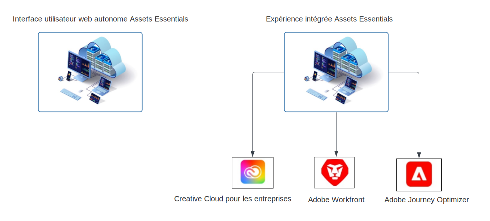

# Présentation d’[!DNL Adobe Experience Manager Assets Essentials] {#assets-essentials}

<!-- TBD: Update this banner to remove Beta label. 

-->

Adobe propose de puissantes solutions de gestion des ressources numériques (DAM) pour vous permettre de tirer le meilleur parti de vos ressources numériques. Adobe Experience Manager Assets Essentials est la solution légère de gestion des ressources d’Adobe pour stocker, gérer, découvrir et utiliser des ressources numériques.

## Qu’est-ce qu’Assets Essentials ? {#assets-essemtials-overview}

Experience Manager Assets Essentials est une édition légère du Cloud Service Adobe Experience Manager Assets. Assets Essentials offre une gestion et une collaboration unifiées des ressources avec une interface utilisateur simplifiée et moderne. La solution conviviale permet à des équipes plus créatives et marketing de stocker, découvrir et distribuer des ressources numériques.

Assets Essentials vous permet d’effectuer les opérations suivantes :

* Gérez, organisez et gérez les ressources à un emplacement central.

* Collaborez au développement de contenu entre les équipes.

* Accédez aux ressources approuvées finales, recherchez-les et recherchez-les.

* Partagez et téléchargez des ressources pour la diffusion en aval.

## Comment accéder à Assets Essentials ? {#access-options}

Assets Essentials offre une interface utilisateur web autonome aux utilisateurs finaux et aux administrateurs, leur permettant d’accéder à toutes les fonctionnalités de la solution. Les utilisateurs d’autres solutions Adobe peuvent également accéder aux ressources d’Assets Essentials et les utiliser au moyen d’une expérience intégrée, disponible dans Creative Cloud pour les applications d’entreprise, Adobe Journey Optimizer et Adobe Workfront.

## Pourquoi Assets Essentials ? {#assets-essentials-features}

Assets Essentials offre des avantages clés, ce qui vous permet d’effectuer les opérations suivantes :

* **Prise en main rapide** avec des outils de gestion des ressources prêts à l’emploi.

* Étendre l’accès aux ressources à davantage d’équipes afin de proposer des expériences client cohérentes avec **gestion simplifiée des ressources**.

* Unifier le cycle de vie du contenu avec natif **intégrations dans d’autres solutions Adobe**.

* Exploitation d’un **plateforme basée sur le cloud**, sécurisé et prêt à être mis à l’échelle à tout moment, n’importe où.

* Commencez par les fonctionnalités essentielles de gestion des ressources numériques et **grossir** à la gestion des actifs numériques de l’entreprise.

**Prise en main rapide**

La solution Assets Essentials est fournie aux clients par Adobe et disponible une fois le processus d’approvisionnement terminé. Les administrateurs ont accès au produit dans Adobe Admin Console et peuvent immédiatement démarrer la configuration du système et l’intégration des utilisateurs.

En savoir plus sur Assets Essentials [administration et intégration des utilisateurs](deploy-administer.md).

**Gestion des ressources simplifiée**

L’interface utilisateur simplifiée d’Assets Essentials facilite la gestion, la découverte et la distribution de vos ressources numériques. Un large ensemble d’utilisateurs provenant de différentes fonctions, y compris les équipes créatives, marketing et métier, peuvent collaborer sur les ressources et accéder aux ressources approuvées appropriées lorsqu’elles en ont besoin.

Pour plus d’informations, voir [Prise en main de la gestion des ressources avec Assets Essentials](get-started.md).

**Intégration à d’autres applications Adobe**

Assets Essentials s’intègre aux solutions d’Adobe prises en charge et fournit une expérience intégrée à partir des interfaces de ces applications. Il permet aux utilisateurs d’accéder facilement aux ressources dont ils ont besoin directement dans leur application. Tous les utilisateurs peuvent utiliser les mêmes ressources gérées de manière centralisée dans leurs outils et applications courants.

L’expérience Assets Essentials intégrée est disponible pour les applications Creative Cloud, Adobe Journey Optimizer et Adobe Workfront.

Pour plus d’informations, voir [Intégration avec d’autres solutions Adobe](integration.md).

**Plateforme basée sur le cloud**

Basée sur l’infrastructure cloud d’Adobe, Assets Essentials permet aux entreprises de se concentrer sur leurs besoins professionnels en matière de création, de gestion et de distribution de ressources numériques. En outre, Adobe s’assure que la solution est disponible, sécurisée, évolutive et toujours à jour, avec des innovations de produits fournies aux utilisateurs en toute transparence via de fréquentes mises à jour.

**Des fonctionnalités qui s&#39;accroissent à vous**

Rendez-vous rapidement opérationnel avec Assets Essentials pour bénéficier des principales fonctionnalités de gestion des ressources numériques au sein de diverses équipes.

Lorsque les besoins de votre entreprise se développent et que vous avez besoin de prise en charge des exigences avancées de gestion des ressources numériques, telles que les personnalisations, l’extensibilité et les intégrations, l’automatisation, Dynamic Media et Brand Portal, Adobe propose également des [Adobe Experience Manager Assets as a Cloud Service](https://experienceleague.adobe.com/docs/experience-manager-cloud-service/content/assets/home.html?lang=en).

## Étapes suivantes {#next-steps}

* Faites des commentaires sur le produit en utilisant l’option [!UICONTROL Commentaires] disponible dans l’interface utilisateur d’Assets Essentials.

* Faites des commentaires sur la documentation en utilisant l’option [!UICONTROL Modifier cette page]  ou [!UICONTROL Enregistrer un problème]  disponible dans la barre latérale droite.

* Contactez l’[assistance clientèle](https://experienceleague.adobe.com/?support-solution=General&amp;lang=fr#support).

>[!MORELIKETHIS]
>
>* [[!DNL Assets Essentials] page tutoriels](https://experienceleague.adobe.com/docs/experience-manager-learn/assets-essentials/overview.html?lang=en)

