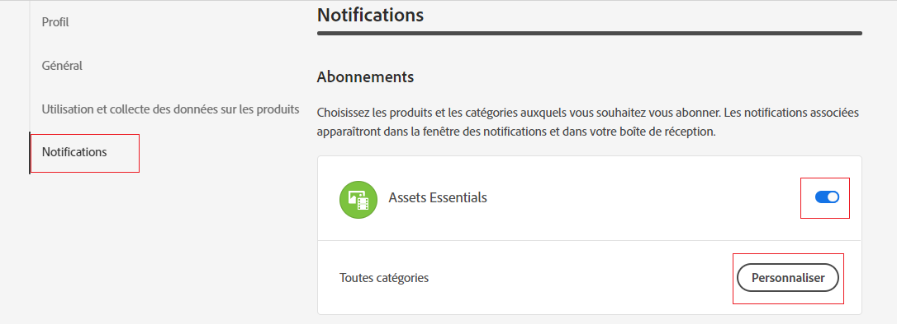
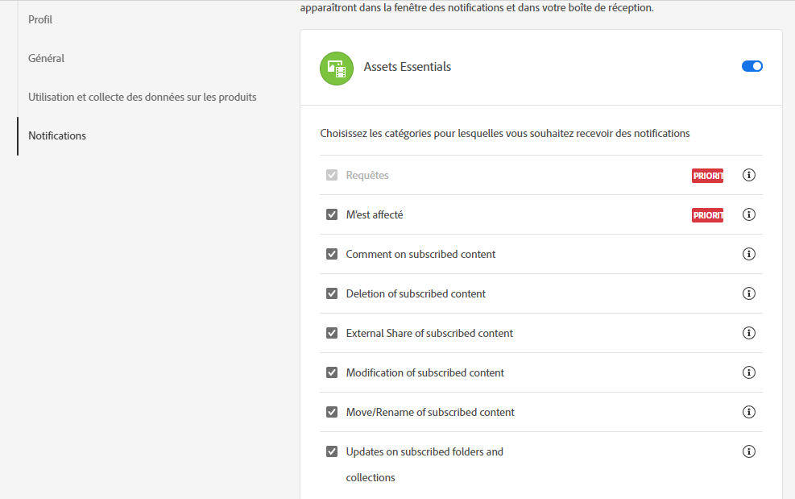
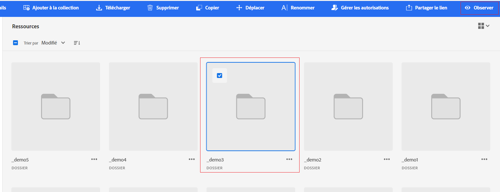

# Gérer les notifications {#manage-notifications}

Les notifications Assets Essentials vous permettent de surveiller les opérations effectuées sur les ressources, dossiers ou collections disponibles dans le référentiel. Pour recevoir les notifications, vous devez sélectionner le contenu et vous y abonner. Vous pouvez également configurer les catégories pour lesquelles les notifications vous sont envoyées.

## S’abonner aux catégories de notification {#subscribe-to-notification-categories}

Vous pouvez choisir de vous abonner à une liste de catégories et recevoir des notifications. Assets Essentials vous envoie les notifications uniquement pour les catégories que vous sélectionnez dans les options disponibles :

<table>
    <tbody>
     <tr>
      <th><strong>Catégorie de notification</strong></th>
      <th><strong>Description</strong></th>
     </tr>
     <tr>
      <td>Demandes</td>
      <td>Lorsque vous affectez une tâche à un utilisateur, vous recevez des notifications pour toute action effectuée sur cette tâche par cet utilisateur.</td>
     </tr>
     <tr>
      <td>Affecté à moi</td>
      <td>Vous recevez une notification lorsqu’une tâche vous est assignée par un autre utilisateur.</td>
     </tr>
     <tr>
      <td>Commentaire sur le contenu auquel vous êtes abonné</td>
      <td>Vous recevez une notification lorsqu’un utilisateur apporte un commentaire sur la ressource à laquelle vous êtes abonné.</td>
     </tr>
     <tr>
      <td>Suppression du contenu auquel vous êtes abonné</td>
      <td>Vous recevez une notification lorsqu’un utilisateur supprime la ressource, le dossier ou la collection auquel vous êtes abonné.</td>
     </tr>
     <tr>
      <td>Partage externe de contenu auquel vous êtes abonné</td>
      <td>Vous recevez une notification lorsqu’un utilisateur génère un lien public pour votre ressource, dossier ou collection abonnée.</td>
     </tr>
     <tr>
      <td>Modification du contenu auquel vous êtes abonné</td>
      <td>Vous recevez une notification lorsqu’un utilisateur crée une nouvelle version de la ressource à laquelle vous êtes abonné.</td>
     </tr>
     <tr>
      <td>Déplacement/changement de nom du contenu auquel vous êtes abonné</td>
      <td>Vous recevez une notification lorsqu’un utilisateur déplace ou renomme la ressource ou le dossier auquel vous êtes abonné.</td>
     </tr>
     <tr>
      <td>Mise à jour des dossiers et collections auxquels vous êtes abonné</td>
      <td>Vous recevez une notification lorsqu’un utilisateur ajoute ou supprime une ressource d’un dossier ou d’une collection abonné.</td>
     </tr>    
    </tbody>
   </table>

Pour vous abonner aux catégories de notification, procédez comme suit :

1. Cliquez sur l’ à l’extrémité droite de la barre de menu de l’interface utilisateur d’Assets Essentials.

1. Cliquez sur l’ pour consulter la page [!UICONTROL Préférences Experience Cloud].

1. Cliquez sur l’option **[!UICONTROL Notifications]** disponible dans le volet de gauche.

1. Dans la section **[!UICONTROL Notifications]**, accédez à la section [!UICONTROL Assets Essentials] et assurez-vous que le bouton (bascule) est bien activé.

   

1. Cliquez sur **[!UICONTROL Personnaliser]** pour afficher les catégories de notification.
   

1. Sélectionnez les catégories pour lesquelles vous souhaitez recevoir des notifications.

## Surveillance et annulation de l’affichage des dossiers, ressources ou collections {#watch-unwatch-assets}

Une fois que vous êtes [abonné aux catégories de notification](#subscribe-to-notification-categories), vous devez vous abonner au contenu pour commencer à recevoir des notifications.

>[!NOTE]
>
>Pour les catégories de notification **[!UICONTROL Demandes]** et **[!UICONTROL Attribué à moi]**, vous n’avez pas besoin de vous abonner au contenu après vous être abonné aux catégories de notification. Les notifications vous sont automatiquement envoyées dans les situations suivantes : lorsque vous créez une demande et lorsqu’une tâche vous est affectée.

Pour vous abonner au contenu, sélectionnez le dossier, la ressource ou la collection auxquels vous devez vous abonner, puis cliquez sur **[!UICONTROL Regarder]**.

Assets Essentials affiche un message de succès. Sur celui-ci, vous pouvez cliquer sur **[!UICONTROL Accéder aux préférences de notification]** pour modifier votre [abonnement aux catégories de notification](#subscribe-to-notification-categories).

Assets Essentials envoie désormais des notifications pour les catégories auxquelles vous êtes abonné. Vous pouvez également sélectionner plusieurs ressources, dossiers ou collections, puis cliquer sur **[!UICONTROL Regarder]** pour gagner du temps. Cependant, l’option **[!UICONTROL Observer]** ne s’affiche pas si des entités auxquelles vous êtes déjà abonné ont été sélectionnées.

De même, pour vous désabonner, sélectionnez la ressource, le dossier ou la collection auxquels vous vous êtes abonné, puis cliquez sur **[!UICONTROL Annuler]**.

## Consulter les notifications {#view-notifications}

Les notifications s’affichent à l’extrémité droite de la barre de menu dans l’interface utilisateur d’Assets Essentials.

Lorsque vous cliquez sur une notification, Assets Essentials vous dirige vers la ressource ou le dossier auquel cette notification fait référence.
