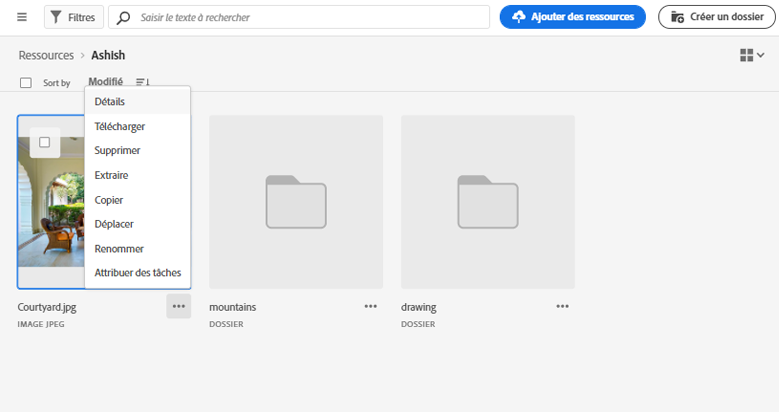
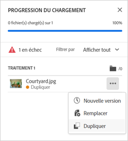
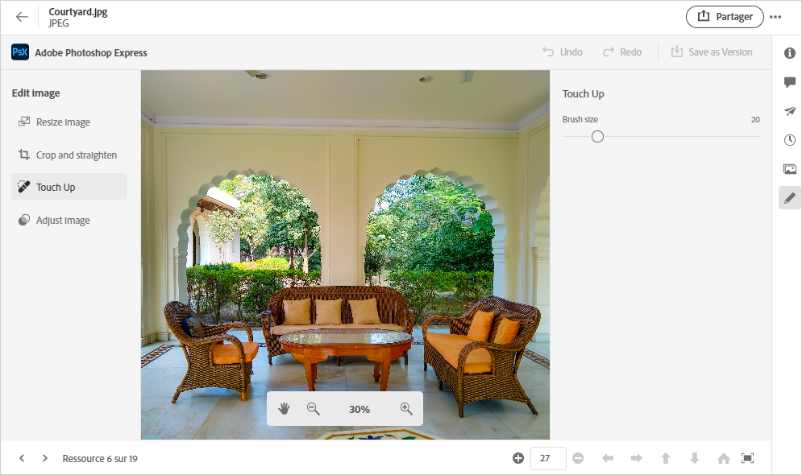
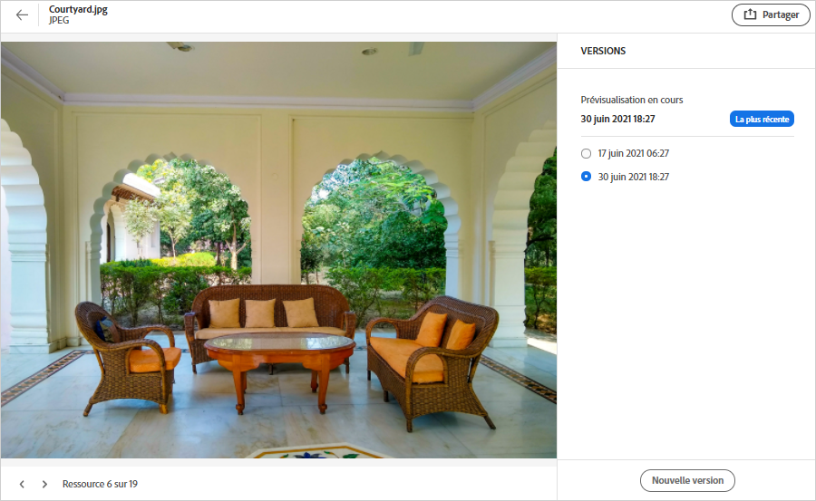
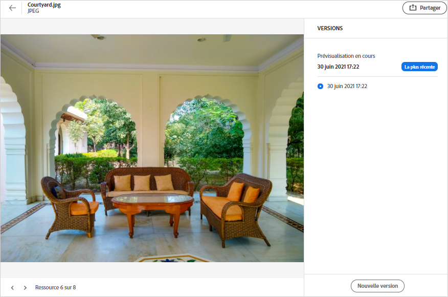

# Gestion des ressources {#manage-assets}

Vous pouvez effectuer facilement diverses tâches de gestion des actifs numériques (DAM) à l’aide de l’interface conviviale de [!DNL Assets Essentials]. Une fois les ressources ajoutées, vous pouvez les rechercher, les télécharger, les déplacer, les copier, les renommer, les supprimer, les mettre à jour et les modifier.

Utilisez [!DNL Assets Essentials] pour accomplir les tâches de gestion des ressources suivantes. Lorsque vous sélectionnez une ressource, les options suivantes s’affichent dans la barre d’outils supérieure.

*Figure : Options disponibles dans la barre d’outils pour une image sélectionnée.*

*  iconDésélectionnez la sélection.
*  iconCliquez pour prévisualiser une ressource et afficher les métadonnées détaillées. Lors de la prévisualisation, vous pouvez afficher les versions et modifier une image.
*  iconTéléchargez la ressource sélectionnée sur votre système de fichiers local.
*  iconSupprimer la ressource ou le dossier sélectionné.
* 

   <!--  --> Checkout an asset.
*  iconCopiez le fichier ou le dossier sélectionné.
*  iconDéplacez la ressource ou le dossier sélectionné vers un autre emplacement de la hiérarchie du référentiel.
*  icon : renommez la ressource ou le dossier sélectionné. Dans le cas contraire, l’utilisation d’un nom unique échoue avec un avertissement. Vous pouvez réessayer avec un nouveau nom.
* 
   <!--  --> Assign tasks to other users to collaborate on an asset.

Vous pouvez afficher les mêmes options sur les miniatures des ressources.

[!DNL Assets Essentials] affiche uniquement les options appropriées de la barre d’outils qui dépendent du type de la ressource sélectionnée.

*Figure : Options disponibles dans la barre d’outils pour un dossier sélectionné.*

*Figure : Options disponibles dans la barre d’outils pour un fichier PDF sélectionné.*

## Téléchargement et distribution de ressources {#download}

Vous pouvez sélectionner une ou plusieurs ressources ou dossiers, ou une combinaison des deux, et télécharger la sélection sur votre système de fichiers local. Vous pouvez modifier les ressources et les charger à nouveau ou les distribuer en dehors de [!DNL Assets Essentials]. Vous pouvez également [télécharger les rendus](/help/add-delete.md#renditions) d’une ressource.

## Contrôle de version des ressources {#versions-of-assets}

<!-- 
TBD: query for engineering: How many versions are maintained. What happens when we reach that limit? Are old versions automatically removed? -->

[!DNL Assets Essentials] versions les ressources lorsque celles-ci sont à nouveau chargées et mises à jour ou modifiées. Vous pouvez afficher l’historique des versions, les versions antérieures et restaurer une version antérieure des ressources en tant que dernière version, qui est restaurée à une version précédente si nécessaire. Les versions de ressources sont créées dans les scénarios suivants :

* Transférez une nouvelle ressource avec le même nom de fichier qu’une ressource existante et dans le même dossier que la ressource existante. [!DNL Assets Essentials] invite à remplacer la ressource précédente ou à enregistrer la nouvelle ressource en tant que version. Voir [Chargement de ressources en double](/help/add-delete.md#resolve-upload-fails).

   

   *Figure : Lors du chargement d’une ressource nommée de la même manière qu’une ressource existante, vous pouvez créer une version de la ressource.*

* Modifiez une image et cliquez sur **[!UICONTROL Enregistrer comme version]**. Voir [modification des images](/help/edit-images.md).

   

   *Figure : Enregistrez l’image modifiée en tant que version.*

* Ouvrez les versions d’une ressource existante. Cliquez sur **[!UICONTROL Nouvelle version]** et téléchargez une version plus récente de la ressource dans le référentiel.

   

### Affichage des versions d’une ressource {#view-versions}

Lors du téléchargement d’une copie en double ou d’une copie modifiée d’une ressource, vous pouvez créer ses versions. Le contrôle de version vous permet de passer en revue les ressources historiques et de revenir à une version précédente si nécessaire.

Pour afficher les versions, ouvrez l’aperçu d’une ressource et cliquez sur **[!UICONTROL Versions]**  dans la barre latérale droite. Pour prévisualiser une version spécifique, sélectionnez-la. Pour y revenir, cliquez sur **[!UICONTROL Dernier]**.

Vous pouvez également créer des versions à partir de la chronologie des versions. Sélectionnez la dernière version, cliquez sur **[!UICONTROL Nouvelle version]**, puis téléchargez une nouvelle copie de la ressource à partir de votre système de fichiers local.

*Figure : Affichez les versions d’une ressource, revenez à une version précédente ou chargez une autre version.*
