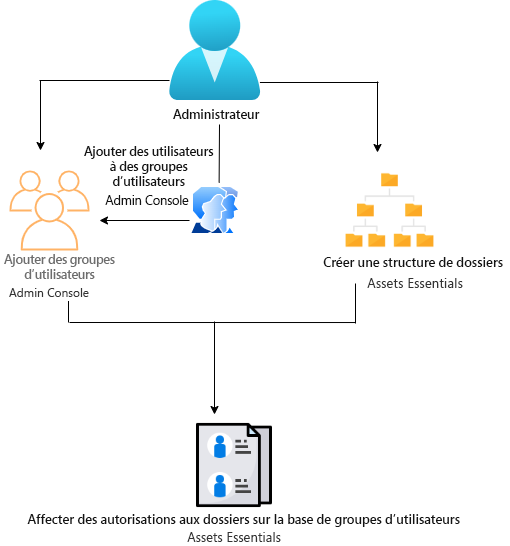
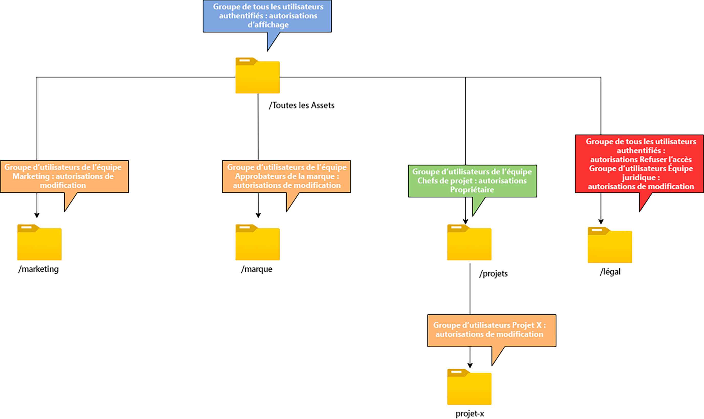

# Gérer les autorisations des dossiers

Grâce à Assets Essentials, les administrateurs peuvent gérer les niveaux d’accès aux dossiers disponibles dans le référentiel. En tant qu’administrateur, vous pouvez créer des groupes d’utilisateurs et leur attribuer des autorisations afin de gérer les niveaux d’accès. Vous pouvez également déléguer les privilèges de gestion des autorisations aux groupes d’utilisateurs au niveau du dossier.

Le diagramme de flux de données suivant illustre la séquence des tâches que vous effectuez pour configurer et gérer les autorisations sur les dossiers disponibles dans le référentiel Assets Essentials :

## Avant de gérer les autorisations pour les dossiers {#before-managing-permissions}

Avant de commencer à gérer les autorisations pour les dossiers dans votre référentiel Assets Essentials, vous devez effectuer certaines tâches, telles que l’ajout d’administrateurs pouvant créer une structure de dossiers logique, créer des groupes d’utilisateurs et gérer les autorisations de dossiers pour divers groupes d’utilisateurs.

### Ajouter des administrateurs {#add-admin-users}

Ajoutez des administrateurs pour l’application Assets Essentials afin qu’ils puissent gérer les autorisations de dossiers pour d’autres groupes d’utilisateurs.

Pour ajouter des administrateurs :

1. Accédez à [Admin Console](https://adminconsole.adobe.com) de votre organisation, cliquez sur **[!UICONTROL Produits]** dans la barre supérieure, puis sur **[!UICONTROL AEM Assets Essentials]**, et enfin sur l’environnement [!DNL Assets Essentials]. [!DNL Assets Essentials] possède trois profils de produits qui représentent l’accès pour les administrateurs, les utilisateurs réguliers et les consommateurs.

   

1. Pour ajouter un utilisateur à un groupe, cliquez sur le groupe Administrateurs d’Assets Essentials, sélectionnez **[!UICONTROL Ajouter un utilisateur]**, fournissez les détails de l’utilisateur, puis cliquez sur **[!UICONTROL Enregistrer]**.

   

   Lorsque vous ajoutez un utilisateur, celui-ci reçoit une invitation par courrier électronique qui lui permet de commencer à l’utilisateur. Vous pouvez désactiver les invitations par e-mail dans les paramètres du profil de produit dans l’[!DNL Admin Console].

1. Pour supprimer un utilisateur d’un groupe, cliquez sur le groupe, sélectionnez un utilisateur existant, puis **[!UICONTROL Supprimer l’utilisateur]**.

### Ajouter des groupes d’utilisateurs {#add-user-groups}

Créez des groupes d’utilisateurs et attribuez des autorisations à ces groupes pour gérer les niveaux d’accès aux dossiers dans le référentiel Assets Essentials. Vous pouvez ensuite affecter vos utilisateurs aux groupes d’utilisateurs.

Vous pouvez ajouter des utilisateurs aux groupes d’utilisateurs (1) et [aux profils de produits Assets Essentials (2)](#add-admin-users). Cependant, vous ne pouvez pas ajouter directement des groupes d’utilisateurs aux profils de produit Assets Essentials (3).

Pour plus d’informations sur la gestion des groupes d’utilisateurs, consultez les sections `Create user groups` et `Edit user groups` sur la page [Gérer les groupes d’utilisateurs](https://helpx.adobe.com/fr/enterprise/using/user-groups.html).

>[!NOTE]
>
>Si Admin Console est configuré pour faire appel à un système de gestion externe des affectations des utilisateurs/groupes, tel que les connecteurs Azure ou Google, l’outil de synchronisation des utilisateurs ou l’API REST User Management, vos affectations de groupes et d’utilisateurs sont configurées automatiquement. Pour plus d’informations, consultez la section [Utilisateurs Adobe Admin Console](https://helpx.adobe.com/fr/enterprise/using/users.html).

### Ajouter des utilisateurs aux groupes {#add-users-to-uesr-groups}

Une fois que vous avez créé des groupes d’utilisateurs, vous pouvez commencer à y ajouter des utilisateurs.

Pour plus d’informations sur la gestion de l’ajout d’utilisateurs aux groupes d’utilisateurs, consultez la section `Add users to groups` de la page [Gérer les groupes d’utilisateurs](https://helpx.adobe.com/fr/enterprise/using/user-groups.html#add-users-to-groups).

### Créer une structure de dossiers {#create-folder-structure}

Pour créer une structure de dossiers dans le référentiel Assets Essentials, utilisez les méthodes suivantes :

* Cliquez sur lʼoption **[!UICONTROL Créer un dossier]** disponible dans la barre d’outils pour créer un dossier vide.

* Cliquez sur lʼoption **[!UICONTROL Ajouter des ressources]** disponible dans la barre d’outils pour [télécharger une structure de dossiers présente sur votre ordinateur local](add-delete.md).

Créez une structure de dossiers qui correspond aux objectifs commerciaux de lʼorganisation. Si vous téléchargez une structure de dossiers existante vers le référentiel Assets Essentials, vous devez vérifier la structure. Pour plus d’informations, consultez la section [Bonnes pratiques relatives à la gestion efficace des autorisations](permission-management-best-practices.md).

## Gérer les autorisations sur les dossiers {#manage-permissions-on-folders}

Vous pouvez attribuer les autorisations suivantes aux groupes d’utilisateurs ou aux utilisateurs. Adobe recommande de ne pas attribuer dʼautorisations aux utilisateurs.

| Nom de l’autorisation | Description |
|-----|------|
| Peut afficher | <ul><li>Accès en lecture à l’affichage et à la navigation des dossiers </li><li>Prévisualiser des ressources</li><li>Télécharger des ressources</li><li>Copier des ressources</li><li>Partager des liens vers des ressources</li><ul> |
| Peut modifier | <ul><li>Tous les privilèges disponibles pour les autorisations Peut afficher </li><li>Créer des dossiers </li><li>Supprimer des dossiers</li><li>Renommer des dossiers</li><li>Créer des ressources</li><li>Mettre à jour des ressources</li><li>Supprimer des ressources</li><li>Déplacer des ressources</li><li>Renommer des ressources</li><ul> |
| Propriétaire | <ul><li>Tous les privilèges disponibles pour les autorisations Peut modifier</li><li>Gérer les autorisations sur un dossier et ses sous-dossiers</li>Cette autorisation permet aux administrateurs de déléguer les droits d’administrateur dʼun dossier et de ses sous-dossiers à d’autres personnes.<ul> |
| Refuser l’accès | Supprime les autorisations Peut afficher, Peut modifier et Propriétaire d’un dossier et de ses sous-dossiers. |

**Autorisations par défaut**

Tous les utilisateurs authentifiés pouvant se connecter à l’application Assets Essentials disposent initialement des autorisations `Can Edit` sur le référentiel Assets Essentials. L’administrateur peut modifier les autorisations par défaut en [modifiant les autorisations pour l’ensemble du référentiel Assets Essentials](#edit-permissions-entire-repository).

**Séquence permettant dʼattribuer les autorisations de dossier aux groupes d’utilisateurs**

Créez des règles pour attribuer des autorisations de dossier aux groupes d’utilisateurs. La séquence utilisée pour attribuer des autorisations à un dossier est importante, car elle détermine l’accès accordé aux groupes d’utilisateurs et in fine aux utilisateurs.

Par exemple, si vous attribuez les autorisations `Can View` pour un dossier à un super groupe et ensuite les autorisations `Can Edit` à son sous-groupe, seuls les membres du sous-groupe disposent des autorisations de modification du dossier. Les utilisateurs du super groupe disposent dʼun accès à lʼaffichage sur le dossier.

Si vous devez accorder des autorisations de modification du dossier `Marketing` uniquement au service marketing de votre organisation et des autorisations dʼaffichage aux autres, attribuez les autorisations `Can View` au super groupe `All Authenticated Users` et les autorisations `Can Edit` à son sous-groupe `Marketing`.

**Héritage des autorisations**

Assets Essentials utilise l’héritage des autorisations : le dossier parent hérite des autorisations définies dans le dossier enfant. Par exemple, si le dossier parent dispose des autorisations `Can View` pour le groupe `All Authenticated Users` et le dossier enfant des autorisations `Can Edit` pour le groupe dʼutilisateurs `Marketing`, lʼhéritage des autorisations permet à tous les utilisateurs authentifiés de disposer des autorisations dʼaffichage pour le dossier enfant et au groupe dʼutilisateurs `Marketing` de disposer des autorisations de modification pour le dossier enfant. Le groupe d’utilisateurs `Marketing` dispose de droits de modification pour les autres niveaux de dossiers situés sous le dossier enfant (Marketing).

>[!NOTE]
>
> Lʼautorisation de refus dʼaccès `Deny Access` accordée à un groupe sur un dossier de niveau supérieur, puis la restauration de cet accès (`Can view`, `Can edit` ou `Owner`) pour ce groupe ou son membre ne sont pas prises en charge. Utilisez lʼautorisation `Deny Access` avec parcimonie.

### Ajouter des autorisations aux groupes d’utilisateurs {#add-permissions}

Pour attribuer des autorisations sur des dossiers à un groupe, procédez comme suit :

1. Sélectionnez le dossier et cliquez sur **[!UICONTROL Gérer les autorisations]**.

1. Dans la boîte de dialogue **[!UICONTROL Gestion des autorisations]**, saisissez le nom du groupe ou d’un utilisateur dans le champ **[!UICONTROL Groupes et utilisateurs]**.

1. Sélectionnez le [niveau d’accès](#manage-permissions-folders) dans la liste déroulante **[!UICONTROL Accès]**.

1. Cliquez sur **[!UICONTROL Ajouter]** pour apporter une modification immédiate aux autorisations accordées à l’utilisateur ou au groupe d’utilisateurs.

1. Répétez les étapes 1 à 3 pour ajouter d’autres règles à la boîte de dialogue **[!UICONTROL Gestion des autorisations]**.

   

   >[!NOTE]
   >
   > L’ordre dans lequel vous attribuez des autorisations à un dossier est important et détermine l’accès disponible pour les groupes d’utilisateurs et éventuellement les utilisateurs ajoutés aux groupes.

   Si vous gérez des autorisations pour plusieurs dossiers, vous pouvez également sélectionner n’importe quel autre dossier dans le volet de gauche et commencer à gérer les autorisations pour ce dossier.

1. Cliquez sur **[!UICONTROL Fermer]**.

>[!CAUTION]
>
> Il est recommandé de gérer les autorisations des groupes d’utilisateurs plutôt que des utilisateurs individuels. Paramétrer l’autorisation `Deny access` n’est pris en charge que pour les groupes d’utilisateurs, mais pas pour les utilisateurs individuels.

### Modifier les autorisations affectées à des groupes d’utilisateurs {#edit-permissions}

Pour modifier les autorisations affectées aux groupes d’utilisateurs sur des dossiers :

1. Sélectionnez le dossier et cliquez sur **[!UICONTROL Gestion des autorisations]**.

1. Dans la boîte de dialogue **[!UICONTROL Gestion des autorisations]**, modifiez le [niveau d’accès](#manage-permissions-folders) de la liste déroulante **[!UICONTROL Accès]**.

1. [Ajoutez d’autres groupes d’utilisateurs ou utilisateurs](#add-permissions) aux règles d’autorisation existantes, si nécessaire.

1. Cliquez sur X pour supprimer les autorisations affectées à un groupe d’utilisateurs.

### Modifier les autorisations pour l’ensemble du référentiel Assets Essentials {#edit-permissions-entire-repository}

Un administrateur d’applications peut modifier les autorisations de l’ensemble du référentiel Assets Essentials à partir d’une valeur `Can Edit` par défaut à tout autre niveau d’accès.

Pour modifier les autorisations pour l’ensemble du référentiel Assets Essentials :

1. Sélectionnez un dossier et cliquez sur **[!UICONTROL Gestion des autorisations]**.

1. Dans la boîte de dialogue **[!UICONTROL Gestion des autorisations]**, cliquez sur **[!UICONTROL Toutes les ressources]** dans le rail de gauche.

1. [Modifiez les autorisations](#edit-permissions) et fermez la boîte de dialogue.

>[!NOTE]
>
>Un administrateur ne peut pas sélectionner le niveau d’autorisation `Deny Access` pour l’ensemble du référentiel Assets Essentials afin de s’assurer que les utilisateurs disposent au moins d’un accès en lecture à l’application. De même, `All Authenticated Users` disposent au moins des autorisations de lecture sur le référentiel, même si l’administrateur supprime explicitement les autorisations `Can Edit` dans la boîte de dialogue [!UICONTROL Gestion des autorisations].

## Exemples de gestion efficace des autorisations {#example-permission-management}

**Cas d’utilisation**

* Tous les groupes Utilisateurs authentifiés disposent d’un accès en mode d’affichage au référentiel.
* Les groupes d’utilisateurs spécifiques à l’équipe disposent des autorisations de modification dans le dossier spécifique à leur fonction.
* Le dossier légal n’est disponible pour aucun utilisateur authentifié, à l’exception de l’équipe juridique.

Créez les groupes d’utilisateurs suivants dans Admin Console :

* Équipe marketing

* Équipe d’approbateurs de marques

* Équipe des chefs de projet

* Équipe du projet X

* Équipe juridique

Le diagramme suivant illustre la hiérarchie des dossiers et les autorisations attribuées à chaque groupe d’utilisateurs :

Voici les niveaux d’accès pour tous les groupes d’utilisateurs dans la hiérarchie des dossiers :

* /All Assets : l’administrateur modifie les autorisations au niveau racine à partir de la valeur par défaut `Can Edit` en `Can View`. Tous les utilisateurs peuvent afficher des dossiers et des ressources, mais ne peuvent pas les modifier.

* /marketing : tous les utilisateurs peuvent afficher les dossiers et leurs sous-dossiers en fonction de l’héritage des autorisations. Toutefois, le groupe d’utilisateurs de l’équipe marketing dispose des autorisations de modification sur le dossier.

* /brand : tous les utilisateurs peuvent afficher les dossiers et leurs sous-dossiers en fonction de l’héritage des autorisations. Toutefois, le groupe d’utilisateurs Équipe d’approbateurs de marque dispose des autorisations de modification sur le dossier.

* /projects : tous les utilisateurs peuvent afficher les dossiers et leurs sous-dossiers en fonction de l’héritage des autorisations. Le groupe d’utilisateurs de l’équipe Chefs de projet dispose :

   * Des autorisations de modification

   * Des autorisations de propriétaire : gérer les autorisations sur un dossier et ses sous-dossiers.

* /projects/project-x : tous les utilisateurs peuvent afficher les dossiers et leurs sous-dossiers. Le groupe d’utilisateurs de l’équipe Chefs de projet dispose des autorisations de modification et peut gérer les autorisations d’un dossier et de ses sous-dossiers (autorisations de propriétaire). Le groupe d’utilisateurs de l’équipe du projet X dispose des autorisations de modification.

* /legal : aucun des utilisateurs ne peut accéder au dossier d’après les autorisations `Deny Access` pour le groupe `All Authenticated Users`. Le groupe d’utilisateurs de l’équipe juridique dispose d’autorisations de modification.
