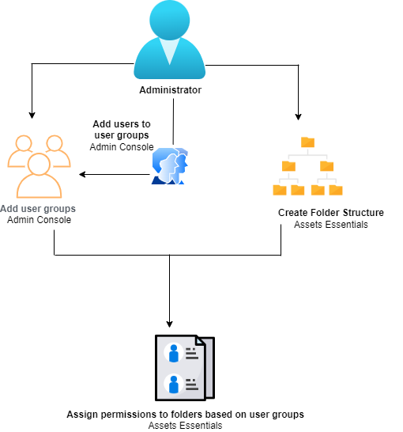
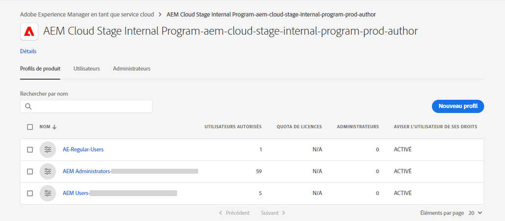
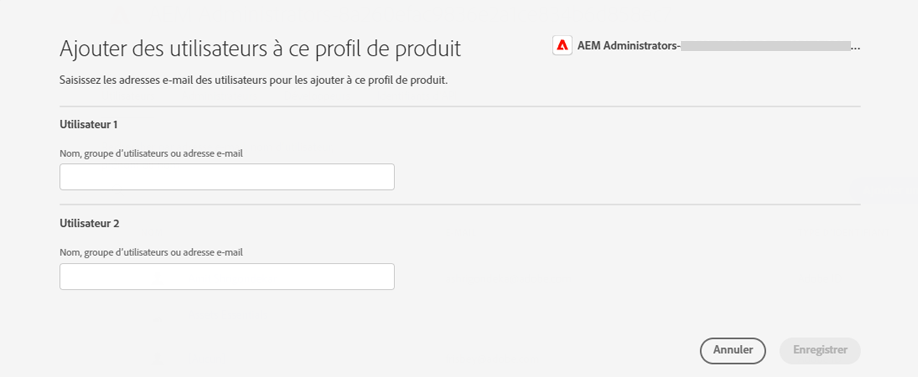
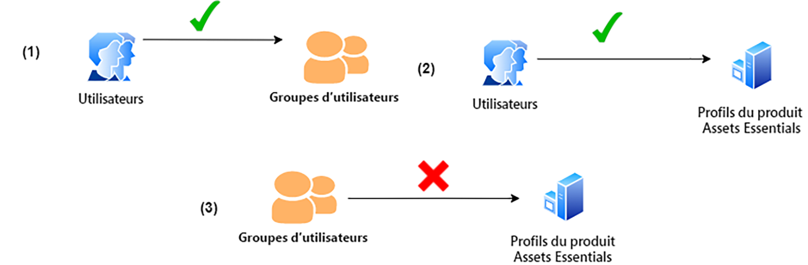
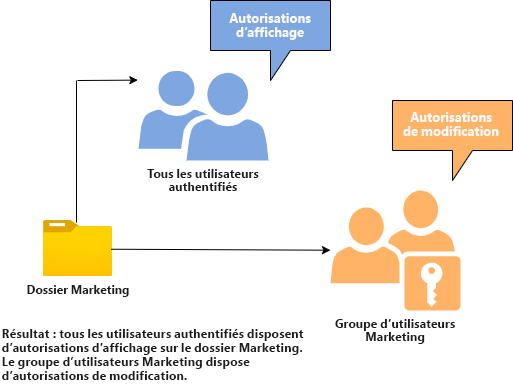
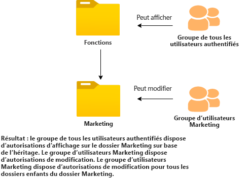
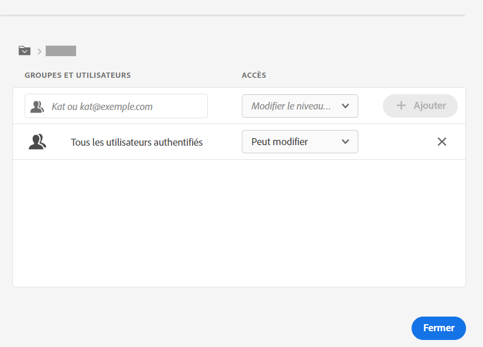
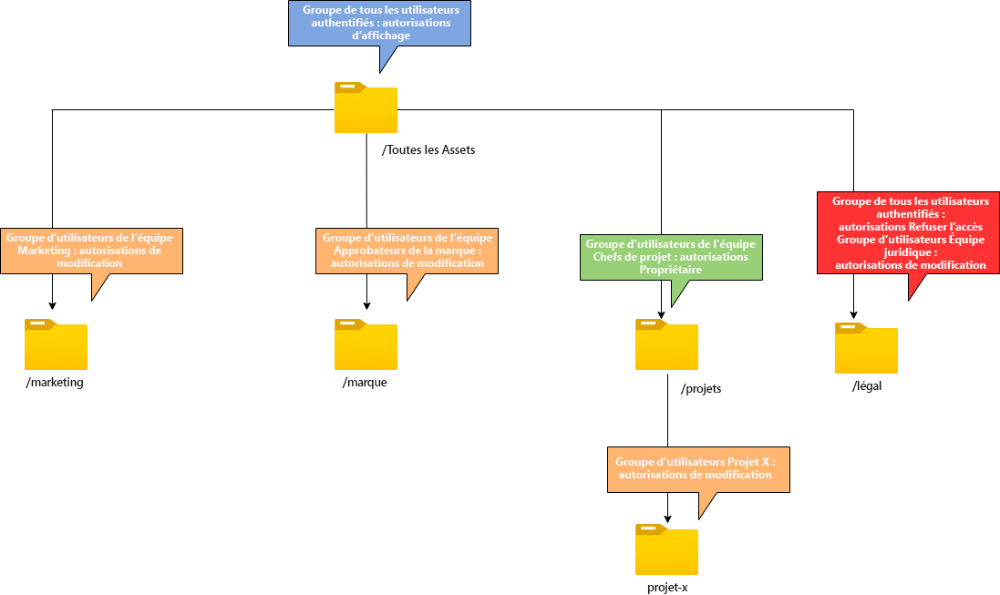

# Gestion des autorisations pour les dossiers

Assets Essentials permet aux administrateurs de gérer les niveaux d’accès pour les dossiers disponibles dans le référentiel. En tant qu’administrateur, vous pouvez créer des groupes d’utilisateurs et leur attribuer des autorisations afin de gérer les niveaux d’accès. Vous pouvez également déléguer les privilèges de gestion des autorisations aux groupes d’utilisateurs au niveau du dossier.

Le diagramme de flux de données suivant illustre la séquence des tâches que vous effectuez pour configurer et gérer les autorisations sur les dossiers disponibles dans le référentiel Assets Essentials :

## Avant de gérer les autorisations des dossiers {#before-managing-permissions}

Avant de commencer à gérer les autorisations pour les dossiers de votre référentiel Assets Essentials, vous devez effectuer certaines tâches, telles que l’ajout d’administrateurs pouvant créer une structure de dossiers logique, créer des groupes d’utilisateurs et gérer les autorisations de dossiers pour divers groupes d’utilisateurs.

### Ajout d’administrateurs {#add-admin-users}

Ajoutez des administrateurs pour l’application Assets Essentials afin qu’ils puissent gérer les autorisations de dossiers pour d’autres groupes d’utilisateurs.

Pour ajouter des administrateurs :

1. Accès [Admin Console](https://adminconsole.adobe.com) pour votre organisation, cliquez sur **[!UICONTROL Produits]** dans la barre supérieure, cliquez sur **[!UICONTROL AEM Assets Essentials]**, puis cliquez sur [!DNL Assets Essentials] environnement. [!DNL Assets Essentials] comporte trois profils de produit qui représentent l’accès pour les administrateurs, les utilisateurs réguliers et les utilisateurs consommateurs.

   

1. Pour ajouter un utilisateur à un groupe, cliquez sur le groupe Administrateurs Assets Essentials , puis sélectionnez **[!UICONTROL Ajouter un utilisateur]**, fournissez les détails de l’utilisateur, puis cliquez sur **[!UICONTROL Enregistrer]**.

   

   Lorsque vous ajoutez un utilisateur, celui-ci reçoit une invitation par courrier électronique qui lui permet de commencer à l’utilisateur. Vous pouvez désactiver les invitations par e-mail dans les paramètres du profil de produit dans l’[!DNL Admin Console].

1. Pour supprimer un utilisateur d’un groupe, cliquez sur le groupe, sélectionnez un utilisateur existant, puis **[!UICONTROL Supprimer l’utilisateur]**.

### Ajout de groupes d’utilisateurs {#add-user-groups}

Créez des groupes d’utilisateurs et attribuez des autorisations à ces groupes pour gérer les niveaux d’accès aux dossiers dans le référentiel Assets Essentials. Vous pouvez ensuite affecter vos utilisateurs aux groupes d’utilisateurs.

Vous pouvez ajouter des utilisateurs à des groupes d’utilisateurs (1) et [Utilisateurs vers les profils de produit Assets Essentials (2)](#add-admin-users). Cependant, vous ne pouvez pas ajouter directement des groupes d’utilisateurs aux profils de produit Assets Essentials (3).

Pour plus d’informations sur la gestion des groupes d’utilisateurs, voir `Create user groups` et `Edit user groups` disponible à l’adresse [Gestion des groupes d’utilisateurs](https://helpx.adobe.com/enterprise/using/user-groups.html).

>[!NOTE]
>
>Si votre Admin Console est configuré pour exploiter un système externe afin de gérer les affectations d’utilisateurs/de groupes, tels que les connecteurs Azure ou Google, l’outil de synchronisation des utilisateurs ou l’API REST User Management, vos groupes et affectations d’utilisateurs sont configurés automatiquement. Pour plus d’informations, voir [Utilisateurs de Adobe Admin Console](https://helpx.adobe.com/enterprise/using/users.html).

### Ajout d’utilisateurs à des groupes {#add-users-to-uesr-groups}

Après avoir créé des groupes d’utilisateurs, vous pouvez commencer à ajouter des utilisateurs à des groupes d’utilisateurs.

Pour plus d’informations sur la gestion de l’ajout d’utilisateurs à des groupes d’utilisateurs, voir `Add users to groups` disponible à l’adresse [Gestion des groupes d’utilisateurs](https://helpx.adobe.com/in/enterprise/using/user-groups.html#add-users-to-groups).

### Création d’une structure de dossiers {#create-folder-structure}

Vous pouvez utiliser les méthodes suivantes pour créer une structure de dossiers dans le référentiel Assets Essentials :

* Cliquez sur le bouton **[!UICONTROL Créer un dossier]** option disponible dans la barre d’outils pour créer un dossier vide.

* Cliquez sur **[!UICONTROL Ajouter des ressources]** option disponible dans la barre d’outils pour [charger une structure de dossiers disponible sur votre ordinateur local](add-delete.md).

Créez une structure de dossiers qui fonctionne bien avec les objectifs de l’entreprise. Si vous téléchargez une structure de dossiers existante vers le référentiel Assets Essentials, vous devez examiner la structure. Pour plus d’informations, voir [Bonnes pratiques relatives à la gestion efficace des autorisations](permission-management-best-practices.md).

## Gestion des autorisations sur les dossiers {#manage-permissions-folders}

Vous pouvez attribuer les autorisations suivantes aux groupes d’utilisateurs ou aux utilisateurs. Adobe ne recommande pas d’attribuer des autorisations aux utilisateurs.

| Nom de l’autorisation | Description |
|-----|------|
| Peut afficher | <ul><li>Accès en lecture à l’affichage et à la navigation des dossiers </li><li>Aperçu des ressources</li><li>Téléchargement de ressources</li><li>Copie de ressources</li><li>Partage de liens vers des ressources</li><ul> |
| Peut modifier | <ul><li>Tous les privilèges disponibles pour les autorisations Peut afficher </li><li>Création de dossiers </li><li>Suppression de dossiers</li><li>Renommer des dossiers</li><li>Création de ressources</li><li>Mise à jour de ressources</li><li>Suppression de ressources</li><li>Déplacement de ressources</li><li>Renommer des ressources</li><ul> |
| Propriétaire | <ul><li>Tous les privilèges disponibles pour les autorisations Peut modifier</li><li>Gestion des autorisations sur un dossier et ses sous-dossiers</li>Cette autorisation permet aux administrateurs de déléguer les privilèges d’administrateur à d’autres personnes pour un dossier et ses sous-dossiers.<ul> |
| Refuser l’accès | Supprimer les autorisations Peut afficher, Peut modifier et Propriétaire d’un dossier et de ses sous-dossiers. |

**Autorisations par défaut**

Tous les utilisateurs authentifiés et pouvant se connecter à l’application Assets Essentials ont `Can Edit` autorisations initialement accordées au référentiel Assets Essentials. L’administrateur peut modifier les autorisations par défaut en [modification des autorisations pour l’ensemble du référentiel Assets Essentials](#edit-permissions-entire-repository).

**Séquence d’affectation d’autorisations de dossier aux groupes d’utilisateurs**

Créez des règles pour attribuer des autorisations de dossier aux groupes d’utilisateurs. La séquence que vous utilisez pour attribuer des autorisations à un dossier est importante et détermine l’accès disponible pour les groupes d’utilisateurs et éventuellement les utilisateurs.

Par exemple, si vous affectez la variable `Can View` autorisations d’un dossier pour un super-groupe, puis attribuer des autorisations `Can Edit` autorisations pour son sous-groupe, seuls les membres du sous-groupe disposent d’autorisations de modification pour le dossier. Les utilisateurs du super groupe ont un accès en vue au dossier.

Si vous devez accorder des autorisations de modification à la variable `Marketing` dossier uniquement au service marketing de votre entreprise et afficher les autorisations d’autres utilisateurs, affecter `Can View` autorisations de super-groupe `All Authenticated Users` et `Can Edit` autorisations pour son sous-groupe `Marketing`.

**Héritage des autorisations**

Assets Essentials utilise l’héritage des autorisations, qui vous permet d’hériter des autorisations définies pour le dossier parent dans le dossier enfant. Par exemple, si le dossier parent contient `Can View` les autorisations de la variable `All Authenticated Users` et que le dossier enfant contient `Can Edit` les autorisations de la variable `Marketing` groupe d’utilisateurs, il permet à tous les utilisateurs authentifiés d’avoir des autorisations d’affichage pour le dossier enfant et le `Marketing` groupe d’utilisateurs pour disposer des autorisations de modification du dossier enfant. Le `Marketing` Ce groupe d’utilisateurs dispose des autorisations de modification pour d’autres niveaux de dossiers sous le dossier enfant (Marketing).

>[!NOTE]
>
> Définition d’une variable `Deny Access` autorisations d’un groupe sur un dossier de niveau supérieur, puis restauration de l’accès (`Can view`, `Can edit` ou `Owner`) pour ce groupe ou son membre n’est pas pris en charge. Utilisation `Deny Access` avec parcimonie.

### Ajout d’autorisations aux groupes d’utilisateurs {#add-permissions}

Pour attribuer des autorisations de groupe à des dossiers :

1. Sélectionnez le dossier et cliquez sur **[!UICONTROL Gestion des autorisations]**.

1. Sur le **[!UICONTROL Gestion des autorisations]** , spécifiez le nom du groupe ou d’un utilisateur dans la **[!UICONTROL Groupes et utilisateurs]** champ .

1. Sélectionnez la [niveau d&#39;accès](#manage-permissions-folders) de la **[!UICONTROL Accès]** liste déroulante

1. Cliquez sur **[!UICONTROL Ajouter]** pour apporter une modification immédiate aux autorisations de l’utilisateur ou du groupe d’utilisateurs.

1. Répétez les étapes 1 à 3 pour ajouter d’autres règles au **[!UICONTROL Gestion des autorisations]** boîte de dialogue.

   

   >[!NOTE]
   >
   > L’ordre dans lequel vous attribuez des autorisations à un dossier est important et détermine l’accès disponible pour les groupes d’utilisateurs et éventuellement les utilisateurs ajoutés aux groupes.

   Si vous gérez des autorisations pour plusieurs dossiers, vous pouvez également sélectionner n’importe quel autre dossier dans le volet de gauche et commencer à gérer les autorisations pour ce dossier.

1. Cliquez sur **[!UICONTROL Fermer]**.

>[!CAUTION]
>
> Il est recommandé de gérer les autorisations des groupes d’utilisateurs plutôt que des utilisateurs individuels. La définition de la variable `Deny access` La permission n’est prise en charge que pour les groupes d’utilisateurs, mais pas pour les utilisateurs individuels.

### Modification des autorisations affectées à des groupes d’utilisateurs {#edit-permissions}

Pour modifier les autorisations affectées aux groupes d’utilisateurs sur des dossiers :

1. Sélectionnez le dossier et cliquez sur **[!UICONTROL Gestion des autorisations]**.

1. Sur le **[!UICONTROL Gestion des autorisations]** , modifiez la boîte de dialogue [niveau d&#39;accès](#manage-permissions-folders) de la **[!UICONTROL Accès]** liste déroulante

1. [Ajouter d’autres groupes d’utilisateurs ou utilisateurs](#add-permissions) aux règles d’autorisation existantes, si nécessaire.

1. Cliquez sur X pour supprimer les autorisations affectées à un groupe d’utilisateurs.

### Modifier les autorisations pour l’ensemble du référentiel Assets Essentials {#edit-permissions-entire-repository}

Un administrateur d’applications peut modifier les autorisations de l’ensemble du référentiel Assets Essentials à partir d’une valeur par défaut. `Can Edit` à tout autre niveau d’accès.

Pour modifier les autorisations pour l’ensemble du référentiel Assets Essentials :

1. Sélectionnez un dossier et cliquez sur **[!UICONTROL Gestion des autorisations]**.

1. Sur le **[!UICONTROL Gestion des autorisations]** boîte de dialogue, cliquez sur **[!UICONTROL Toutes les ressources]** dans le rail de gauche.

1. [Modifier les autorisations](#edit-permissions) et fermez la boîte de dialogue.

>[!NOTE]
>
>Un administrateur ne peut pas sélectionner la variable `Deny Access` niveau d’autorisation pour l’ensemble du référentiel Assets Essentials afin de s’assurer que les utilisateurs disposent au moins d’un accès en lecture à l’application. De même, `All Authenticated Users` disposer au moins des autorisations de lecture sur le référentiel, même si l’administrateur supprime explicitement la variable `Can Edit` les autorisations de la variable [!UICONTROL Gestion des autorisations] boîte de dialogue.

## Exemples de gestion efficace des autorisations {#example-permission-management}

**Cas d’utilisation**

* Tous les groupes Utilisateurs authentifiés disposent d’un accès en mode d’affichage au référentiel.
* Les groupes d’utilisateurs spécifiques à l’équipe disposent des autorisations de modification dans leur propre dossier spécifique à la fonction.
* Le dossier légal n’est disponible pour aucun utilisateur authentifié, à l’exception de l’équipe juridique.

Créez les groupes d’utilisateurs suivants dans Admin Console :

* Équipe marketing

* Équipe d’approbateurs de marques

* Équipe des chefs de projet

* Équipe du projet X

* Équipe juridique

Le diagramme suivant illustre la hiérarchie de dossiers et les autorisations attribuées à chaque groupe d’utilisateurs :

Voici les niveaux d’accès pour tous les groupes d’utilisateurs dans la hiérarchie de dossiers :

* /All Assets : L’administrateur modifie les autorisations au niveau racine à partir de la valeur par défaut. `Can Edit` to `Can View`. Tous les utilisateurs peuvent afficher des dossiers et des ressources, mais ne peuvent pas les modifier.

* /marketing: Tous les utilisateurs peuvent afficher les dossiers et leurs sous-dossiers en fonction de l’héritage des autorisations. Toutefois, le groupe d’utilisateurs de l’équipe marketing dispose des autorisations de modification sur le dossier.

* /brand : Tous les utilisateurs peuvent afficher les dossiers et leurs sous-dossiers en fonction de l’héritage des autorisations. Toutefois, le groupe d’utilisateurs Équipe d’approbateurs de marque dispose des autorisations de modification sur le dossier.

* /projects : Tous les utilisateurs peuvent afficher les dossiers et leurs sous-dossiers en fonction de l’héritage des autorisations. Le groupe d’utilisateurs de l’équipe des chefs de projet comprend :

   * Modifier les autorisations

   * Autorisations de propriétaire : Gérez les autorisations sur un dossier et ses sous-dossiers.

* /projects/project-x : Tous les utilisateurs peuvent afficher les dossiers et leurs sous-dossiers. Le groupe d’utilisateurs de l’équipe Chefs de projet dispose des autorisations de modification et peut gérer les autorisations d’un dossier et de ses sous-dossiers (autorisations de propriétaire). Le groupe d’utilisateurs de l’équipe du projet X dispose des autorisations de modification.

* /legal : Aucun des utilisateurs ne peut accéder au dossier en fonction de la variable `Deny Access` autorisations pour `All Authenticated Users` groupe. Le groupe d’utilisateurs de l’équipe juridique dispose d’autorisations de modification.
