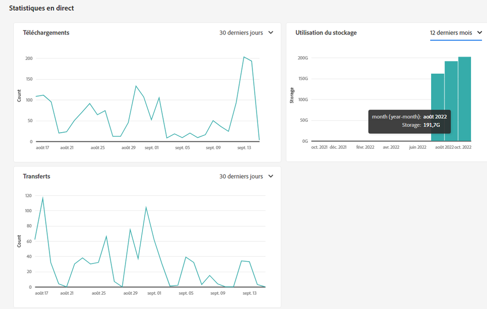
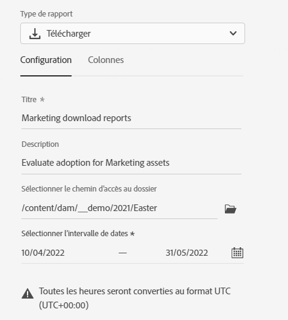
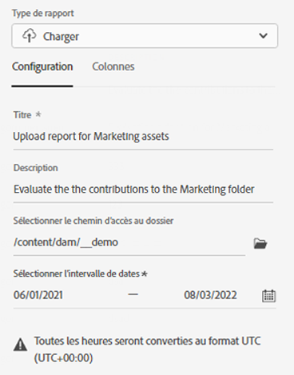
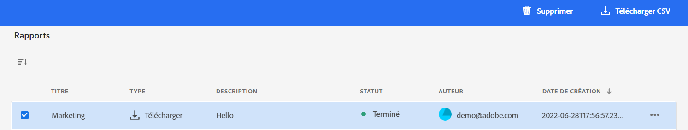

# Gérer les rapports {#manage-reports}

Les rapports de ressources offrent aux administrateurs une visibilité sur l’activité de l’environnement Adobe Experience Manager Assets Essentials. Ces données fournissent des informations utiles sur la façon dont les utilisateurs interagissent avec le contenu et le produit.

## Accéder aux rapports {#access-reports}

Tous les utilisateurs affectés au [profil de produit Administrateurs d’Assets Essentials](deploy-administer.md) peuvent accéder au tableau de bord des statistiques dynamiques ou créer des rapports définis par l’utilisateur dans Assets Essentials.

## Afficher les statistiques dynamiques {#view-live-statistics}

Assets Essentials vous permet d’afficher des données en temps réel pour votre environnement Assets Essentials à l’aide du tableau de bord Statistiques dynamiques. Vous pouvez afficher les mesures d’événement en temps réel au cours des 30 derniers jours ou au cours des 12 derniers mois.

Cliquez sur **[!UICONTROL Statistiques en direct]** disponibles dans le volet de navigation de gauche pour afficher les graphiques générés automatiquement suivants :

* **Téléchargements** : nombre de ressources téléchargées à partir de l’environnement Assets Essentials au cours des 30 derniers jours ou 12 derniers mois, représentées à l’aide d’un graphique en courbes.

* **Transferts** : nombre de ressources chargées dans l’environnement Assets Essentials au cours des 30 derniers jours ou 12 derniers mois, représentées à l’aide d’un graphique en courbes.

* **Utilisation du stockage** : l’utilisation du stockage, en gigaoctets (Go), pour l’environnement Assets Essentials, au cours des 30 derniers jours ou 12 derniers mois a été représentée à l’aide d’un graphique à barres.

## Créer un rapport de téléchargement {#create-download-report}

Pour créer un rapport de téléchargement, procédez comme suit :

1. Accédez à **[!UICONTROL Paramètres]** > **[!UICONTROL Rapports]** et cliquez sur **[!UICONTROL Créer un rapport]**.

1. Sous l’onglet [!UICONTROL Configuration], définissez le type de rapport comme **[!UICONTROL Téléchargement]**.

1. Entrez un titre et une description facultative pour le rapport.

1. Sélectionnez le chemin d’accès au dossier, qui contient les ressources sur lesquelles portera le rapport, à l’aide du champ **[!UICONTROL Sélectionner le chemin d’accès au dossier]**.

1. Sélectionnez la période du rapport.
   >[!NOTE]
   >
   > Assets Essentials convertit tous les fuseaux horaires locaux en temps universel coordonné (UTC).

1. Sous l’onglet [!UICONTROL Colonnes], sélectionnez les noms des colonnes à afficher dans le rapport.

1. Cliquez sur **[!UICONTROL Créer]**.

   

Le tableau suivant décrit l’utilisation de toutes les colonnes que vous pouvez ajouter au rapport :

<table>
    <tbody>
     <tr>
      <th><strong>Nom de la colonne</strong></th>
      <th><strong>Description</strong></th>
     </tr>
     <tr>
      <td>Titre</td>
      <td>Titre de la ressource.</td>
     </tr>
     <tr>
      <td>Chemin </td>
      <td>Chemin d’accès au dossier qui contient la ressource dans Assets Essentials.</td>
     </tr>
     <tr>
      <td>Type MIME</td>
      <td>Type MIME de la ressource.</td>
     </tr>
     <tr>
      <td>Taille</td>
      <td>Taille de la ressource en octets.</td>
     </tr>
     <tr>
      <td>Téléchargé par</td>
      <td>ID d’e-mail de l’utilisateur qui a téléchargé la ressource.</td>
     </tr>
     <tr>
      <td>Date de téléchargement</td>
      <td>Date à laquelle la ressource a été téléchargée.</td>
     </tr>
     <tr>
      <td>Créateur ou créatrice</td>
      <td>Le créateur ou la créatrice de la ressource.</td>
     </tr>
     <tr>
      <td>Date de création</td>
      <td>Date à laquelle la ressource a été chargée dans Assets Essentials.</td>
     </tr>
     <tr>
      <td>Date de modification</td>
      <td>Date de dernière modification de la ressource.</td>
     </tr>
     <tr>
      <td>Expiré</td>
      <td>Statut d’expiration de la ressource.</td>
     </tr>
     <tr>
      <td>Téléchargé par « Nom d’utilisateur »</td>
      <td>Nom de l’utilisateur qui a téléchargé la ressource.</td>
     </tr>           
    </tbody>
   </table>

## Créer un rapport de chargement {#create-upload-report}

Pour créer un rapport de chargement, procédez comme suit :

1. Accédez à **[!UICONTROL Paramètres]** > **[!UICONTROL Rapports]** et cliquez sur **[!UICONTROL Créer un rapport]**.

1. Sous l’onglet [!UICONTROL Configuration], définissez le type de rapport comme **[!UICONTROL Chargement]**.

1. Entrez un titre et une description facultative pour le rapport.

1. Sélectionnez le chemin d’accès au dossier, qui contient les ressources sur lesquelles portera le rapport, à l’aide du champ **[!UICONTROL Sélectionner le chemin d’accès au dossier]**.

1. Sélectionnez la période du rapport.

1. Sous l’onglet [!UICONTROL Colonnes], sélectionnez les noms des colonnes à afficher dans le rapport.

1. Cliquez sur **[!UICONTROL Créer]**.

   

Le tableau suivant décrit l’utilisation de toutes les colonnes que vous pouvez ajouter au rapport :

<table>
    <tbody>
     <tr>
      <th><strong>Nom de la colonne</strong></th>
      <th><strong>Description</strong></th>
     </tr>
     <tr>
      <td>Titre</td>
      <td>Titre de la ressource.</td>
     </tr>
     <tr>
      <td>Chemin </td>
      <td>Chemin d’accès au dossier qui contient la ressource dans Assets Essentials.</td>
     </tr>
     <tr>
      <td>Type MIME</td>
      <td>Type MIME de la ressource.</td>
     </tr>
     <tr>
      <td>Taille</td>
      <td>Taille de la ressource.</td>
     </tr>
     <tr>
      <td>Créateur ou créatrice</td>
      <td>Le créateur ou la créatrice de la ressource.</td>
     </tr>
     <tr>
      <td>Date de création</td>
      <td>Date à laquelle la ressource a été chargée dans Assets Essentials.</td>
     </tr>
     <tr>
      <td>Date de modification</td>
      <td>Date de dernière modification de la ressource.</td>
     </tr>
     <tr>
      <td>Expiré</td>
      <td>Statut d’expiration de la ressource.</td>
     </tr>              
    </tbody>
   </table>

## Affichage des rapports existants {#view-report-list}

Une fois l’étape de [création du rapport](#create-download-report) effectuée, vous pouvez consulter la liste des rapports existants et choisir de les télécharger au format CSV ou de les supprimer.

Pour afficher la liste des rapports, accédez à **[!UICONTROL Paramètres]** > **[!UICONTROL Rapports]**.

Pour chaque rapport, vous pouvez afficher les éléments suivants : le titre, le type, la description spécifiée lors de la création, le statut, l’ID d’e-mail du créateur ou de la créatrice et la date de création.

Le statut `Completed ` du rapport indique que celui-ci est prêt à être téléchargé.

## Télécharger un rapport au format CSV {#download-csv-report}

Pour télécharger un rapport au format CSV, procédez comme suit :

1. Accédez à **[!UICONTROL Paramètres]** > **[!UICONTROL Rapports]**.

1. Sélectionnez un rapport, puis cliquez sur **[!UICONTROL Télécharger CSV]**.

Le rapport sélectionné sera téléchargé au format CSV. Les colonnes affichées dans le rapport CSV dépendent des colonnes que vous sélectionnez lors de la [création du rapport](#create-download-report).

## Supprimer un rapport {#delete-report}

Pour supprimer un rapport :

1. Accédez à **[!UICONTROL Paramètres]** > **[!UICONTROL Rapports]**.

1. Sélectionnez un rapport, puis cliquez sur **[!UICONTROL Supprimer]**.

1. Cliquez à nouveau sur **[!UICONTROL Supprimer]** pour confirmer.
