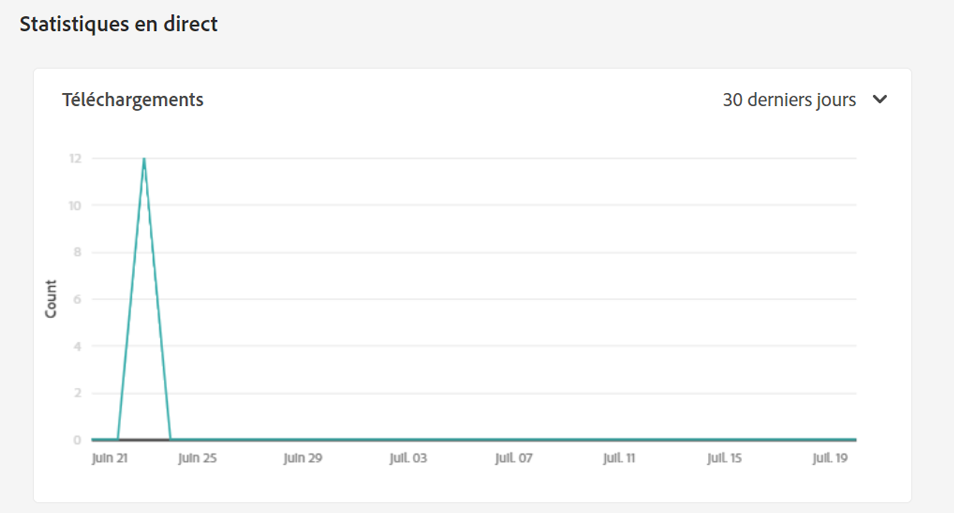

# Gestion des rapports {#manage-reports}

Les rapports de ressources permettent aux administrateurs d’évaluer l’utilité du déploiement de Adobe Experience Manager Assets Essentials. Les rapports fournissent des informations utiles sur la manière dont les utilisateurs interagissent avec les ressources disponibles dans votre déploiement.

Utilisez les informations contenues dans les rapports pour obtenir des mesures de succès clés afin de mesurer l’adoption d’Assets au sein de votre entreprise et par les clients.

## Accès aux rapports {#access-reports}

Tous les utilisateurs affectés à la variable [Profil de produit des administrateurs Assets Essentials](deploy-administer.md) peuvent accéder aux statistiques et rapports en direct dans Assets Essentials.

## Affichage des statistiques en direct {#view-live-statistics}

Assets Essentials vous permet d’afficher les données de téléchargement générées automatiquement pour votre déploiement Assets Essentials. Vous pouvez choisir d’afficher le nombre de téléchargements de ressources effectués au cours des 30 derniers jours ou au cours des 12 derniers mois.

Accédez à **[!UICONTROL Paramètres]** > **[!UICONTROL Statistiques en direct]** pour afficher les données de téléchargement générées automatiquement.

## Créer un rapport {#create-report}

Pour créer un rapport :

1. Accédez à **[!UICONTROL Paramètres]** > **[!UICONTROL Rapports]** et cliquez sur **[!UICONTROL Créer un rapport]**.

1. Dans le [!UICONTROL Configuration] , indiquez un titre et une description facultative du rapport.

1. Sélectionnez le chemin du dossier, qui comprend les ressources sur lesquelles exécuter le rapport, à l’aide de la variable **[!UICONTROL Sélectionner le chemin du dossier]** champ .

1. Sélectionnez l’intervalle de dates du rapport.

1. Dans le [!UICONTROL Colonnes] sélectionnez les noms des colonnes à afficher dans le rapport.

1. Cliquez sur **[!UICONTROL Créer]**.

   

Le tableau suivant explique l’utilisation de toutes les colonnes que vous pouvez ajouter au rapport :

<table>
    <tbody>
     <tr>
      <th><strong>Nom de la colonne</strong></th>
      <th><strong>Description</strong></th>
     </tr>
     <tr>
      <td>Titre</td>
      <td>Titre de la ressource.</td>
     </tr>
     <tr>
      <td>Chemin </td>
      <td>Chemin du dossier dans lequel la ressource est disponible dans Assets Essentials.</td>
     </tr>
     <tr>
      <td>Type</td>
      <td>Type MIME de la ressource.</td>
     </tr>
     <tr>
      <td>Taille</td>
      <td>Taille de la ressource.</td>
     </tr>
     <tr>
      <td>Téléchargé par</td>
      <td>ID de courrier électronique de l’utilisateur qui a téléchargé la ressource.</td>
     </tr>
     <tr>
      <td>Date de téléchargement</td>
      <td>Date à laquelle l’action de téléchargement de ressources est effectuée.</td>
     </tr>
     <tr>
      <td>Création</td>
      <td>L’auteur de la ressource.</td>
     </tr>
     <tr>
      <td>Date de création</td>
      <td>Date à laquelle la ressource est chargée dans Assets Essentials.</td>
     </tr>
     <tr>
      <td>Date de modification</td>
      <td>Date de dernière modification de la ressource.</td>
     </tr>
     <tr>
      <td>Expiré</td>
      <td>État d’expiration de la ressource.</td>
     </tr>
     <tr>
      <td>Téléchargé par nom d’utilisateur</td>
      <td>Nom de l’utilisateur qui a téléchargé la ressource.</td>
     </tr>           
    </tbody>
   </table>

## Afficher la liste des rapports {#view-report-list}

Après [création du rapport](#create-report), vous pouvez afficher la liste des rapports et choisir de les télécharger au format CSV ou de les supprimer.

Pour afficher la liste des rapports, accédez à **[!UICONTROL Paramètres]** > **[!UICONTROL Rapports]**.

Pour chaque rapport, vous pouvez afficher le titre du rapport, le type du rapport, la description spécifiée lors de la création du rapport, l’état du rapport, l’e-mail de l’auteur du rapport et la date de création du rapport.

`Completed ` Le statut du rapport indique que le rapport est prêt pour le téléchargement.

## Téléchargement d’un rapport CSV {#download-csv-report}

Pour télécharger un rapport au format CSV :

1. Accédez à **[!UICONTROL Paramètres]** > **[!UICONTROL Rapports]**.

1. Sélectionnez un rapport et cliquez sur **[!UICONTROL Téléchargement de fichier CSV]**.

Téléchargements du rapport sélectionné au format CSV. Les colonnes affichées dans le rapport CSV dépendent des colonnes sélectionnées lors de la [création du rapport](#create-report).

## Supprimer un rapport {#delete-report}

Pour supprimer un rapport :

1. Accédez à **[!UICONTROL Paramètres]** > **[!UICONTROL Rapports]**.

1. Sélectionnez un rapport et cliquez sur **[!UICONTROL Supprimer]**.
