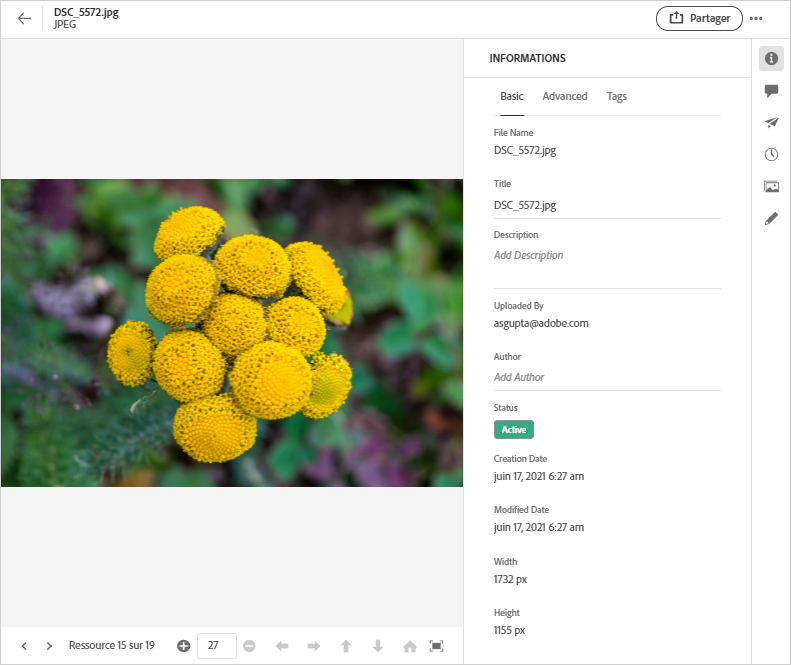
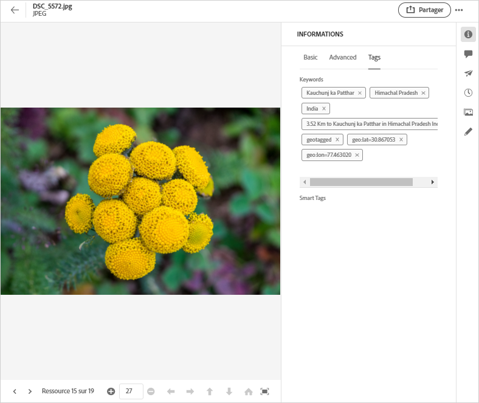
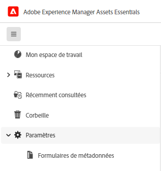
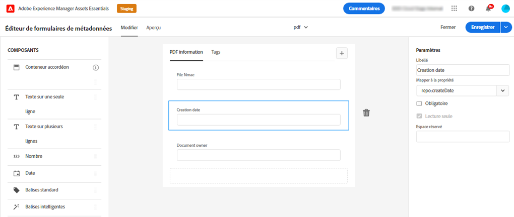

# Métadonnées dans [!DNL Assets Essentials] {#metadata}

Les métadonnées sont constituées de données ou de descriptions de données. Par exemple, vos images en tant que ressource peuvent contenir des informations sur l’appareil photo qui a pris la photo ou des informations relatives aux droits d’auteur. Ces informations représentent les métadonnées de l’image. Les métadonnées sont essentielles pour gérer efficacement des ressources. Elles constituent un ensemble de toutes les données disponibles pour cette ressource mais sans être nécessairement contenues dans cette ressource.

Les métadonnées permettent de classer les fichiers de manière détaillée à mesure que le volume d’informations numériques augmente. Il est ainsi possible de gérer quelques centaines de fichiers en ne prenant en compte que leurs noms, leurs miniature et leur taille. Pour autant, cette approche n’est pas évolutive. Elle est insuffisante si le nombre de personnes concernées et la quantité de ressources gérées augmentent.

Avec l’ajout de métadonnées, la valeur d’une ressource numérique augmente, car elle devient :

* plus accessible : les systèmes et les utilisateurs peuvent la trouver facilement ;
* plus facile à gérer : vous pouvez rechercher plus facilement des ressources avec un même ensemble de propriétés et leur apporter des modifications ;
* complète : la ressource contient davantage d’informations et de contexte grâce à un plus grand nombre de métadonnées.

Pour ces raisons, Assets vous offre des moyens pertinents pour créer, gérer et échanger des métadonnées pour vos ressources numériques.

## Affichage des métadonnées {#view-metadata}

Pour afficher les métadonnées d’une ressource, accédez à la ressource ou recherchez-la, sélectionnez-la, puis cliquez sur **[!UICONTROL Détails]** dans la barre d’outils.

*Image : pour afficher une ressource et ses métadonnées, cliquez sur **[!UICONTROL Détails]** dans la barre d’outils ou double-cliquez sur la ressource.*

Les métadonnées de base telles que le titre, la description et la date de chargement sont disponibles dans l’onglet [!UICONTROL De base]. L’onglet [!UICONTROL Avancé] contient des métadonnées plus précises telles que le modèle de l’appareil photo, les informations sur l’objectif et des informations de géolocalisation. L’onglet [!UICONTROL Balises] contient des balises appliquées automatiquement en fonction du contenu de l’image.

## Mettre à jour les métadonnées {#update-metadata}

Vous pouvez mettre à jour manuellement certains champs de métadonnées. Ces champs comprennent le [!UICONTROL Titre], la [!UICONTROL Description], l’[!UICONTROL Auteur] et les [!UICONTROL Mots-clés].

## Balises {#tags}

[!DNL Assets Essentials] utilise l’intelligence artificielle d’[Adobe Sensei](https://www.adobe.com/fr/sensei.html) pour appliquer automatiquement les balises pertinentes à toutes les ressources que vous avez chargées. Ces balises, les bien-nommées Balises intelligentes, augmentent la vitesse du contenu de vos projets en vous aidant à trouver rapidement les ressources appropriées. Les balises intelligentes sont un exemple de métadonnées qui ne sont pas contenues dans l’image.

Les balises intelligentes sont appliquées en temps quasi réel et sont générées en fonction du contenu de l’image. Lorsque vous chargez une ressource, l’interface utilisateur affiche [!UICONTROL Traitement] sur la miniature de la ressource pendant un certain temps. Une fois le traitement terminé, vous pouvez [afficher les métadonnées](#view-metadata) et les balises intelligentes.

*Image : pour afficher les balises intelligentes d’une ressource, cliquez sur **[!UICONTROL Détails]** dans la barre d’outils ou double-cliquez sur la ressource.*

Les balises intelligentes contiennent également un score de confiance en pourcentage. Elle indique le degré de confiance associé à la balise appliquée. Vous pouvez modérer les balises intelligentes qui ont été appliquées automatiquement.

## Ajouter ou mettre à jour des balises {#manually-tag}

Vous pouvez ajouter d’autres balises à vos ressources en plus des balises intelligentes qui sont ajoutées automatiquement à l’aide du service intelligent [!DNL Adobe Sensei]. Ouvrez l’aperçu d’une ressource, cliquez sur [!UICONTROL Balises], puis saisissez les mots-clés souhaités dans le champ [!UICONTROL Mots-clés]. Pour ajouter la balise, appuyez sur Entrée. [!DNL Assets Essentials] indexe le mot-clé en temps quasi réel et votre équipe peut bientôt rechercher les ressources mises à jour à l’aide des nouveaux mots-clés.

Vous pouvez également supprimer de la section [!UICONTROL Balises intelligentes] des balises qui ont été automatiquement ajoutées par [!DNL Assets Essentials] à toutes les ressources chargées.

## Formulaires de métadonnées {#metadata-forms}

Assets Essentials fournit par défaut de nombreux champs de métadonnées standard. Les entreprises ont d’autres besoins en métadonnées et ont besoin de davantage de champs de métadonnées pour ajouter des métadonnées spécifiques à leur entreprise. Les formulaires de métadonnées permettent aux entreprises d’ajouter des champs de métadonnées personnalisés à la page [!UICONTROL Détails] d’une ressource. Les métadonnées spécifiques à l’entreprise améliorent la gouvernance et la découverte de ses ressources.

Vous pouvez configurer des formulaires de métadonnées pour différents types de ressources (différents types MIME). Utilisez le même nom de formulaire que le type MIME du fichier. Essentials correspond automatiquement aux ressources chargées au nom du formulaire. Par exemple, si un formulaire de métadonnées portant le nom `PDF` ou `pdf` existe, les documents PDF téléchargés contiennent des champs de métadonnées tels que définis dans le formulaire. Vous pouvez créer des formulaires entièrement ou réutiliser un formulaire existant.

>[!IMPORTANT]
>
>Le nouveau formulaire de métadonnées pour un type de fichier spécifique remplace complètement le formulaire de métadonnées par défaut fourni par [!DNL Assets Essentials]. Si vous supprimez ou renommez un formulaire de métadonnées, les champs de métadonnées par défaut sont à nouveau disponibles pour les nouvelles ressources.

Pour créer un formulaire de métadonnées, procédez comme suit :

1. Dans le rail de gauche, cliquez sur **[!UICONTROL Paramètres]** > **[!UICONTROL Forms de métadonnées]**.

   

1. Cliquez sur **[!UICONTROL Créer]**, dans la zone supérieure droite de l’interface utilisateur.
1. Attribuez un nom au formulaire et cliquez sur **[!UICONTROL Créer]**.
1. Attribuez un nom à l’onglet dans **[!UICONTROL Paramètres]** dans le rail de droite.
1. Dans la section **[!UICONTROL Composants]** disponible dans le rail de gauche, faites glisser les composants requis sur un onglet du formulaire. Faites glisser les composants dans la séquence souhaitée.

   

   *Figure : Interface de création de formulaire de métadonnées avec des options pour ajouter des composants et une option pour prévisualiser le formulaire.*

1. Pour chaque composant, indiquez un nom dans la section **[!UICONTROL Paramètres]** du rail de droite, fournissez un mappage avec les propriétés prises en charge.
1. Si vous le souhaitez, pour un composant, sélectionnez **[!UICONTROL Obligatoire]** pour rendre le champ de métadonnées obligatoire et sélectionnez **[!UICONTROL Lecture seule]** pour rendre le champ non modifiable dans la page [!UICONTROL Détails] de la ressource.
1. Si vous le souhaitez, cliquez sur **[!UICONTROL Aperçu]** pour prévisualiser le formulaire que vous créez.
1. Vous pouvez éventuellement ajouter d’autres onglets et les composants requis dans chaque onglet.
1. Cliquez sur **[!UICONTROL Enregistrer]** une fois le formulaire terminé.

Une fois qu’un formulaire est créé, il est automatiquement appliqué lorsque les utilisateurs chargent une ressource du type MIME correspondant.

Pour réutiliser un formulaire existant afin de créer un formulaire, sélectionnez un formulaire de métadonnées, cliquez sur **[!UICONTROL Copier]** dans la barre d’outils, attribuez un nom, puis cliquez sur **[!UICONTROL Confirmer]**. Vous pouvez modifier un formulaire de métadonnées. Lorsque vous modifiez un formulaire, il est utilisé pour les ressources chargées après la modification. Elle ne modifie pas les ressources existantes.

<!-- TBD: Cannot create a form using the second option. Documenting only the first option for now.
To reuse an existing form to create a new form, do one of these:

* Select a metadata form and click **[!UICONTROL Copy]** from the toolbar, provide a name, and click **[!UICONTROL Confirm]**.

* Click **[!UICONTROL Create]**, select **[!UICONTROL Use existing form structure as template]** option, and select an existing form. 
-->

<!-- TBD: Queries for PM and engg.

Can we edit the existing metadata in any form?

How to moderate smart tags?

Allow or deny list for smart tags?

What about Tags displayed just above Smart Tags in the UI?

Is there a detailed metadata tab. Where do the other details of an asset go?

How can one search based strictly on the metadata. Similar to AEM Assets GQL queries.
-->

<!-- TBD: Link to related articles if any.

>[!MORELIKETHIS]
>
>* [Search assets](search.md).
-->
