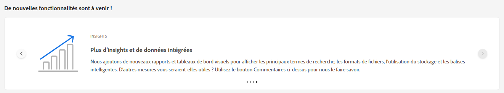
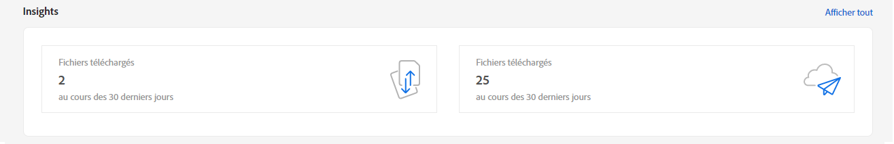
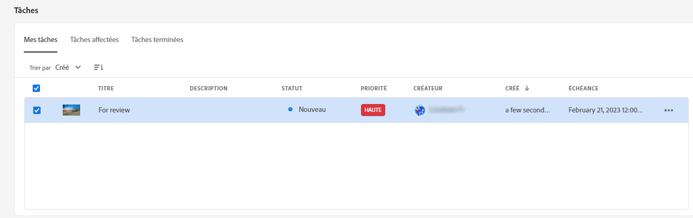
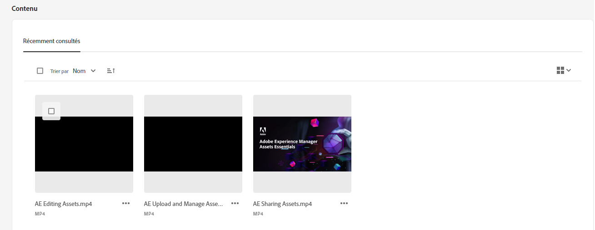
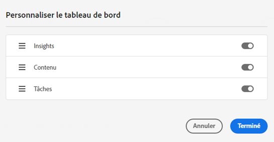

# Mon espace de travail pour les ressources {#my-workspace}

Assets comprend désormais un espace de travail personnalisable qui fournit des widgets pour accéder facilement aux zones clés de l’interface utilisateur d’Assets et des informations qui vous concernent le plus. Cette page sert de solution ponctuelle pour fournir un aperçu de vos tâches et pour donner un accès rapide aux workflows clés. Un accès plus pratique à ces options augmente votre efficacité et votre vitesse de contenu.

Vous pouvez accéder à Mon espace de travail en cliquant sur **[!UICONTROL Mon espace de travail]** des éléments disponibles dans le volet de navigation de gauche. Mon espace de travail comprend divers widgets qui affichent les nouvelles fonctionnalités à venir, les widgets Statistiques, Tâches et Contenu. Vous pouvez configurer l’affichage de ces widgets dans votre espace de travail en fonction de vos préférences.

>[!NOTE]
>
>Le widget Statistiques n’est visible que par les administrateurs.

**Nouvelles fonctionnalités bientôt disponibles**

Met en évidence les fonctionnalités à venir pour Assets.

**Statistiques**

Les administrateurs peuvent afficher un résumé du nombre de téléchargements et de téléchargements effectués dans l’environnement Assets au cours des 30 derniers jours. Vous pouvez cliquer sur **[!UICONTROL Afficher tout]** pour accéder rapidement à la page Statistiques afin d’obtenir des tableaux de bord plus détaillés.

**Tâches**

Affiche la liste des tâches qui vous sont actuellement affectées dans le **[!UICONTROL Mes tâches]** , créé par vous dans la **[!UICONTROL Tâches affectées]** et les tâches déjà effectuées par vous dans la **[!UICONTROL Terminé]** . Vous pouvez sélectionner une tâche et cliquer sur **[!UICONTROL Terminer la tâche]** pour approuver ou rejeter une tâche. Vous pouvez également sélectionner une tâche et cliquer sur **[!UICONTROL Ouvrir les détails de la tâche]** pour afficher la tâche et l’approuver, la rejeter, la modifier ou la supprimer.

>[!NOTE]
>
> Le **[!UICONTROL Affecter des tâches]** l’option permettant d’affecter une tâche sur une ressource à un autre utilisateur est disponible lorsque vous sélectionnez une ressource ou lorsque vous ouvrez la vue d’informations sur la ressource.

**Contenu**

Affiche des vues assorties de ressources, y compris la liste des ressources que vous avez récemment consultées. Vous pouvez choisir d’afficher les ressources du widget en mode Liste, Grille, Galerie ou Cascade, et de les trier par nom, taille et date de modification. Vous pouvez également sélectionner une ressource pour afficher les détails de la ressource ou la supprimer de la liste des ressources récemment consultées.

## Personnalisation de mon espace de travail {#configure-widgets}

Tous les widgets s’affichent par défaut, mais vous pouvez activer ou désactiver les widgets qui s’affichent dans Mon espace de travail. Les préférences sont spécifiques à chaque utilisateur.

1. Cliquez sur **[!UICONTROL Mon espace de travail]** disponible dans le volet de navigation de gauche, puis cliquez sur **[!UICONTROL Personnaliser]**.

1. Désactivez le bouton d’activation/désactivation du widget que vous n’avez pas besoin d’afficher dans Workspace. Vous pouvez également faire glisser un widget vers un emplacement approprié pour mettre à jour son ordre d’affichage dans l’espace de travail.

1. Cliquez sur **[!UICONTROL Terminé]** pour enregistrer les modifications.

   
