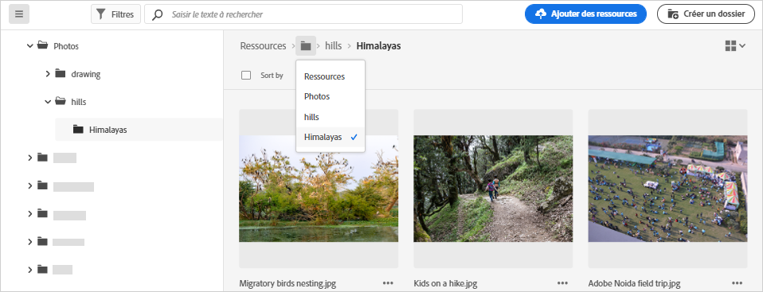
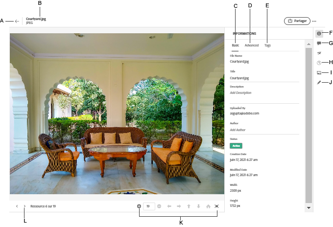

# Accédez aux fichiers et aux dossiers et affichez les ressources {#view-assets-and-details}

<!-- TBD: Give screenshots of all views with many assets. Zoom out to showcase how the thumbnails/tiles flow on the UI in different views. -->

<!-- TBD: The options in left sidebar may change. Shared with me and Shared by me are missing for now. Update this section as UI is updated. -->

## Comprendre l’interface utilisateur d’[!DNL Assets Essentials]  {#understand-interface-navigation}

[!DNL Assets Essentials] offre une interface utilisateur intuitive et conviviale. La clarté de son interface vous aide à rechercher et à mémoriser les ressources et les informations qui les concernent.

Lorsque vous vous connectez à [!DNL Assets Essentials], l’interface suivante s’affiche.

<!-- TBD: Update this screenshot. Remove top bar. Remove 2 labels from top bar. -->

![[!DNL Assets Essentials]Interface utilisateur d’](assets/essentials-interface1.png)

*Figure : premier écran après connexion et emplacement des principales fonctionnalités.*
    *A : barre latérale gauche permettant de parcourir le référentiel et permet d’accéder à quelques autres options.*
    *B : afficher ou réduire la barre latérale gauche pour augmenter la zone d’affichage des ressources.*
    *C : filtrer les résultats de la recherche.*
    *D : zone de recherche.*
    *E : options de tri des ressources.*
    *F : donner votre avis sur les produits.*
    *G : modifier vos préférences utilisateur ou vous déconnecter.*
    *H : basculer entre les différentes vues.*

<!-- TBD: Need an embedded video here with narration. It has to be hosted on MPC to be embeddable. -->

## Parcourir et afficher les ressources et les dossiers {#browse-repository}

Vous pouvez accéder aux dossiers requis à partir de l’interface utilisateur principale ou de la barre latérale gauche. Lors de votre navigation, vous pouvez utiliser l’interface pour afficher les miniatures de vos ressources afin de parcourir visuellement le référentiel ou d’afficher les détails de la ressource pour trouver rapidement la ressource souhaitée. Les options disponibles dans la barre latérale gauche sont les suivantes :

* **Ressources** : liste de tous les dossiers auxquels vous avez accès sous la forme d’une arborescence.
* **Récemment consultés** : liste des ressources que vous avez récemment prévisualisées. [!DNL Assets Essentials] affiche uniquement les ressources que vous prévisualisez. Cette fonctionnalité n’affiche pas les ressources que vous faites défiler en naviguant dans les fichiers ou dossiers du référentiel.
* **Corbeille** : Répertorier les ressources supprimées de la racine **[!UICONTROL Ressources]** dossier. Vous pouvez sélectionner une ressource dans le dossier Corbeille pour la restaurer à l’emplacement d’origine ou la supprimer définitivement.

<!-- TBD: Not sure if we want to publish these right now. CC Libs are beta as per Greg.
* **Libraries**: Access to [!DNL Adobe Creative Cloud Team] (CCT) Libraries view. This view is visible only if the user is entitled to CCT Libraries.
-->

<!-- TBD: My Work Space shows task inbox and it is not visible on AEM Cloud Demos as of now. It is the source of truth server hence not documenting My Work Space option for now.
-->

Vous pouvez développer ou réduire la barre latérale gauche pour augmenter la zone d’affichage des ressources disponible.

Dans [!DNL Assets Essentials], vous pouvez afficher les ressources, les dossiers et les résultats de recherche dans quatre types différents de mises en page.

*  [!UICONTROL Vue Liste]
*  [!UICONTROL Vue Grille]
*  [!UICONTROL Vue Galerie]
*  [!UICONTROL Vue Cascade]

Pour localiser une ressource, vous pouvez trier les ressources par ordre croissant ou décroissant de `Name`, `Relevancy`, `Size`, `Modified` et `Created`.

Pour accéder à un dossier, double-cliquez sur la miniature du dossier ou sélectionnez le dossier dans la barre latérale gauche. Pour afficher les détails d’un dossier, sélectionnez-le et cliquez sur Détails dans la barre d’outils supérieure. Pour parcourir la hiérarchie de haut en bas, utilisez la barre latérale gauche ou le chemin de navigation en haut.

*Image : pour parcourir la hiérarchie, utilisez les chemins de navigation dans la partie supérieure ou la barre latérale gauche.*

## Aperçu des ressources {#preview-assets}

Avant d’utiliser, de partager ou de télécharger une ressource, vous pouvez l’afficher pour en connaître les détails. La fonction d’aperçu vous permet d’afficher non seulement les images, mais également quelques autres types de ressources pris en charge.

Pour prévisualiser une ressource, sélectionnez-la et cliquez sur  [!UICONTROL Détails] dans la barre d’outils supérieure. Vous pouvez non seulement afficher la ressource, mais également afficher le détail de ses métadonnées et effectuer d’autres actions.

*A : revenez au dossier actif ou au résultat de la recherche dans le référentiel.*
*B : nom et format du fichier que vous prévisualisez.*
*C : métadonnées de base.*
*D : métadonnées avancées.*
*E : mots-clés et balises intelligentes.*
*F : prévisualisation de la ressource et affichage des informations des métadonnées.*
*G : commentaires et annotations.*
*H : affichage et gestion des versions.*
*I : affichage des rendus de l’image.*
*J : modification de l’image.*
*K : aperçu plus détaillé. Zoom, plein écran et d’autres options.*
*L : passer à la ressource précédente ou suivante dans le dossier actif sans revenir au dossier.*

Vous pouvez également prévisualiser des vidéos.

Si vous prévisualisez explicitement une ressource, [!DNL Assets Essentials] l’affiche comme une ressource récemment affichée.

<!-- TBD: Describe the options.

Explicitly previewed assets are displayed as recently viewed assets. Give screenshot of this.
Other use cases after previewing.
-->

## Étapes suivantes {#next-steps}

* Faites des commentaires sur le produit en utilisant l’option [!UICONTROL Commentaires] disponible dans l’interface utilisateur d’Assets Essentials.

* Faites des commentaires sur la documentation en utilisant l’option [!UICONTROL Modifier cette page]  ou [!UICONTROL Enregistrer un problème]  disponible dans la barre latérale droite.

* Contactez l’[assistance clientèle](https://experienceleague.adobe.com/?support-solution=General&amp;lang=fr#support).

>[!MORELIKETHIS]
>
>* [Afficher les versions d’une ressource](/help/manage-organize.md#view-versions).

