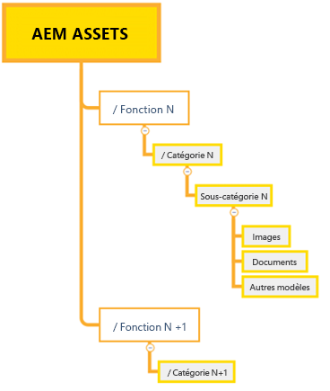
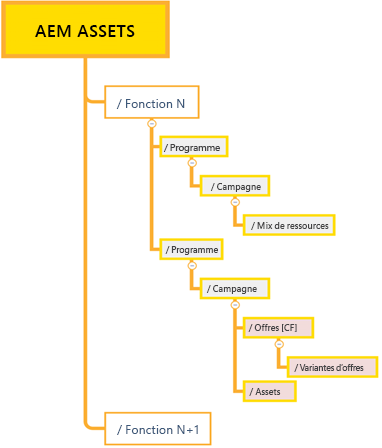

# Bonnes pratiques relatives à la gestion efficace des autorisations {#best-practices-permissions-management}

En tant qu’administrateur, avant de commencer à gérer les autorisations de dossier pour le référentiel Assets Essentials, vous pouvez mettre en oeuvre diverses bonnes pratiques pour rendre l’infrastructure intuitive pour les administrateurs et les utilisateurs finaux lors de la gestion ultérieure des opérations.

Vous pouvez incorporer les bonnes pratiques suivantes en procédant comme suit :

* [Création de groupes d’utilisateurs dans Admin Console](#admin-console-best-practices)

* [Création d’une structure de dossiers dans le référentiel Assets Essentials](#folder-structure-assets-essentials)

* [Gestion des autorisations dans le référentiel Assets Essentials](#folder-permissions)

## Admin Console {#admin-console-best-practices}

Identifiez les besoins en matière d’accès en fonction des groupes d’utilisateurs de votre entreprise. Planifiez et créez des groupes d’utilisateurs pour votre organisation, puis ajoutez des utilisateurs à ces groupes. Il est plus facile de gérer les autorisations de dossier en fonction des groupes d’utilisateurs et non des utilisateurs individuels.

## Structure de dossiers pour le référentiel Assets Essentials {#folder-structure-assets-essentials}

Tenez compte des points suivants lorsque vous commencez à planifier la création d’une structure de dossiers dans le référentiel Assets Essentials :

* Gouvernance future : Les dossiers régis par les administrateurs et les dossiers qui sont [Délégué pour les autorisations à d’autres utilisateurs en tant que propriétaires](manage-permissions.md##manage-permissions-folders).

* Évolutif : La structure de dossiers doit répondre aux besoins futurs de votre entreprise et doit être facilement évolutive.

* Taille : Un dossier ne doit pas contenir trop de ressources. Cela peut entraîner des problèmes d’utilisation et devenir difficile à gérer.

* Intuitif : La structure de dossiers doit être facile à parcourir et intuitive pour les utilisateurs finaux. Les utilisateurs doivent être en mesure d’identifier facilement où charger une nouvelle ressource dans la structure de dossiers.

Il existe différents types de structure de dossiers que vous pouvez utiliser pour votre entreprise. Voici quelques exemples de structures de dossiers standard :

* Basé sur les fonctions et les catégories

   

* Campagne basée

   

* Basé sur l’emplacement de l’offre (ou canal)

   

## Autorisations de dossier {#folder-permissions}

Après avoir créé des groupes d’utilisateurs pour votre entreprise, ajouté des utilisateurs à ces groupes d’utilisateurs, sélectionné et créé une structure de dossiers dans le référentiel Assets Essentials qui répond aux besoins de votre entreprise, vous pouvez commencer à gérer les autorisations de dossiers pour votre entreprise. Tenez compte des points suivants lorsque vous commencez à gérer les autorisations de dossier :

* Appliquez des autorisations aux groupes d’utilisateurs, et non aux utilisateurs individuels. Cela se traduit par une structure d’autorisations plus simple et plus efficace.

* Maintenez la structure d’autorisation aussi simple que possible pour optimiser l’efficacité opérationnelle.

* Utilisez soigneusement Refuser les autorisations d’accès et préférez appliquer des autorisations positives (Peut modifier, Peut afficher, Propriétaire) à la structure de dossiers.

Pour obtenir des exemples sur la manière d’obtenir une structure de dossiers simple et efficace, voir [Gestion des autorisations sur les dossiers](manage-permissions.md##manage-permissions-folders).

