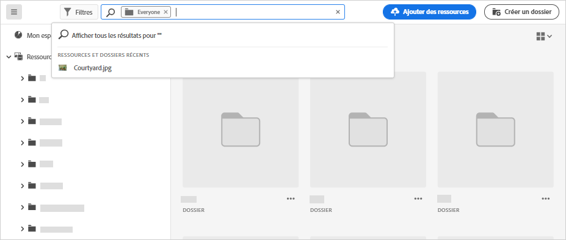
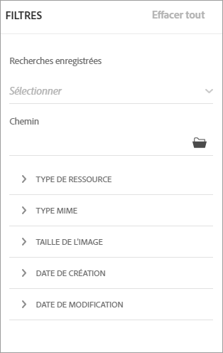
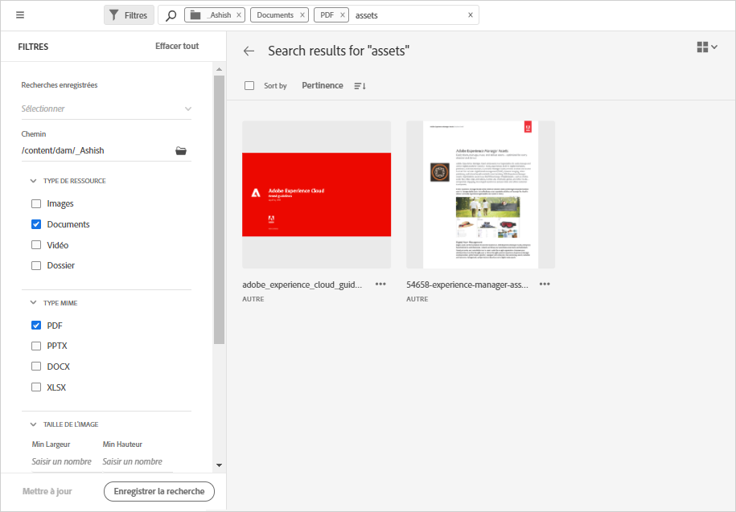

# Recherche de ressources dans [!DNL Assets Essentials] {#search-assets}

[!DNL Assets Essentials] offre des fonctionnalités de recherche efficaces, qui fonctionnent simplement par défaut. La recherche fonctionne de façon exhaustive car il s’agit d’une recherche de type plein texte. Ses puissantes fonctionnalités de recherche vous permettent de trouver rapidement la ressource appropriée et d’améliorer la vitesse de votre contenu. [!DNL Assets Essentials] fournit une recherche plein texte, ou même des capacités de recherche basées sur les métadonnées telles que les balises intelligentes, le titre, la date de création et le copyright.

Pour rechercher des ressources,

* Cliquez dans la zone de recherche située en haut de la page. Par défaut, la recherche s’effectue dans le dossier que vous êtes en train de parcourir. Utilisez l’une des méthodes suivantes :

   

   * Effectuez une recherche à l’aide d’un mot-clé ou vous pouvez changer de dossier. Appuyez sur Entrée.

   * Commencez à travailler avec une ressource récemment consultée en la recherchant directement. Cliquez dans la zone de recherche et sélectionnez une ressource récemment consultée parmi les suggestions.

## Filtrer les résultats de la recherche {#refine-search-results}

Vous pouvez filtrer les résultats de la recherche en fonction des paramètres suivants.

*Image : filtrage des ressources recherchées en fonction de divers paramètres.*

* Type de ressource : filtrez les résultats de la recherche selon les types de fichiers pris en charge, à savoir `Images`, `Documents` et `Videos`.
* Type MIME : filtrez un ou plusieurs formats de fichiers pris en charge. <!-- TBD:  [supported file formats](/help/supported-file-formats.md). -->
* Taille de l’image : fournissez une ou plusieurs dimensions minimales et maximales pour filtrer les images. Les dimensions sont fournies en pixels et ne correspondent pas à la taille de fichier des images.
* Date de création : date de création de la ressource telle qu’elle figure dans les métadonnées. Le format de date standard utilisé est `yyyy-mm-dd`.
* Date de modification : date de dernière modification des ressources. Le format de date standard utilisé est `yyyy-mm-dd`.

Vous pouvez trier les ressources recherchées par ordre croissant ou décroissant de `Name`, `Relevancy`, `Size`, `Modified` et `Created`.

## Recherches enregistrées {#saved-search}

La fonctionnalité de recherche est assez facile à utiliser dans [!DNL Assets Essentials]. Dans la zone de recherche, vous pouvez non seulement saisir un mot-clé et appuyer sur Entrée pour afficher les résultats, mais vous pouvez également rechercher rapidement vos mots-clés recherchés récemment en un seul clic.

Vous pouvez également filtrer les résultats de la recherche en fonction de critères spécifiques relatifs aux métadonnées et au type de ressources. Pour les filtres fréquemment utilisés, [!DNL Assets Essentials] permet d’enregistrer les paramètres de recherche afin d’améliorer l’expérience de recherche. Vous pouvez ensuite sélectionner la recherche enregistrée pour l’utiliser et appliquer le filtre, en un seul clic.

Pour créer une recherche enregistrée, recherchez une ressource, appliquez un ou plusieurs filtres, puis cliquez sur [!UICONTROL Enregistrer la recherche] dans le panneau [!UICONTROL Filtres].

<!-- TBD: Search behavior. Full-text search. Ranking and rank boosts. Hidden assets.
Report poor UX that users can only save a filtered search and not a simple search.
.
Are other supported files fully indexed and support full-text search? Eg. audio/videos files can at best have metadata indexed.
Anything about ranking of assets displayed in search results?

What about temporarily hiding an asset (suspending search on it) from the search results? If an asset is undergoing review collaboration, should it be used by others? Should it be hidden in search?

When userA is searching and userB add an asset that matches search results, will the asset display in search as soon as userA refreshes the page? Assuming indexing is near real-time. May not be so for bulk uploads.
-->
