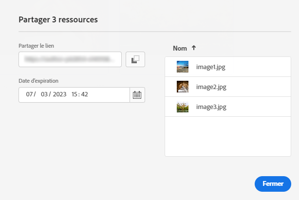
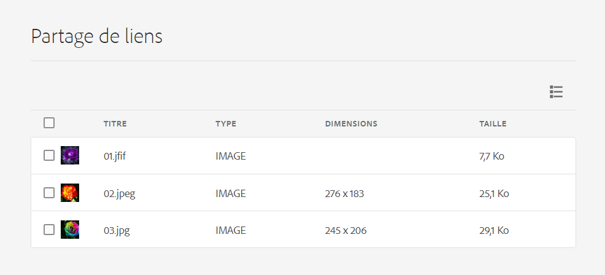

# Partage de liens pour les ressources {#share-links-assets}

[!DNL Assets Essentials] vous permet de générer un lien et de partager des ressources avec des parties prenantes externes qui n’ont pas accès à la variable [!DNL Assets Essentials] application. Vous pouvez définir :

* Date d’expiration du lien

* Si les destinataires sont autorisés à télécharger les ressources (fichiers binaires originaux) après avoir accédé au lien.

En fonction de ces paramètres, le destinataire du lien peut choisir de prévisualiser les ressources ou de les télécharger.

## Génération d’un lien pour les ressources {#generate-link-for-assets}

Pour générer un lien pour une ressource ou un dossier contenant des ressources :

1. Sélectionnez la ou les ressources et/ou le ou les dossiers contenant les ressources, puis cliquez sur **[!UICONTROL Partager le lien]**.

1. Si vous souhaitez l’ajuster, cliquez sur l’icône Calendrier pour définir une date d’expiration pour le lien à l’aide de la variable **[!UICONTROL Date d’expiration]** champ . Vous pouvez également spécifier une date directement dans la variable `yyyy-mm-dd` format. Par défaut, la date d’expiration d’un lien est définie sur 2 semaines à compter de la date de partage.

1. Sélectionner **[!UICONTROL Autoriser le téléchargement]** pour permettre au destinataire du lien de télécharger des ressources.

1. Cliquez sur **[!UICONTROL Générer un lien]**.

1. Cliquez sur **[!UICONTROL Copier le lien]** pour copier le lien. Vous pouvez également copier le lien à partir du **[!UICONTROL Partager le lien]** champ .

   

1. Cliquez sur **[!UICONTROL Fermer]** et partager le lien à l’aide de la messagerie électronique ou d’autres outils de collaboration.

## Accès aux ressources partagées {#access-shared-assets}

Après avoir partagé le lien public des ressources, les destinataires peuvent cliquer sur le lien pour prévisualiser ou télécharger les ressources partagées dans un navigateur web sans avoir à se connecter à [!DNL Assets Essentials].

Cliquez sur le lien, cliquez sur le dossier pour accéder à la ressource, puis cliquez sur la ressource pour la prévisualiser. Vous pouvez choisir d’afficher les ressources partagées en mode Liste ou Carte.

Vous pouvez placer le pointeur de la souris sur la ressource partagée ou le dossier des ressources partagées pour la sélectionner ou la télécharger.

Vous pouvez également sélectionner plusieurs ressources et cliquer sur **[!UICONTROL Télécharger]**. [!DNL Assets Essentials] télécharge les ressources sélectionnées sous la forme d’un fichier zip. [!DNL Assets Essentials] crée un sous-dossier dans le fichier zip parent, portant le même nom que la ressource, pour chaque ressource que vous choisissez de télécharger.

Pour télécharger toutes les ressources à la fois, passez à la **[!UICONTROL Mode Liste]**, cliquez sur **[!UICONTROL Tout sélectionner]** puis cliquez sur **[!UICONTROL Télécharger]**.

>[!NOTE]
>
>Si vous n’activez pas l’option de téléchargement lors de la [génération du lien](#share-links-assets) pour une ressource et si le destinataire du lien choisit de télécharger la ressource, [!DNL Assets Essentials] télécharge un fichier zip vide.

