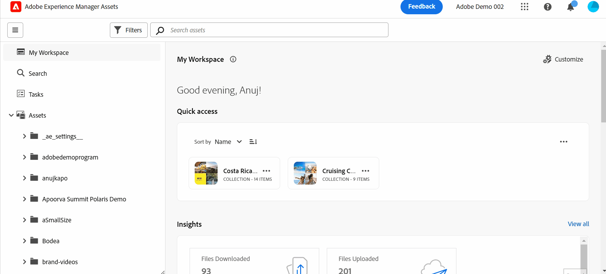

# Présentation de la vue Assets {#assets-view}

Dans le paysage actuel de la gestion dynamique des actifs numériques, où la création et la diffusion de contenu en temps réel sont essentielles, une expérience de gestion des actifs numériques (DAM) conçue pour la vitesse marketing en aval est primordiale. Adobe, qui tire parti de son expertise pour autonomiser les professionnels du marketing et de la création, présente une nouvelle expérience utilisateur Assets View qui change tout le monde. Cette approche axée sur les workflows permet de révolutionner la manière dont les entreprises gèrent leurs ressources numériques dynamiques, en permettant aux marketeurs d’optimiser l’efficacité dans la recherche, la collaboration, la personnalisation et la diffusion des ressources. Ces workflows rationalisés accélèrent la vitesse du contenu et propulsent vos efforts marketing vers de nouveaux sommets.

## Comment accéder à la vue Assets ? {#access-assets-view}

Vous pouvez accéder à la vue Ressources de la manière suivante :

* **Activation/désactivation dans la vue d’administration**

   * Se connecter [!DNL Experience Manager] à l’aide de Cloud Manager.
   * Accédez à **[!UICONTROL Ressources]** > **[!UICONTROL Fichiers]**.
   * Cliquez sur l’icône de profil dans le coin supérieur droit.
   * Cliquez sur **[!UICONTROL Mode bascule]** de la **[!UICONTROL Paramètres de profil]** .
Répétez ces étapes pour revenir à la vue Admin.

* **Sélecteur de produits**
   * Se connecter [!DNL Experience Manager] et cliquez sur
   * Sélectionner **[!UICONTROL Experience Manager Assets]** pour accéder à la vue Ressources.
   * Sélectionner **[!UICONTROL Experience Manager]** pour accéder à la vue Admin.

* **Liens rapides**
   * Connectez-vous à experience.adobe.com.
   * Cliquez sur **[!UICONTROL Experience Manager Assets]** pour accéder à la vue Ressources.
   * Cliquez sur **[!UICONTROL Experience Manager Assets]** pour accéder à la vue Ressources.

## Mon tableau de bord Workspace pour offrir des expériences rationalisées

Saluez une solution de gestion des ressources numériques qui comprend les différents besoins des différents rôles de l’entreprise. La nouvelle vue étincelante des ressources donne la priorité à la facilité d’utilisation et à la vitesse, en fonction des préférences des marketeurs en matière d’attrait visuel et d’espaces de travail encombrants. Avec un tableau de bord My Workspace personnalisé spécifique à l’utilisateur, les marketeurs peuvent rapidement trouver, prévisualiser, modifier, gérer et diffuser des ressources avec une efficacité remarquable. Adieu aux interminables heures passées à rechercher des ressources spécifiques et accueillir une expérience simplifiée qui met tout ce dont vous avez besoin au bout de vos doigts.

