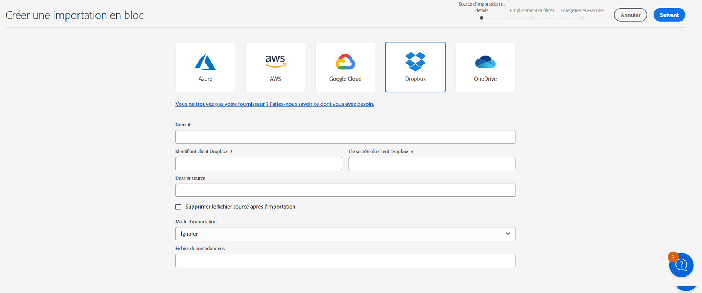

# Importation de ressources en bloc à l’aide d’Assets Essentials  {#bulk-import-essentials}

>[!CONTEXTUALHELP]
>id="assets_bulk_import"
>title="Importer des ressources en bloc"
>abstract="Les administrateurs et administratrices peuvent désormais importer un grand nombre de ressources d’une source de données vers Experience Manager Assets à l’aide d’Assets Essentials. Les administrateurs et administratrices n’ont plus besoin de charger des ressources ou des dossiers individuels vers Experience Manager Assets. Les fournisseurs d’espace de stockage pris en charge pour l’importation en bloc sont Azure, AWS, Google Cloud et Dropbox."

L’importation en bloc dans AEM Assets Essentials permet aux administrateurs d’importer un grand nombre de ressources d’une source de données vers AEM Assets. Les administrateurs et administratrices n’ont plus besoin de charger des ressources ou des dossiers individuels vers AEM Assets.

>[!NOTE]
>
>L’importateur en vrac Assets Essentials utilise le même serveur principal que celui de l’importateur en vrac as a Cloud Service d’Assets. Cependant, Assets Essentials offre davantage de sources de données à partir desquelles importer et une expérience utilisateur plus simplifiée.

Vous pouvez importer des ressources à partir des sources de données suivantes :

* Azure
* AWS
* Google Cloud
* Dropbox

## Conditions préalables requises {#prerequisites}

| Source de données | Conditions préalables requises |
|-----|------|
| Azure | <ul> <li>Compte de stockage Azure </li> <li> Conteneur d’objets blob Azure <li> Clé d’accès Azure ou jeton SAS en fonction du mode d’authentification </li></ul> |
| AWS | <ul> <li>Région AWS </li> <li> Compartiment AWS <li> Clé d’accès AWS </li><li> Secret d’accès AWS </li></ul> |
| Google Cloud | <ul> <li>Compartiment GCP </li> <li> Adresse e-mail du compte de service GCP <li> Clé privée du compte de service GCP</li></ul> |
| Dropbox | <ul> <li>ID client Dropbox </li> <li> Secret client Dropbox</li></ul> |

Outre ces conditions préalables en fonction de la source de données, vous devez connaître le nom du dossier source disponible dans votre source de données, qui contient toutes les ressources à importer dans AEM Assets.

## Créer une configuration d’import en bloc {#create-bulk-import-configuration}

Pour créer une configuration d’import en bloc, procédez comme suit :

1. Accédez à **[!UICONTROL Paramètres]** > **[!UICONTROL Import en bloc]** et cliquez sur **[!UICONTROL Créer un import]**.
1. Sélectionnez la source de données. Les options disponibles comprennent Azure, AWS, Google Cloud et Dropbox.
1. Indiquez un nom pour la configuration de lʼimport en bloc dans le champ **[!UICONTROL Nom]**.
1. Indiquez les informations d’identification spécifiques à la source de données, comme mentionné dans les [conditions préalables](#prerequisites).
1. Indiquez le nom du dossier racine qui contient les ressources de la source de données dans le champ **[!UICONTROL Dossier source]**.
1. (Facultatif) Sélectionnez lʼoption **[!UICONTROL Supprimer le fichier source après lʼimport]** afin de supprimer les fichiers originaux du magasin de données source après lʼimport des fichiers dans Experience Manager Assets.
1. Sélectionnez le **[!UICONTROL Mode d’importation]**. Les modes suivants sont disponibles : **[!UICONTROL Ignorer]**, **[!UICONTROL Remplacer]** ou **[!UICONTROL Créer une version]**. Le mode par défaut est Ignorer. Dans ce mode, l’outil d’ingestion ignore l’import d’une ressource si elle existe déjà.
   

1. (Facultatif) Indiquez le fichier de métadonnées à importer, fourni au format CSV, dans le champ Fichier de métadonnées, puis cliquez sur **[!UICONTROL Suivant]** pour accéder à **[!UICONTROL Emplacement et filtres]**.
1. Pour définir un emplacement dans la gestion des ressources numériques (DAM) où les ressources doivent être importées à l’aide du champ **[!UICONTROL Dossier cible des ressources]**, indiquez un chemin d’accès. Par exemple, `/content/dam/imported_assets`.
1. (Facultatif) Dans la section **[!UICONTROL Choisir des filtres]**, indiquez la taille de fichier minimale des ressources en Mo à inclure dans le processus d’ingestion dans le champ **[!UICONTROL Filtrer par taille minimale]**.
1. (Facultatif) Indiquez la taille de fichier maximale des ressources en Mo à inclure dans le processus d’ingestion dans le champ **[!UICONTROL Filtrer par taille maximale]**.
1. (Facultatif) Sélectionnez les types MIME à inclure dans le processus d’ingestion à l’aide du champ **[!UICONTROL Inclure le type MIME]**. Vous pouvez sélectionner plusieurs types MIME dans ce champ. Si vous ne définissez pas de valeur, tous les types MIME sont inclus dans le processus d’ingestion.

1. (Facultatif) Sélectionnez les types MIME à exclure dans le processus d’ingestion à l’aide du champ **[!UICONTROL Exclure le type MIME]**. Vous pouvez sélectionner plusieurs types MIME dans ce champ. Si vous ne définissez pas de valeur, tous les types MIME sont inclus dans le processus d’ingestion.

   

1. Cliquez sur **[!UICONTROL Suivant]**. Sélectionnez **[!UICONTROL Enregistrer et exécuter l’import]** pour enregistrer la configuration et exécuter l’import en bloc. Sélectionnez **[!UICONTROL Enregistrer l’import]** pour enregistrer la configuration afin de pouvoir l’exécuter ultérieurement.

   

1. Cliquez sur **[!UICONTROL Enregistrer]** pour exécuter l’option sélectionnée.

### Gestion des noms de fichier lors de l’importation en bloc {#filename-handling-bulkimport-assets-view}

Lorsque vous importez des ressources ou des dossiers en bloc, [!DNL Experience Manager Assets] importe toute la structure de ce qui existe dans la source d’import. [!DNL Experience Manager] suit les règles intégrées pour les caractères spéciaux dans les noms de ressources et de dossiers ; par conséquent, ces noms de fichier doivent être assainis. Pour les noms de dossier et de ressource, le titre défini par l’utilisateur reste inchangé et est stocké dans `jcr:title`.

Lors de l’importation en bloc, [!DNL Experience Manager] recherche les dossiers existants pour éviter de réimporter les ressources et les dossiers et vérifie également les règles d’assainissement appliquées dans le dossier parent où l’importation a lieu. Si les règles d’assainissement sont appliquées dans le dossier parent, les mêmes règles sont appliquées à la source d’importation. Pour une nouvelle importation, les règles d’assainissement suivantes sont appliquées pour gérer les noms de fichiers des ressources et dossiers.

Pour plus d’informations sur les noms interdits, la gestion des noms de ressources et la gestion des noms de dossiers lors de l’importation en bloc, voir [Gestion des noms de fichier lors de l’importation en bloc](https://experienceleague.adobe.com/docs/experience-manager-cloud-service/content/assets/manage/add-assets.html?lang=en#filename-handling-bulkimport).

## Afficher les configurations d’import en bloc existantes {#view-import-configuration}

Si vous choisissez d’enregistrer la configuration après sa création, celle-ci s’affiche dans l’onglet **[!UICONTROL Imports enregistrés]**.

Si vous choisissez d’enregistrer et d’exécuter l’import, la configuration de celui-ci s’affiche dans l’onglet **[!UICONTROL Imports exécutés]**.

Si vous planifiez un import, il s’affiche dans l’onglet **[!UICONTROL Imports planifiés]**.

## Modifier la configuration d’import en bloc {#edit-import-configuration}

Pour modifier les détails de la configuration, cliquez sur les points de suspension … correspondants au nom de la configuration, puis sur **[!UICONTROL Modifier]**. Notez que certains éléments ne sont pas modifiables, tels que le titre de la configuration et la source de données d’import. Vous pouvez modifier la configuration à l’aide des onglets Imports exécutés, planifiés ou enregistrés.

## Planifier des imports ponctuels ou récurrents {#schedule-imports}

Pour planifier un import en bloc ponctuel ou récurrent, procédez comme suit :

1. cliquez sur les points de suspension … correspondants au nom de la configuration disponible dans l’onglet **[!UICONTROL Imports exécutés]** ou **[!UICONTROL Imports enregistrés]** et cliquez sur **[!UICONTROL Planifier]**. Vous pouvez également replanifier un import planifié existant en accédant à l’onglet **[!UICONTROL Imports planifiés]** et en cliquant sur **[!UICONTROL Planifier]**.

1. Définissez une ingestion ponctuelle ou planifiez une planification horaire, quotidienne ou hebdomadaire. Cliquez sur **[!UICONTROL Envoyer]**.

   

## Exécuter un contrôle de l’intégrité de l’import {#import-health-check}

Pour valider la connexion à la source de données, cliquez sur les points de suspension … correspondants à la configuration, puis sur **[!UICONTROL Vérifier]**. Si la connexion est établie, Experience Manager Assets affiche le message suivant :

## Effectuer un essai avant l’exécution d’un import {#dry-run-bulk-import}

Cliquez sur les points de suspension … correspondants au nom de la configuration et cliquez sur **[!UICONTROL Exécution dʼessai]** pour lancer une exécution test pour la tâche d’import en bloc. Experience Manager Assets affiche les informations suivantes sur la tâche d’import en bloc :

## Exécuter un import en bloc {#run-bulk-import}

Si vous avez enregistré l’import lors de la création de la configuration, vous pouvez accéder à l’onglet Imports enregistrés, cliquez sur les points de suspension … correspondants à la configuration, puis sur **[!UICONTROL Exécuter]**.

De même, si vous devez exécuter un import déjà exécuté, accédez à l’onglet Imports exécutés, cliquez sur les points de suspension … correspondants au nom de la configuration, puis sur **[!UICONTROL Exécuter]**.

## Arrêter ou planifier un import en cours {#schedule-stop-ongoing-report}

Vous pouvez planifier ou arrêter un import en bloc en cours à l’aide de la boîte de dialogue de statut d’import en bloc qui s’affiche sur la page d’accueil de l’import en bloc au cours d’un import.

Vous pouvez également afficher les ressources importées dans le dossier cible en cliquant sur **[!UICONTROL Afficher les ressources]**.

## Supprimer une configuration d’import en bloc {#delete-bulk-import-configuration}

Cliquez sur les points de suspension … correspondants au nom de la configuration qui existe dans les onglets **[!UICONTROL Imports exécutés]**, **[!UICONTROL Imports planifiés]**, ou **[!UICONTROL Imports enregistrés]** et cliquez sur **[!UICONTROL Supprimer]** pour supprimer la configuration d’import en bloc.

## Accéder aux ressources après l’exécution de l’import en bloc {#view-assets-after-bulk-import}

Pour afficher l’emplacement cible des ressources où les ressources sont importées après l’exécution de la tâche d’import en bloc, cliquez sur les points de suspension … correspondants au nom de la configuration, puis sur **[!UICONTROL Afficher les ressources]**.
