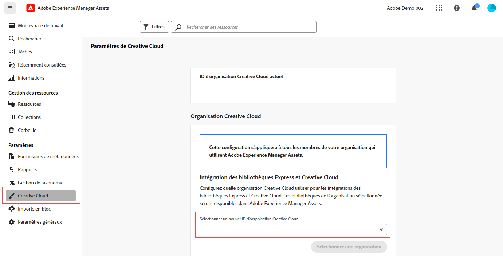

# Droits inter-organisations pour les intégrations Creative Cloud  {#cross-org-entitlements}

Experience Manager Assets a la capacité de se connecter à un droit Creative Cloud fourni à une autre organisation IMS afin d’utiliser facilement les dernières intégrations Creative Cloud dans AEM Assets, notamment les bibliothèques Express et Creative Cloud.

Si vos produits Creative Cloud et AEM Assets sont configurés pour des organisations IMS distinctes, vous pouvez vous connecter à une autre organisation Creative Cloud pour pouvoir exécuter des workflows intégrés entre les deux solutions.

## Conditions préalables {#prerequisites}

* Droits d’administration sur Experience Manager Assets

* Droit actif sur Creative Cloud pour le même ID d’utilisateur ou d’utilisatrice utilisé dans Creative Cloud et Experience Manager. Les droits sur les identifiants personnels et fédérés avec la même adresse e-mail sont traités comme des identifiants d’utilisateur ou d’utilisatrice différents.

## Se connecter à une nouvelle organisation Creative Cloud {#connect-to-creative-cloud-org}

Pour vous connecter à une nouvelle organisation Creative Cloud, exécutez les étapes suivantes :

1. Accédez à **[!UICONTROL Paramètres]** > **[!UICONTROL Creative Cloud]**.

1. Sélectionnez la nouvelle organisation Creative Cloud à l’aide de la liste déroulante **[!UICONTROL Sélectionner un nouvel ID d’organisation Creative Cloud]**. La liste affiche toutes les organisations auxquelles vous avez accès. Sélectionnez l’organisation disposant de droits Creative Cloud actifs.

1. Cliquez sur **[!UICONTROL Changer d’organisation]** pour passer à la nouvelle organisation.

   

## Limites {#limitations}

* Vous pouvez connecter AEM Assets à une seule organisation Creative Cloud à la fois. La connexion simultanée à plusieurs organisations Creative Cloud n’est pas prise en charge.

* L’organisation Creative Cloud à laquelle vous vous connectez dans AEM Assets s’applique à tous les utilisateurs et utilisatrices de votre organisation.
