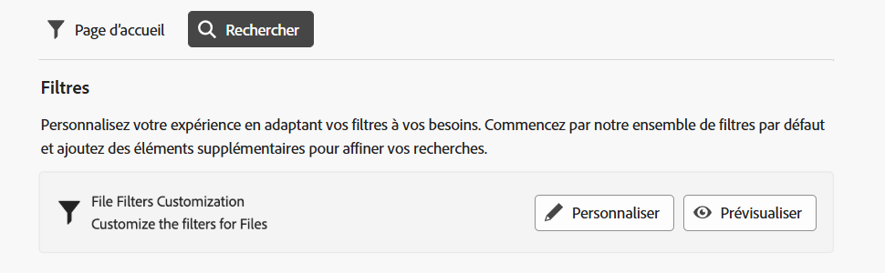
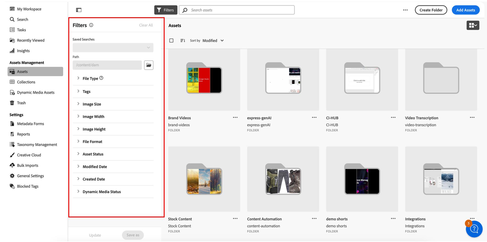

<table>
    <tr>
        <td>
            
            <a href="https://experienceleague.adobe.com/fr/docs/experience-manager-cloud-service/content/assets/dynamicmedia/dm-prime-ultimate"><b>Dynamic Media Prime et Ultimate</b></a>
        </td>
        <td>
            
            <a href="https://experienceleague.adobe.com/fr/docs/experience-manager-cloud-service/content/assets/assets-ultimate-overview"><b>AEM Assets Ultimate</b></a>
        </td>
        <td>
            
<a href="http://experienceleague.adobe.com/fr/docs/experience-manager-cloud-service/content/assets/integrate-aem-assets-edge-delivery-services"><b>Intégration d’AEM Assets à Edge Delivery Services</b></a>
        </td>
        <td>
            
            <a href="https://experienceleague.adobe.com/fr/docs/experience-manager-cloud-service/content/assets/assets-view/aem-assets-view-ui-extensibility"><b>Extensibilité de l’interface d’utilisation</b></a>
        </td>
          <td>
            
            <a href="https://experienceleague.adobe.com/fr/docs/experience-manager-cloud-service/content/assets/dynamicmedia/dm-prime-ultimate"><b>Activer Dynamic Media Prime et Ultimate</b></a>
        </td>
    </tr>
    <tr>
        <td>
            <a href="https://experienceleague.adobe.com/fr/docs/experience-manager-cloud-service/content/assets/best-practices/search-best-practices"><b>Bonnes pratiques de recherche</b></a>
        </td>
        <td>
            <a href="https://experienceleague.adobe.com/fr/docs/experience-manager-cloud-service/content/assets/best-practices/metadata-best-practices"><b>Bonnes pratiques relatives aux métadonnées</b></a>
        </td>
        <td>
            <a href="https://experienceleague.adobe.com/fr/docs/experience-manager-cloud-service/content/assets/content-hub/product-overview"><b>Hub de contenus</b></a>
        </td>
        <td>
            <a href="https://experienceleague.adobe.com/fr/docs/experience-manager-assets-essentials/help/custom-search-filters"><b>Fonctionnalités Dynamic Media avec OpenAPI</b></a>
        </td>
        <td>
            <a href="https://developer.adobe.com/experience-cloud/experience-manager-apis/"><b>Documentation de développement pour AEM Assets</b></a>
        </td>
    </tr>
</table>

# Personnaliser les filtres de recherche {#customize-search-filters}

Les filtres de recherche vous permettent d’affiner les résultats de recherche en fonction de divers paramètres tels que la date, le type de fichier, les balises et la pertinence, ce qui améliore la précision des requêtes de recherche. L’application de filtres vous permet de passer rapidement au crible les résultats les plus pertinents. Cela permet non seulement de gagner du temps, mais également d’améliorer l’expérience de recherche globale en adaptant les résultats aux préférences et aux besoins spécifiques.
En savoir plus sur la [recherche](search.md).

Les filtres de recherche AEM Assets personnalisés ne peuvent être mappés qu’aux entrées de votre index de propriétés indexables. Assurez-vous que toutes les métadonnées personnalisées sont incluses avant de configurer votre expérience de filtres personnalisés. [!DNL Assets Essentials] permet de personnaliser les filtres de recherche pour optimiser le processus de recherche. Pour personnaliser les filtres de recherche personnalisés d’AEM Assets, procédez comme suit :

1. Accédez à **[!UICONTROL Paramètres]** > **[!UICONTROL Paramètres généraux]**.
1. Accédez à l’onglet **[!UICONTROL Recherche]**. Cliquez sur **[!UICONTROL Personnaliser]** pour configurer votre formulaire de recherche.

   

1. Le formulaire [!UICONTROL Configurer les filtres] s’affiche. Assurez-vous d’être en mode Édition afin de pouvoir apporter des modifications au modèle. Vous pouvez passer en [!UICONTROL mode Prévisualisation] pour prévisualiser un formulaire de recherche existant.
1. Déposez des éléments de filtre à partir des [filtres personnalisés](#available-custom-filters) sur la zone de travail. Vous pouvez faire glisser et déposer le composant pour le réorganiser si nécessaire.

   >[!VIDEO](https://video.tv.adobe.com/v/3443080)

1. Cliquez sur **[!UICONTROL Mode Prévisualisation]** pour passer en revue les modifications.
1. Cliquez sur **[!UICONTROL Confirmer]** pour enregistrer.

## Filtres personnalisés disponibles {#available-custom-filters}

Assets Essentials fournit les filtres personnalisés suivants, qui peuvent être reconfigurés en fonction des besoins :

* [Éléments de filtre](#filter-elements)
* [Filtres préconfigurés](#preconfigured-filters)

### Éléments de filtre {#filter-elements}

AEM Assets, avec les filtres personnalisés, vous permet d’utiliser une collection d’éléments de filtre sur votre zone de travail de filtres de recherche personnalisés. Ces éléments sont reconfigurables en fonction de l’utilisabilité des attributs des propriétés de recherche. Cependant, vous pouvez personnaliser les [propriétés de filtres](#filter-properties) en fonction de vos besoins. Les éléments de filtre suivants sont disponibles dans [!DNL Assets Essentials] :

<table>
    <tr>
        <th>Éléments de filtre</th>
        <th>Description</th>
        <th>Propriétés</th>
    </tr>
    <tr>
        <td>Texte</td>
        <td>Un champ de texte est une zone de saisie dans laquelle vous pouvez saisir des informations relatives au filtre.</td>
        <td>
            <ul>
                <li>Libellé
                <li>Métadonnées
                <li>Valeurs
                <li>Description
            </ul>
        </td>
    </tr>
    <tr>
        <td>Options</td>
        <td>Les options se rapportent aux alternatives disponibles pour sélectionner un élément préféré dans une liste.</td>
        <td>
            <ul>
                <li>Libellé
                <li>Métadonnées
                <li>Valeurs
                <li>Options
                <li>Description
            </ul>
        </td>
    </tr>
    <tr>
        <td>Booléen</td>
        <td>Une valeur booléenne représente une valeur vraie. Elle peut être utilisée lorsque vous souhaitez être spécifique pour choisir une option parmi d’autres.</td>
        <td>
            <ul>
                <li>Libellé
                <li>Métadonnées
                <li>Description
            </ul>
        </td>
    </tr>
    <tr>
        <td>Nombre</td>
        <td>Utilisez cet élément de filtre pour représenter une valeur numérique.</td>
        <td>
            <ul>
                <li>Libellé
                <li>Métadonnées
                <li>Type de sélection
                <li>Contrôleur incrémentiel
                <li>Valeur du contrôleur incrémentiel
                <li>Description
            </ul>
        </td>
    </tr>
    <tr>
        <td>Liste déroulante</td>
        <td>Pour choisir parmi différentes options affichées dans une liste d’options.</td>
        <td>
            <ul>
                <li>Libellé
                <li>Métadonnées
                <li>Options
                <li>Valeurs
                <li>Description
            </ul>
        </td>
    </tr>
    <tr>
        <td>Plage</td>
        <td>Utilisé pour spécifier la date.</td>
        <td>
            <ul>
                <li>Libellé
                <li>Métadonnées
                <li>Type de sélection
                <li>Description
            </ul>
        </td>
    </tr>
    <tr>
        <td>Navigateur de chemin d’accès</td>
        <td>Permet de parcourir les fichiers ou dossiers du référentiel Experience Manager.</td>
        <td>
            <ul>
                <li>Libellé
                <li>Métadonnées
                <li>Explorateur de chemin d’accès
                <li>Description
            </ul>
        </td>
    </tr>
    <tr>
        <td>Balises</td>
        <td>Permet de sélectionner des balises parmi les options disponibles. Les balises fournissent des informations plus spécifiques sur les ressources et améliorent leur visibilité. Les balises déjà appliquées aux ressources sélectionnées sont affichées dans le panneau <b>Propriétés</b>. Si vous stockez des balises dans une propriété de métadonnées personnalisée et que vous utilisez le chemin racine pour la restreindre à une hiérarchie, vous pouvez utiliser la même configuration dans vos filtres de recherche. Si vous ne trouvez pas les balises appropriées, créez-les et affectez-les aux ressources sélectionnées. Consultez <a href = "/help/using/tagging-management.md">Gérer les balises dans Assets Essentials</a> pour plus d’informations sur la création et l’affectation de balises à des ressources.</td>
        <td>
            <ul>
                <li>Libellé
                <li>Métadonnées
                <li>Sélecteur de balises
                <li>Description
            </ul>
        </td>
    </tr>
    <tr>
        <td>User</td>
        <td>Utilisé pour spécifier le type d’utilisateur ou d’utilisatrice parmi les administrateurs et administratrices, les utilisateurs et utilisatrices réguliers et les consommateurs et consommatrices.</td>
        <td>
            <ul>
                <li>Libellé
                <li>Métadonnées
                <li>Description
            </ul>
        </td>
    </tr>
</table>

### Filtres préconfigurés {#preconfigured-filters}

Les filtres préconfigurés sont des paramètres prédéfinis, ce qui vous permet de les utiliser directement dans la zone de travail. Cependant, vous pouvez personnaliser les [propriétés de filtre](#filter-properties) en fonction de vos besoins. Les filtres suivants sont préconfigurés dans [!DNL Assets Essentials] :

<table>
    <tr>
        <th>Filtres préconfigurés</th>
        <th>Description</th>
        <th>Propriétés</th>
    </tr>
    <tr>
        <td>Type de fichier</td>
        <td>Filtrez les résultats de recherche selon les types de fichiers pris en charge suivants : « images », « documents » et « vidéos ».</td>
        <td>
            <ul>
                <li>Libellé
                <li>Métadonnées
                <li>Type de sélection
                <li>Options
                <li>Valeurs
                <li>Description
            </ul>
        </td>
    </tr>
    <tr>
        <td>Format de fichier</td>
        <td>Assets Essentials prend en charge tout format de fichier binaire avec les services de base, tels que le stockage, le chargement, la copie, le déplacement, la suppression et l’ajout de métadonnées.</td>
        <td>
            <ul>
                <li>Libellé
                <li>Métadonnées
                <li>Type de sélection
                <li>Description
            </ul>
        </td>
    </tr>
    <tr>
        <td>Taille de l’image</td>
        <td>Saisissez une ou plusieurs dimensions minimales et maximales pour filtrer les images. Les dimensions sont fournies en pixels et ne correspondent pas à la taille de fichier des images.</td>
        <td>
            <ul>
                <li>Libellé
                <li>Métadonnées
                <li>Type de sélection
                <li>Contrôleur incrémentiel
                <li>Valeur du contrôleur incrémentiel
                <li>Description
            </ul>
        </td>
    </tr>
    <tr>
        <td>Largeur de l’image</td>
        <td>Dimensions verticales d’une image.</td>
        <td>
            <ul>
                <li>Libellé
                <li>Métadonnées
                <li>Type de sélection
                <li>Contrôleur incrémentiel
                <li>Valeur du contrôleur incrémentiel
                <li>Description
            </ul>
        </td>
    </tr>
    <tr>
        <td>Hauteur de l’image</td>
        <td>Dimensions horizontales d’une image.</td>
        <td>
            <ul>
                <li>Libellé
                <li>Métadonnées
                <li>Type de sélection
                <li>Contrôleur incrémentiel
                <li>Valeur du contrôleur incrémentiel
                <li>Description
            </ul>
        </td>
    </tr>
    <tr>
        <td>Date de création</td>
        <td>Période durant laquelle des ressources ont été créées.</td>
        <td>
            <ul>
                <li>Libellé
                <li>Métadonnées
                <li>Type de sélection
                <li>Description
            </ul>
        </td>
    </tr>
    <tr>
        <td>Date de modification</td>
        <td>Période durant laquelle des ressources ont été modifiées.</td>
        <td>
            <ul>
                <li>Libellé
                <li>Métadonnées
                <li>Type de sélection
                <li>Description
            </ul>
        </td>
    </tr>
    <tr>
        <td>Statuts des ressources</td>
        <td>Assets Essentials vous permet de définir le statut des ressources disponibles dans le référentiel. Définissez le statut d’une ressource pour mieux gouverner et gérer la consommation en aval des ressources numériques. Choisissez entre <b>Approuvé, Rejeté ou Aucun statut</b>.</td>
        <td>
            <ul>
                <li>Libellé
                <li>Métadonnées
                <li>Type de sélection
                <li>Description
            </ul>
        </td>
    </tr>
    <tr>
        <td>Balises intelligentes</td>
        <td>Filtrez les ressources à l’aide de balises intelligentes ajoutées au référentiel Experience Manager.</td>
        <td>
            <ul>
                <li>Libellé
                <li>Métadonnées
                <li>Type de sélection
                <li>Prise en charge des délimiteurs
                <li>Description
            </ul>
        </td>
    </tr>
    <tr>
        <td>Statut Dynamic Media</td>
        <td>Choisissez le statut d’une ressource, entre Publié ou Dépublié.</td>
        <td>
            <ul>
                <li>Libellé
                <li>Métadonnées
                <li>Type de sélection
                <li>Options
                <li>Valeurs
                <li>Description
            </ul>
        </td>
    </tr>
    <tr>
        <td>Date d’expiration</td>
        <td>Filtrez les ressources en spécifiant une période après laquelle les ressources ne sont plus valides ou nécessaires. </td>
        <td>
            <ul>
                <li>Libellé
                <li>Métadonnées
                <li>Type de sélection
                <li>Description
            </ul>
        </td>
    </tr>
    <tr>
        <td>Balises (taxonomie)</td>
        <td>Il s’agit d’un système d’organisation et de classification des ressources numériques à l’aide de balises, créant essentiellement une structure hiérarchique de mots-clés qui permet aux utilisateurs et aux utilisatrices de rechercher et de trouver facilement du contenu pertinent en appliquant des balises spécifiques à chaque ressource. </td>
        <td>
            <ul>
                <li>Libellé
                <li>Métadonnées
                <li>Sélecteur de balises
                <li>Description
            </ul>
        </td>
    </tr>
</table>

#### Propriétés de filtre {#filter-properties}

Chaque élément de filtre est associé à un ensemble de propriétés. Les filtres de recherche personnalisés d’AEM Assets utilisent les propriétés suivantes dans les éléments de filtre et les éléments préconfigurés :

<table>
    <tr>
        <th>Propriétés</th>
        <th>Valeurs</th>
        <th>Description</th>
    </tr>
    <tr>
        <td>Libellé</td>
        <td>Texte</td>
        <td>Il s’agit de l’identifiant du filtre que vous utilisez.</td>
    </tr>
    <tr>
        <td>Métadonnées</td>
        <td>Liste déroulante</td>
        <td>La propriété de métadonnées est utilisée pour mapper des métadonnées approuvées à partir du référentiel Adobe Experience Manager Assets. Vous pouvez choisir dans le menu déroulant la valeur de métadonnées qui doit être mappée à l’élément de filtre. </td>
    </tr>
    <tr>
        <td>Type de sélection</td> 
        <td>Unique, Multiple, Exacte ou Plage </td>
        <td>
            <ul>
                <li>La <b>sélection unique</b> permet de choisir un seul élément à la fois, ce qui est idéal pour les choix distincts.
                <li>La <b>sélection multiple</b> permet de choisir plusieurs éléments simultanément, ce qui s’avère utile pour sélectionner plusieurs options. 
                <li>La <b>sélection exacte</b> permet de choisir un élément précis parmi diverses options.
                <li>La <b>sélection de plage</b> permet de choisir un ensemble continu de valeurs dans une plage définie, ce qui est utile pour sélectionner une plage de dates ou de valeurs numériques.
            </ul>
        </td>   
    </tr>
    <tr>
        <td>Options</td>
        <td>Manuel, Chemin JSON ou Chargement de fichier CSV</td>
        <td>
            <ul>
                <li>Choisissez <b>Manuel</b> si vous souhaitez ajouter des options manuellement. 
                <li>Choisissez <b>Chemin JSON</b> pour ajouter des options à partir du fichier JSON. 
                <li>Choisissez <b>Chargement de fichier CSV</b> pour importer un fichier CSV contenant les valeurs à ajouter dans les options.
            </ul>
        </td>
    </tr>
    <tr>
       <td>Valeurs</td>
        <td>Ajouter ou modifier</td>
        <td>
        <ul>
        <li>Cliquez sur <b>ajouter</b> pour ajouter une nouvelle valeur. 
        <li>Cliquez sur ✎ pour modifier le libellé. 
        <li>Cliquez sur 🗑 pour supprimer la valeur de l’option. 
        <li>Cliquez sur <b>Modifier</b> pour modifier les options d’édition. 
        <li>Vous pouvez également modifier l’ordre des options en les glissant-déposant.
        </td>
    </tr>
    <tr>
        <td>Prise en charge des délimiteurs</td>
        <td>Activer ou désactiver</td>
        <td>Un délimiteur est un symbole utilisé pour séparer des éléments distincts dans le texte. Par exemple, des virgules, des espaces ou des points-virgules.</td>
    </tr>
    <tr>
        <td>Contrôleur incrémentiel</td>
        <td>Valeur</td>
        <td>Ajoutez le bouton de contrôle incrémentiel au champ Nombre pour augmenter ou diminuer la valeur par paliers lors de chaque clic. </td>
    </tr>
    <tr>
        <td>Valeur du contrôleur incrémentiel </td>
        <td>Nombre</td>
        <td>Indique la valeur des paliers d’augmentation/de diminution lors de l’utilisation du bouton de contrôle incrémentiel. Elle s’affiche lorsque le contrôle incrémentiel est activé.</td>
    </tr>
    <tr>
        <td>Description</td>
        <td>Texte</td>
        <td>Ajoutez une explication détaillée pour fournir des informations supplémentaires sur l’élément de filtre.</td>
    </tr>
</table>

## Supprimer un élément de filtre {#delete-a-filter-element}

Pour supprimer un filtre de recherche, procédez de la manière suivante :

1. Accédez à **[!UICONTROL Paramètres]** > **[!UICONTROL Paramètres généraux]**.
1. Accédez à l’onglet **[!UICONTROL Recherche]**. Cliquez sur **[!UICONTROL Personnaliser]** pour configurer votre formulaire de recherche.
1. Le formulaire [!UICONTROL Configurer les filtres] s’affiche. Assurez-vous d’être en mode Édition afin de pouvoir apporter des modifications au modèle.
1. Sélectionnez l’élément de filtre que vous souhaitez supprimer. Sélectionnez par exemple **[!UICONTROL Hauteur d’image]**.
1. Cliquez sur **[!UICONTROL Supprimer la catégorie]** pour supprimer l’élément de filtre. L’élément **[!UICONTROL Hauteur d’image]** est alors supprimé de la zone de travail.
1. Cliquez sur **[!UICONTROL Confirmer]** pour enregistrer le formulaire.

## Utilisation de filtres de recherche personnalisés{#using-custom-search-filters}

Une fois les filtres de recherche configurés, vous pouvez les utiliser pour rechercher des ressources dans le référentiel.

>[!MORELIKETHIS]
>
>* [Recherche de ressources](/help/using/search.md)
