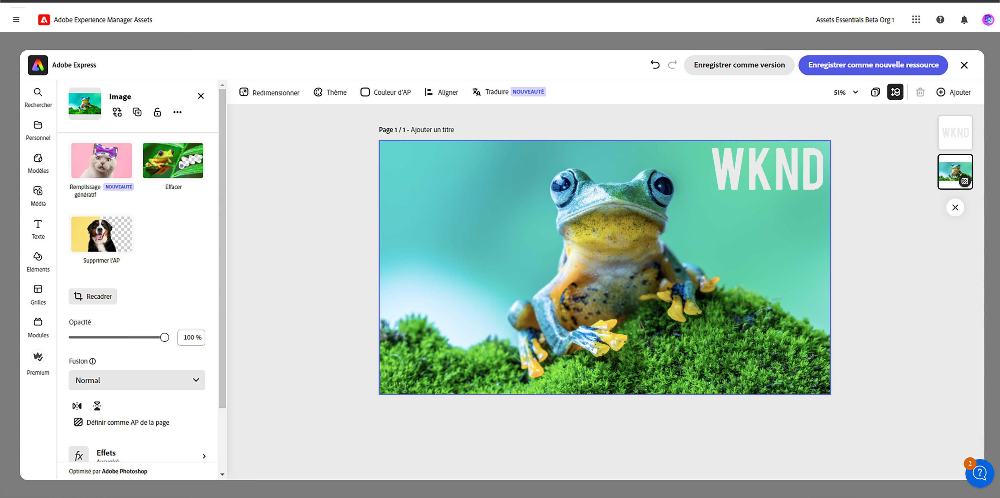
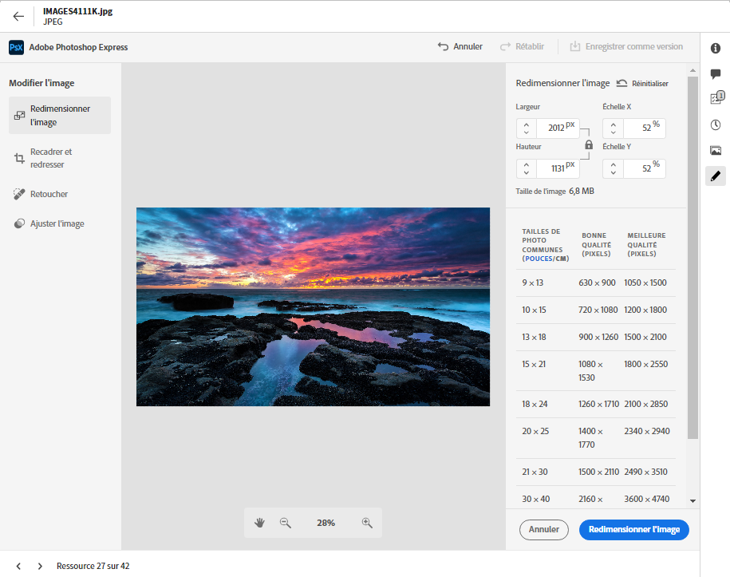
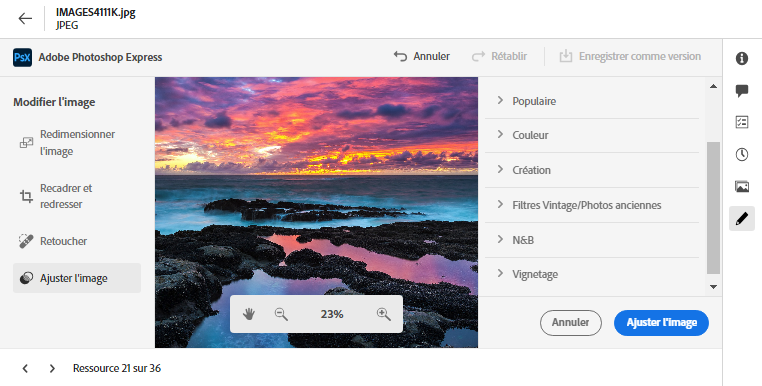

# Modifier des images dans [!DNL Assets Essentials] {#edit-images}

[!DNL Assets Essentials] fournit des options de modification conviviales, optimisées par [!DNL Adobe Express] et [!DNL Adobe Photoshop Express]. Les actions de modification disponibles à l’aide d’[!DNL Adobe Express] sont Redimensionner l’image, Supprimer l’arrière-plan, Recadrer l’image et Convertir le JPEG en PNG.

Après avoir modifié une image, vous pouvez enregistrer la nouvelle image en tant que nouvelle version de cette image. Le contrôle de version vous permet de revenir ultérieurement à la ressource d’origine, si nécessaire. Pour modifier une image, [ouvez son aperçu](/help/using/navigate-view.md#preview-assets) et cliquez sur **[!UICONTROL Modifier l’image]**.

>[!NOTE]
>
>Vous pouvez modifier les images des types de fichiers PNG et JPEG à l’aide d’[!DNL Adobe Express].

<!--The editing actions that are available are Spot healing, Crop and straighten, Resize image, and Adjust image.-->

## Modifier des images à l’aide d’Adobe Express {#edit-using-express}

>[!CONTEXTUALHELP]
>id="assets_express_integration"
>title="Intégration d’Adobe Express"
>abstract="Des outils simples et intuitifs d’édition d’images optimisés par Adobe Express sont disponibles directement dans AEM Assets pour augmenter la réutilisation du contenu et accélérer sa vitesse de diffusion."

### Redimensionnement de l’image {#resize-image-using-express}

Le redimensionnement d’une image à une taille spécifique est un cas d’utilisation courant. [!DNL Assets Essentials] permet de redimensionner rapidement l’image pour l’adapter aux tailles de photo courantes en fournissant de nouvelles résolutions précalculées pour des tailles de photo spécifiques. Pour redimensionner l’image à l’aide d’[!DNL Assets Essentials], procédez comme suit :

1. Sélectionnez une image, puis cliquez sur **Modifier**.
2. Cliquez sur **[!UICONTROL Redimensionner l’image]** dans les actions rapides disponibles du volet de gauche.
3. Sélectionnez la plateforme de médias sociaux appropriée dans la liste déroulante **[!UICONTROL Redimensionner pour]** et sélectionnez la taille de l’image parmi les options qui s’affichent.
4. Mettez l’image à l’échelle, le cas échéant, à l’aide du champ **[!UICONTROL Échelle d’image]**.
5. Cliquez sur **[!UICONTROL Appliquer]** pour appliquer vos modifications.
   

   Votre image modifiée peut être téléchargée. Vous pouvez enregistrer la ressource modifiée en tant que nouvelle version de la même ressource ou l’enregistrer en tant que nouvelle ressource.
   

### Supprimer l’arrière-plan {#remove-background-using-express}

Vous pouvez supprimer l’arrière-plan d’une image en quelques étapes simples, comme indiqué ci-dessous :

1. Sélectionnez une image, puis cliquez sur **Modifier**.
2. Cliquez sur **[!UICONTROL Supprimer l’arrière-plan]** dans les actions rapides disponibles du volet de gauche. Experience Manager Assets affiche l’image sans arrière-plan.
3. Cliquez sur **[!UICONTROL Appliquer]** pour appliquer vos modifications.
   

   Votre image modifiée peut être téléchargée. Vous pouvez enregistrer la ressource modifiée en tant que nouvelle version de la même ressource ou l’enregistrer en tant que nouvelle ressource.

### Recadrer l’image {#crop-image-using-express}

La transformation d’une image en taille parfaite est facile à l’aide des actions rapides d’[!DNL Adobe Express] intégrées.

1. Sélectionnez une image, puis cliquez sur **Modifier**.
2. Cliquez sur **[!UICONTROL Recadrer l’image]** dans les actions rapides disponibles du volet de gauche.
3. Faites glisser les poignées sur les coins de l’image pour créer le recadrage souhaité.
4. Cliquez sur **[!UICONTROL Appliquer]**.
   
L’image recadrée peut être téléchargée. Vous pouvez enregistrer la ressource modifiée en tant que nouvelle version de la même ressource ou l’enregistrer en tant que nouvelle ressource.

### Convertir le JPEG en PNG {#convert-jpeg-to-png-using-express}

Vous pouvez rapidement convertir une image JPEG au format PNG à l’aide d’Adobe Express. Procédez comme suit :

1. Sélectionnez une image, puis cliquez sur **Modifier**.
2. Cliquez sur **[!UICONTROL JPEG à PNG]** dans les actions rapides disponibles du volet de gauche.
   
3. Cliquez sur **[!UICONTROL Télécharger]**.

### Limites {#limitations-adobe-express}

* Résolution d’image prise en charge : minimum de 50 pixels, maximum de 6 000 pixels par dimension

* Taille de fichier maximale : 17 Mo

## Modifier des images à l’aide de l’éditeur intégré Adobe Express {#edit-using-embedded-editor}

Les personnes ayant accès à Express disposent désormais d’outils intégrés d’édition et de création d’images Adobe Express et Adobe Firefly disponibles directement dans Assets Essentials afin d’améliorer la réutilisation du contenu et d’accélérer sa vitesse de diffusion. Vous pouvez également utiliser des éléments prédéfinis pour optimiser l’aspect de vos ressources ou exécuter des actions rapides pour modifier vos images en quelques clics seulement.

Pour modifier des images à l’aide de l’éditeur intégré [!DNL Adobe Express], procédez comme suit :

1. Sélectionnez une image dans le référentiel Assets [!DNL Experience Manager].
1. Cliquez sur **[!UICONTROL Ouvrir dans Adobe Express]**.

   

   Vous pouvez tirer parti des fonctionnalités d’[!DNL Adobe Express] pour effectuer toutes les actions liées à la modification d’images, telles que le [redimensionnement d’image](https://helpx.adobe.com/fr/express/using/resize-image.html), la [suppression ou modification de la couleur d’arrière-plan](https://helpx.adobe.com/fr/express/using/remove-background.html), le [recadrage d’image](https://helpx.adobe.com/fr/express/using/crop-image.html) et bien plus encore.

1. Une fois la modification d’image terminée, vous pouvez télécharger une ressource en tant que nouvelle ressource ou l’enregistrer en tant que nouvelle version.

## Créer des ressources à l’aide d’Adobe Express {#create-new-embedded-editor}

[!DNL Assets Essentials] vous permet de créer un modèle entièrement nouveau à l’aide de l’éditeur intégré [!DNL Adobe Express]. Pour créer une ressource à l’aide d’[!DNL Adobe Express], exécutez les étapes suivantes :

1. Accédez à **[!UICONTROL Mon espace de travail]** et cliquez sur **[!UICONTROL Créer]** dans la bannière d’Adobe Express qui s’affiche au-dessus de la section [!UICONTROL Accès rapide]. La zone de travail vierge d’[!DNL Adobe Express] s’affiche dans l’interface utilisateur d’[!DNL Assets Essentials].
1. Créez votre contenu à l’aide de [modèles](https://helpx.adobe.com/fr/express/using/work-with-templates.html). Sinon, accédez à **[!UICONTROL Vos créations]** pour modifier le contenu existant.
1. Une fois les modifications terminées, cliquez sur **[!UICONTROL Enregistrer en tant que nouvelle ressource]**.
1. Spécifiez un chemin de destination pour la ressource créée, puis cliquez sur **[!UICONTROL Enregistrer]**.

>[!NOTE]
>
>* Vous ne pouvez modifier que les images dont les types de format sont `JPEG` et `PNG`.
>* Cette ressource doit présenter une taille inférieure à 14 Mo.
>* Vous pouvez enregistrer une image aux formats `PDF`, `JPEG` ou `PNG`.

<!--
## Edit images using [!DNL Adobe Photoshop Express] {#edit-using-photoshop-express}

<!--
After editing an image, you can save the new image as a new version. Versioning helps you to revert to the original asset later, if needed. To edit an image, [open its preview](/help/using/navigate-view.md#preview-assets) and click **[!UICONTROL Edit Image]**  from the rail on the right.

*Figure: The options to edit images are powered by [!DNL Adobe Photoshop Express].*
-->
<!--
### Spot heal images {#spot-heal-images-using-photoshop-express}

If there are minor spots or small objects on an image, you can edit and remove the spots using the spot healing feature provided by Adobe Photoshop.

The brush samples the retouched area and makes the repaired pixels blend seamlessly into the rest of the image. Use a brush size that is only slightly larger than the spot you want to fix.

<!-- 
TBD: See if we should give backlinks to PS docs for these concepts.
For more information about how Spot Healing works in Photoshop, see [retouching and repairing photos](https://helpx.adobe.com/photoshop/using/retouching-repairing-images.html). 
-->
<!--
### Crop and straighten images {#crop-straighten-images-using-photoshop-express}

Using the crop and straighten option that you can do basic cropping, rotate image, flip it horizontally or vertically, and crop it to dimensions suitable for popular social media websites.

To save your edits, click **[!UICONTROL Crop Image]**. After editing, you can save the new image as a version.

Many default options let you crop your image to the best proportions that fit various social media profiles and posts.

### Resize image {#resize-image-using-photoshop-express}

You can view the common photo sizes in centimeters or inches to know the dimensions. By default, the resizing method retains the aspect ratio. To manually override the aspect ratio, click .

Enter the dimensions and click **[!UICONTROL Resize Image]** to resize the image. Before you save the changes as a version, you can either undo all the changes done before saving by clicking [!UICONTROL Undo] or you can change the specific step in the editing process by clicking [!UICONTROL Revert].

### Adjust image {#adjust-image-using-photoshop-express}

[!DNL Assets Essentials] lets you adjust the color, tone, contrast, and more, with just a few clicks. Click **[!UICONTROL Adjust image]** in the edit window. The following options are available in the right sidebar:

* **Popular**: [!UICONTROL High Contrast & Detail], [!UICONTROL Desaturated Contrast], [!UICONTROL Aged Photo], [!UICONTROL B&W Soft], and [!UICONTROL B&W Sepia Tone].
* **Color**: [!UICONTROL Natural], [!UICONTROL Bright], [!UICONTROL High Contrast], [!UICONTROL High Contrast & Detail], [!UICONTROL Vivid], and [!UICONTROL Matte].
* **Creative**: [!UICONTROL Desaturated Contrast], [!UICONTROL Cool Light], [!UICONTROL Turquoise & Red], [!UICONTROL Soft Mist], [!UICONTROL Vintage Instant], [!UICONTROL Warm Contrast], [!UICONTROL Flat & Green], [!UICONTROL Red Lift Matte], [!UICONTROL Warm Shadows], and [!UICONTROL Aged Photo].
* **B&W**: [!UICONTROL B&W Landscape], [!UICONTROL B&W High Contrast], [!UICONTROL B&W Punch], [!UICONTROL B&W Low Contrast], [!UICONTROL B&W Flat], [!UICONTROL B&W Soft], [!UICONTROL B&W Infrared], [!UICONTROL B&W Selenium Tone], [!UICONTROL B&W Sepia Tone], and [!UICONTROL B&W Split Tone].
* **Vignetting**: [!UICONTROL None], [!UICONTROL Light], [!UICONTROL Medium], and [!UICONTROL Heavy].

<!--
TBD: Insert a video of the available social media options.
-->

### Étapes suivantes {#next-steps}

* Faites des commentaires sur le produit en utilisant l’option [!UICONTROL Commentaires] disponible dans l’interface utilisateur d’Assets Essentials.

* Faites des commentaires sur la documentation en utilisant l’option [!UICONTROL Modifier cette page]  ou [!UICONTROL Enregistrer un problème]  disponible dans la barre latérale droite.

* Contactez l’[assistance clientèle](https://experienceleague.adobe.com/?support-solution=General&amp;lang=fr#support).

>[!MORELIKETHIS]
>
>* [Affichage de l’historique des versions d’une ressource](/help/using/navigate-view.md)
