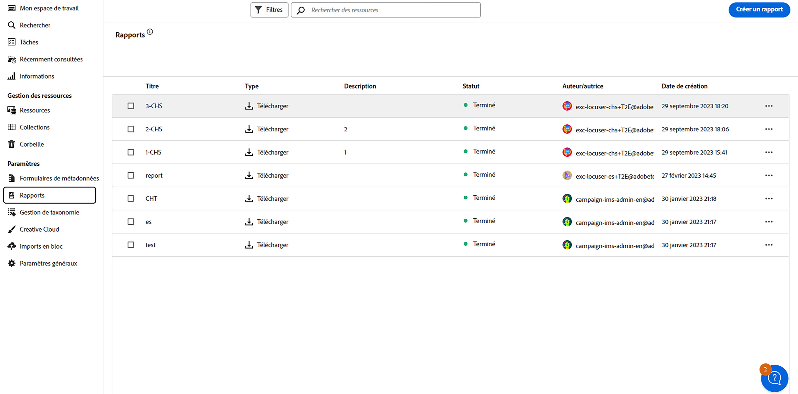
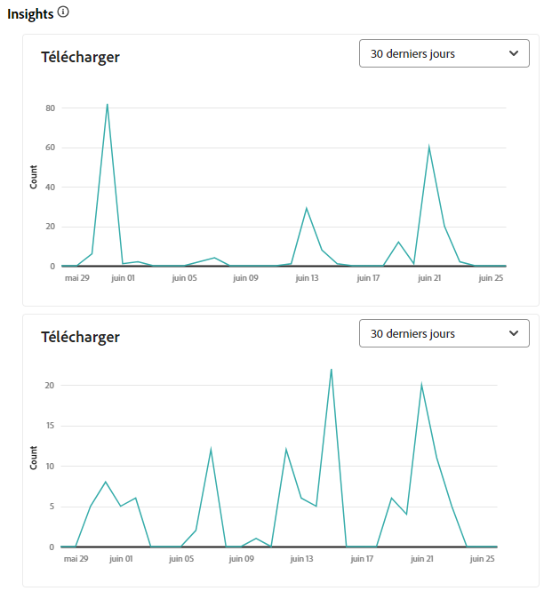
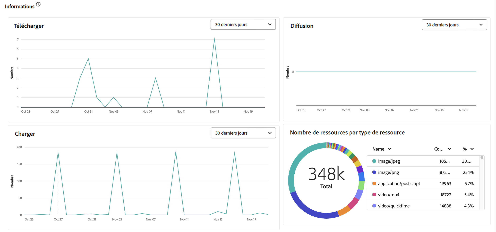
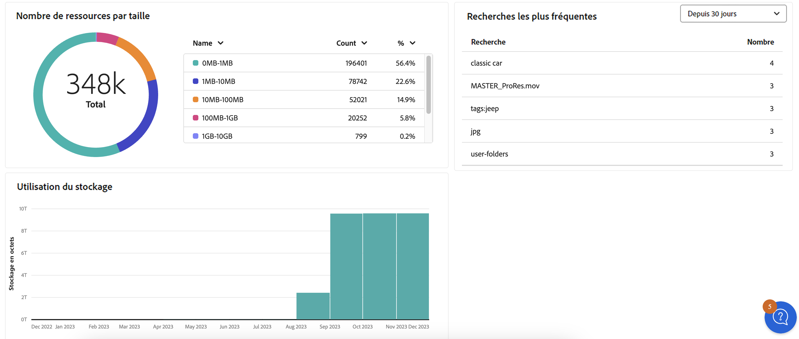

# Gérer les rapports {#manage-reports}

Les rapports de ressources offrent aux administrateurs une visibilité sur l’activité de l’environnement Adobe Experience Manager Assets Essentials. Ces données fournissent des informations utiles sur la façon dont les utilisateurs interagissent avec le contenu et le produit. Tous les utilisateurs et utilisatrices peuvent accéder au tableau de bord Insights et ceux qui sont affectés au profil de produit Administrateurs et administratrices peuvent créer des rapports définis par l’utilisateur ou l’utilisatrice.

## Accéder aux rapports {#access-reports}

Tous les utilisateurs et toutes les utilisatrices affectés au [profil de produit Administration d’Assets Essentials](deploy-administer.md) peuvent accéder au tableau de bord des insights ou créer des rapports définis par l’utilisateur dans Assets Essentials.

Pour accéder aux rapports, accédez à **[!UICONTROL Rapports]** sous **[!UICONTROL Paramètres]**.

<!--
In the **[!UICONTROL Reports]** screen, various components are shown in the tabular format which includes the following:

* **Title**: Title of the report
* **Type**: Determines whether the report is uploaded or downloaded to the repository
* **Description**: Provide details of the report that was given during uploading/downloading the report
* **Status**: Determines whether the report is completed, under progress, or deleted.
* **Author**: Provides email of the author who has uploaded/downloaded the report.
* **Created**: Gives information of the date when the report was generated.
-->

## Créer un rapport {#create-report}

L’environnement AEM Assets Essentials offre des fonctionnalités de reporting complètes via le tableau de bord Rapports. Cette fonctionnalité permet aux utilisateurs et utilisatrices de générer et de télécharger des rapports CSV détaillant les chargements et les téléchargements de ressources dans des périodes spécifiées, qu’il s’agisse d’intervalles ponctuels, quotidiens, hebdomadaires, mensuels ou annuels.

**Pour créer un rapport, procédez come suit :**

1. Accédez à **Reports** et cliquez sur **Créer un rapport** (dans le coin supérieur droit). La boîte de dialogue **Créer un rapport** affiche les champs suivants :
   

   **Dans l’onglet Configuration :**

   1. **Type de rapport :** choisissez entre le type de chargement et de téléchargement.
   1. **Titre :** ajoutez un titre au rapport.
   1. **Description :** ajoutez une description facultative au rapport.
   1. **Sélectionner le chemin d’accès au dossier :** sélectionnez un chemin d’accès au dossier pour générer le rapport des ressources chargées et téléchargées dans ce dossier spécifique. Par exemple, si vous avez besoin d’un rapport de ressources chargées dans un dossier, indiquez le chemin d’accès à ce dossier.
   1. **Sélectionner l’intervalle de dates :** sélectionnez la période pour afficher l’activité de chargement ou de téléchargement dans le dossier.
    

   >[!NOTE]
   >
   > Assets Essentials convertit tous les fuseaux horaires locaux en temps universel coordonné (UTC).

   **Dans l’onglet Colonnes :** sélectionnez les noms de colonne à afficher dans le rapport. Le tableau suivant explique l’utilisation de toutes les colonnes :

   <table>
    <tbody>
     <tr>
      <th><strong>Nom de la colonne</strong></th>
      <th><strong>Description</strong></th>
      <th><strong>Type de rapport</strong></th>
     </tr>
     <tr>
      <td>Titre</td>
      <td>Titre de la ressource.</td>
      <td>Chargement et téléchargement</td>
     </tr>
     <tr>
      <td>Chemin</td>
      <td>Chemin d’accès au dossier qui contient la ressource dans Assets Essentials.</td>
      <td>Chargement et téléchargement</td>
     </tr>
     <tr>
      <td>Type MIME</td>
      <td>Type MIME de la ressource.</td>
      <td>Chargement et téléchargement</td>
     </tr>
     <tr>
      <td>Taille</td>
      <td>Taille de la ressource en octets.</td>
      <td>Chargement et téléchargement</td>
     </tr>
     <tr>
      <td>Téléchargé par</td>
      <td>ID d’e-mail de l’utilisateur qui a téléchargé la ressource.</td>
      <td>Téléchargement</td>
     </tr>
     <tr>
      <td>Date de téléchargement</td>
      <td>Date à laquelle la ressource a été téléchargée.</td>
      <td>Téléchargement</td>
     </tr>
     <tr>
      <td>Créateur ou créatrice</td>
      <td>Le créateur ou la créatrice de la ressource.</td>
      <td>Chargement et téléchargement</td>
     </tr>
     <tr>
      <td>Date de création</td>
      <td>Date à laquelle la ressource a été chargée dans Assets Essentials.</td>
      <td>Chargement et téléchargement</td>
     </tr>
     <tr>
      <td>Date de modification</td>
      <td>Date de dernière modification de la ressource.</td>
      <td>Chargement et téléchargement</td>
     </tr>
     <tr>
      <td>Expiré</td>
      <td>Statut d’expiration de la ressource.</td>
      <td>Chargement et téléchargement</td>
     </tr>
     <tr>
      <td>Téléchargé par « Nom d’utilisateur »</td>
      <td>Nom de l’utilisateur qui a téléchargé la ressource.</td>
      <td>Téléchargement</td>
     </tr>           
    </tbody>
   </table>

## Afficher et télécharger un rapport existant {#View-and-download-existing-report}

Les rapports existants s’affichent dans l’onglet **Rapports exécutés**. Cliquez sur **Rapports** et sélectionnez **Rapports exécutés** pour afficher tous les rapports créés dont le statut est **Terminé**, indiquant qu’ils peuvent être téléchargés. Pour télécharger le rapport au format CSV ou le supprimer, sélectionnez la ligne du rapport. Sélectionnez ensuite **Télécharger le fichier CSV** ou **Supprimer**.

## Planifier un rapport {#schedule-report}

Dans l’interface d’utilisation d’AEM Essentials, **Planifier le rapport** configure une génération automatique de rapports à des intervalles futurs précis, par exemple tous les jours, toutes les semaines, tous les mois ou tous les ans. Cette fonctionnalité permet de rationaliser les besoins récurrents en matière de reporting et d’assurer des mises à jour opportunes des données. **Créer un rapport** génère pour sa part des rapports pour les dates antérieures. Les rapports terminés sont répertoriés dans **Rapports exécutés** et les rapports à venir se trouvent dans **Rapports planifiés**.

Pour planifier un rapport, procédez comme suit :

1. Cliquez sur Rapports dans le volet de gauche, puis sur Créer un rapport (en haut à droite).
1. La boîte de dialogue du rapport affiche les informations suivantes :
   1. **Type de rapport :** choisissez entre le type de chargement et de téléchargement.
   1. **Titre :** ajoutez un titre au rapport.
   1. **Description :** ajoutez une description facultative au rapport.
   1. **Sélectionner le chemin d’accès au dossier :** sélectionnez un chemin d’accès au dossier afin de générer un rapport pour les ressources qui seront chargées ou téléchargées à partir de ce dossier spécifique à l’avenir.
   1. Activer **Planifier un rapport :** activez cette option pour planifier le rapport à une date ultérieure ou récurrente.
      

   1. **Choisir la fréquence :** spécifiez l’intervalle de génération du rapport (par exemple, quotidien, hebdomadaire, mensuel, annuel ou ponctuel) et définissez la date et l’heure d’exécution du rapport ainsi que la date de fin de la périodicité. Pour un rapport ponctuel, sélectionnez la période du rapport sur le type d’activité sélectionné dans l’environnement AEM. Par exemple, si vous avez besoin d’un rapport sur les ressources téléchargées entre le 10 et le 29 (dates futures) d’un mois spécifique, sélectionnez ces dates dans le champ **Sélectionner l’intervalle de dates**.

   >[!NOTE]
   >
   > Assets Essentials convertit tous les fuseaux horaires locaux en temps universel coordonné (UTC).

## Afficher les rapports planifiés {#view-scheduled-reports}

Les rapports planifiés s’affichent dans l’onglet **Rapports planifiés** et sont organisés de manière systématique. Tous les rapports terminés pour chaque rapport planifié sont stockés dans un seul dossier de rapports. Cliquez sur  pour afficher les rapports terminés. Par exemple, si vous avez planifié un rapport quotidien, tous les rapports terminés sont regroupés dans un seul dossier. Cette organisation simplifie la navigation et la recherche des rapports. Pour afficher les rapports planifiés, cliquez sur **Rapports**, puis sur **Rapports planifiés**. Tous les rapports planifiés s’affichent, avec le statut En cours ou Terminé. Les rapports terminés peuvent être téléchargés.

## Modifier et annuler des rapports planifiés {#edit-cancel-scheduled-reports}

1. Accédez à l’onglet **Rapports planifiés**.
1. Sélectionnez la ligne du rapport.
1. Cliquez sur **Modifier**.
1. Cliquez sur **Annuler la planification**, puis sur **Confirmer** pour annuler le rapport planifié. Pour les rapports annulés, la prochaine exécution devient vide et le statut est Annulé.
   

### Reprendre le planning {#resume-schedule}

Pour reprendre le planning annulé, sélectionnez la ligne du rapport et cliquez sur **Reprendre le planning**. Lors de la reprise, les entrées d’exécution suivantes s’affichent à nouveau et le statut est En cours.

>[!NOTE]
>
> Si vous reprenez un rapport annulé avant la date de fin planifiée, les rapports entre la date d’annulation et la date de reprise sont automatiquement générés.

## Afficher les insights {#view-live-statistics}

>[!CONTEXTUALHELP]
>id="assets_reports"
>title="Rapports"
>abstract="Le tableau de bord Insights vous permet d’afficher les mesures des événements en temps réel pour votre environnement Experience Manager Assets au cours des 30 derniers jours ou des 12 derniers mois. La liste des événements inclut le nombre de téléchargements, de chargements, de recherches principales, etc."

Assets Essentials vous permet d’afficher des données en temps réel pour votre environnement Assets Essentials à l’aide du tableau de bord Insights. Vous pouvez afficher les mesures d’événement en temps réel au cours des 30 derniers jours ou au cours des 12 derniers mois.

<!---->

Cliquez sur les **[!UICONTROL Insights]** disponibles dans le volet de navigation de gauche pour afficher les graphiques générés automatiquement suivants :

* **Téléchargements** : nombre de ressources téléchargées à partir de l’environnement Assets Essentials au cours des 30 derniers jours ou 12 derniers mois, représentées à l’aide d’un graphique en courbes.
  

* **Chargements** : nombre de ressources chargées dans l’environnement Assets Essentials au cours des 30 derniers jours ou 12 derniers mois, représentées à l’aide d’un graphique en courbes.
  

<!--* **Asset Count by Size**: The division of count of assets based on their range of various sizes from 0 MB to 100 GB.-->

* **Utilisation du stockage** : utilisation du stockage, en octets, pour l’environnement Assets Essentials, représentée à l’aide d’un histogramme.
  
  <!--* **Delivery**: The graph depicts the count of assets as the delivery dates.-->

<!--* **Asset Count by Asset Type**: Represents count of various MIME types of the available assets. For example, application/zip, image/png, video/mp4, application/postscripte.-->

* **Recherches les plus fréquentes** : affichez les termes recherchés les plus fréquemment, ainsi que le nombre de fois où ces termes ont été recherchés dans votre environnement Assets Essentials au cours des 30 derniers jours ou 12 derniers mois, représentés sous forme de tableau.
  

  <!--
   
   
   -->

* **Nombre de ressources par taille :** segmente le nombre total de ressources dans votre environnement Assets Essentials en différentes plages de tailles, en soulignant le nombre et le pourcentage de ressources dans chaque plage de tailles, avec une représentation de graphique en anneau.
  

* **Nombre de ressources par type de ressource :** segmente le nombre total de ressources dans votre environnement Assets Essentials, en soulignant le nombre et le pourcentage de ressources en fonction de leurs types de fichiers, avec une représentation de graphique en anneau.
  

