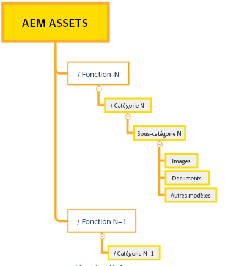
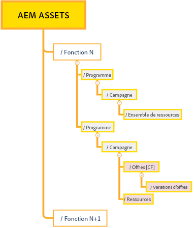
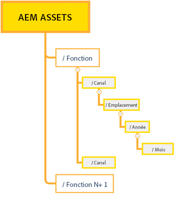

# Bonnes pratiques pour une gestion efficace des autorisations {#best-practices-permissions-management}

En tant qu’administrateur, avant de commencer à gérer les autorisations de dossiers pour le référentiel Assets Essentials, il existe plusieurs bonnes pratiques que vous pouvez implémenter pour rendre l’infrastructure intuitive pour les administrateurs et les utilisateurs finaux lors de la gestion ultérieure des opérations.

Vous pouvez intégrer ces bonnes pratiques tout en :

* [Créant des groupes d’utilisateurs dans Admin Console.](#admin-console-best-practices)

* [Créant une structure de dossiers dans le référentiel Assets Essentials.](#folder-structure-assets-essentials)

* [Gérant les autorisations dans le référentiel Assets Essentials.](#folder-permissions)

## Admin Console {#admin-console-best-practices}

Identifiez les besoins en matière d’accès en fonction des groupes d’utilisateurs de votre entreprise. Planifiez et créez des groupes d’utilisateurs pour votre entreprise, puis ajoutez des utilisateurs à ces groupes. Il est plus facile de gérer les autorisations de dossiers en fonction des groupes d’utilisateurs et non des utilisateurs individuels.

## Structure des dossiers pour le référentiel Assets Essentials {#folder-structure-assets-essentials}

Tenez compte des points suivants lorsque vous commencez à planifier la création d’une structure de dossiers dans le référentiel Assets Essentials :

* Gouvernance future : les dossiers qui sont régis par les administrateurs et les dossiers dont les [autorisations sont délégués à d’autres utilisateurs en tant que propriétaires](manage-permissions.md##manage-permissions-folders).

* Évolutive : la structure des dossiers doit répondre aux besoins futurs de votre entreprise et doit être facilement évolutive.

* Taille : un dossier ne doit pas contenir trop de ressources. Cela pourrait entraîner des problèmes d’utilisation et devenir difficile à gérer.

* Intuitive : la structure du dossier doit être facile à parcourir et intuitive pour les utilisateurs finaux. Les utilisateurs doivent être en mesure d’identifier facilement où charger une nouvelle ressource dans la structure de dossiers.

Il existe plusieurs types de structure de dossiers que vous pouvez utiliser pour votre organisation. Voici quelques exemples de structures de dossiers typiques :

* Basée sur la fonction et la catégorisation

  

* Basée sur Campaign

  

* Basée sur l’emplacement de l’offre (ou canal)

  

## Autorisations des dossiers {#folder-permissions}

Après avoir créé des groupes d’utilisateurs pour votre organisation, ajouté des utilisateurs à ces groupes d’utilisateurs, et sélectionné et créé une structure de dossiers dans le référentiel Assets Essentials qui répond aux besoins de votre organisation, vous pouvez commencer à gérer les autorisations de dossiers pour votre organisation. Tenez compte des points suivants lorsque vous commencez à gérer les autorisations de dossiers :

* Appliquez des autorisations aux groupes d’utilisateurs, et non aux utilisateurs individuels. Cela permet d’obtenir une structure d’autorisations plus simple et plus efficace.

* Maintenez la structure des autorisations aussi simple que possible pour une efficacité opérationnelle.

* Utilisez les autorisations de refus d’accès avec précaution et préférez l’application des autorisations positives (Peut modifier, Peut afficher, Propriétaire) à la structure des dossiers.

Pour des exemples sur la manière d’obtenir une structure de dossiers simple et efficace, voir [Gérer les autorisations sur les dossiers](manage-permissions.md##manage-permissions-folders).

## Étapes suivantes {#next-steps}

* Faites des commentaires sur le produit en utilisant l’option [!UICONTROL Commentaires] disponible dans l’interface utilisateur d’Assets Essentials.

* Faites des commentaires sur la documentation en utilisant l’option [!UICONTROL Modifier cette page]  ou [!UICONTROL Enregistrer un problème]  disponible dans la barre latérale droite.

* Contactez l’[assistance clientèle](https://experienceleague.adobe.com/?support-solution=General&amp;lang=fr#support).
