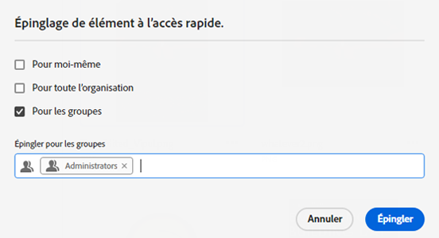
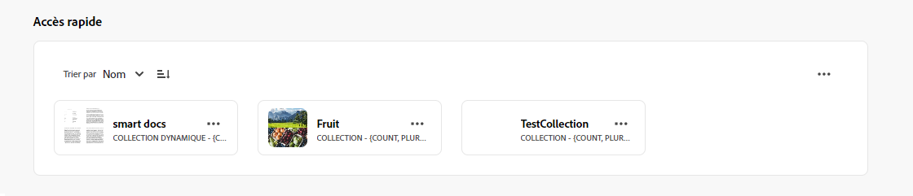
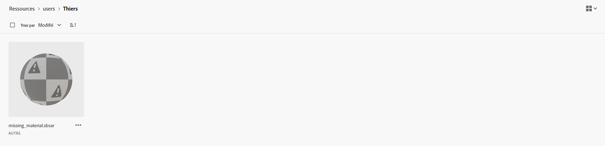
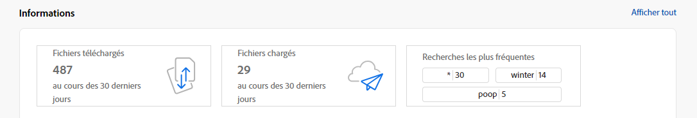
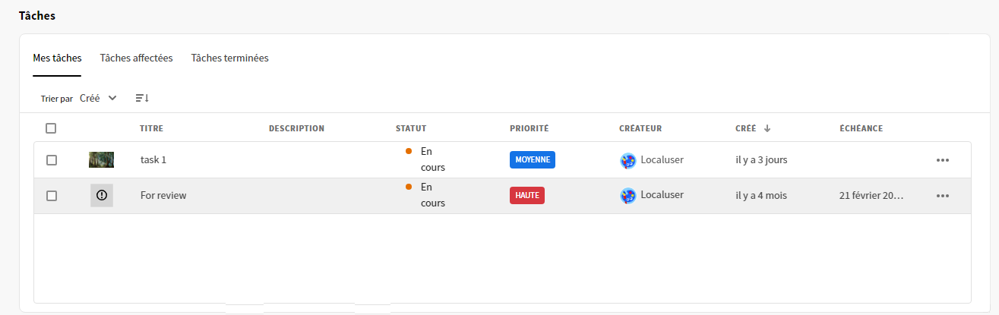
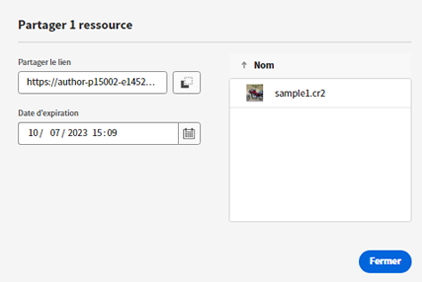

# Notes de mise à jour d’[!DNL Assets Essentials] {#release-notes}

La version actuelle d’Assets Essentials a été publiée le 25 juillet 2024.

Voici quelques-unes des fonctions récemment ajoutées :

**Intégration des informations de traçabilité du contenu**

Experience Manager Assets prend désormais en charge les informations de traçabilité du contenu pour les formats d’image pris en charge. Vous y trouverez des informations sur la traçabilité de la ressource et sur sa création, y compris si elle a été modifiée à l’aide de GenAI.

**Prévisualisations du contenu du dossier**

Experience Manager Assets affiche désormais des prévisualisations du contenu du dossier sur sa miniature lors de la navigation ou de la recherche de contenu, ce qui améliore la visibilité des ressources disponibles dans le référentiel AEM Assets.

**Recherche contextuelle**

Vous pouvez également rechercher des ressources disponibles dans le référentiel en définissant des invites de texte. Experience Manager Assets transforme automatiquement ces invites de texte en filtres de recherche et affiche les résultats de la recherche. Vous pouvez afficher et modifier des filtres automatiques à l’aide du volet Filtres pour affiner davantage les résultats de la recherche.

<!--

**Dynamic renditions**

You can now view and download dynamic renditions (including smart crops) in Experience Manager Assets. Dynamic renditions are customized versions of image assets created in real-time to meet specific needs, such as resizing images based on device resolution or cropping to fit different aspect ratios. These renditions enable organizations to deliver personalized and optimized experiences to diverse audience needs.

-->

**Changement statique du nom des ressources et des dossiers**

Experience Manager Assets offre désormais une expérience utilisateur simplifiée en permettant de renommer une ressource ou un dossier en un seul clic.

**Actions rapides sur les vidéos express**

Experience Manager Assets comprend désormais des outils d’édition vidéo simples et intuitifs optimisés par Adobe Express pour augmenter la réutilisation du contenu et accélérer sa vitesse de diffusion. Les options de retouche incluent le rognage, le recadrage, le redimensionnement d’une vidéo, ainsi que la conversion d’un fichier MP4 en fichier GIF.

>[!NOTE]
> Des droits d’accès [!DNL Adobe Express] sont requis, ainsi qu’au moins un environnement dans AEM Assets. L’environnement peut être l’un des référentiels dans [!DNL Assets as a Cloud Service] ou [!DNL Assets Essentials].

**Affecter un formulaire de métadonnées à plusieurs dossiers ou le supprimer de ceux-ci**

Un formulaire de métadonnées peut désormais être attribué à plusieurs dossiers ou supprimé de ceux-ci.

**Gérer les autorisations des collections privées**

Vous pouvez autoriser les administrateurs et administratrices, de même que les personnes qui ne le sont pas, à gérer les niveaux d’accès pour les collections privées disponibles dans le référentiel. Vous pouvez attribuer les autorisations `Can View` et `Can Edit` aux groupes d’utilisateurs et d’utilisatrices et aux personnes. Vous pouvez également déléguer les privilèges de gestion des autorisations aux groupes d’utilisateurs et d’utilisatrices.

**Améliorations basées sur les commentaires des clients**

Améliorations et correctifs de bugs basés sur les commentaires des clients.

## Problèmes connus {#known-issues}

La liste des problèmes connus de l’offre [!DNL Assets Essentials] est révisée et mise à jour régulièrement.

<!--

* Assets Essentials does not support creating Private collections.

-->

<!--* Private collections are available to creator and the users with administrator privileges. As an administrator, you cannot delegate the permissions to access the collection to other users.-->

Si vous rencontrez des problèmes ou même si vous avez des demandes d’amélioration, [communiquez vos requêtes](#provide-feedback) à l’équipe.

## Versions antérieures {#past-releases}

### Version de janvier 2024 {#january-2024-release}

**Liste bloquée des balises intelligentes**

Assets Essentials vous permet désormais de définir une liste bloquée contenant des mots qui ne doivent pas être ajoutés en tant que balises intelligentes aux ressources chargées dans le référentiel. Cette fonctionnalité vous aide à maintenir la conformité de la marque et réduit les efforts de modération des balises intelligentes.

**Créer des images GenAI avec Adobe Firefly**

Créez des images à partir de requêtes de recherche avec une intégration de la fonctionnalité « du texte à l’image » d’Adobe Firefly (nécessite une licence Adobe Firefly).

**Rechercher des images similaires**

Vous pouvez désormais facilement rechercher du contenu en sélectionnant une image et en affichant des images similaires dans le référentiel Experience Manager Assets.

**Éditeur d’Adobe Express intégré à AEM Assets**

Les personnes ayant accès à Express disposent désormais d’outils intégrés d’édition et de création d’images Adobe Express et Adobe Firefly disponibles directement dans AEM Assets, permettant d’améliorer la réutilisation du contenu et d’accélérer sa vitesse.

**Rapports sur l’utilisation du stockage dans Insights** :

Les administrateurs et administratrices ont désormais la possibilité d’afficher les rapports sur l’utilisation du stockage disponibles dans le cadre d’Insights.

**Configuration de la page d’accueil axée sur la recherche**

Assets Essentials vous permet désormais de configurer l’expérience de la page d’accueil de votre organisation. Si vous sélectionnez l’approche axée sur la recherche pour votre page d’accueil, vous pouvez configurer l’alignement de la barre de recherche, l’image d’arrière-plan et le logo de votre organisation. Le fait de choisir [!UICONTROL Paramètres généraux] remplace la page de destination par défaut. Par exemple, la page de destination par défaut est [!UICONTROL Mon espace de travail] pour l’équipe d’administration et une [!UICONTROL page axée sur la recherche] pour les personnes non administratrices. Le fait de choisir l’une des options sous Paramètres généraux s’applique à toutes les personnes.

### Version d’octobre 2023 {#october2023-release}

**Importer des ressources en bloc à partir d’une source de données OneDrive**

Les administrateurs et administratrices peuvent désormais [importer un grand nombre de ressources depuis une source de données vers AEM Assets](/help/using/bulk-import-assets-view.md). La liste mise à jour des sources de données prises en charge pour l’import en bloc comprend Azure, AWS, Google Cloud, Dropbox et OneDrive.

**Prise en charge des droits inter-organisations pour les bibliothèques**

Experience Manager Assets vous permet désormais de configurer l’accès aux bibliothèques Creative Cloud dans une autre organisation IMS. Cela permet d’accéder plus facilement aux derniers workflows inter-produits entre Creative Cloud et Experience Manager et réduit le temps et les efforts pour les personnes responsables de la création.

### Version de septembre 2023 {#september2023-release}

**Attribuer un formulaire de métadonnées à un dossier**

Vous pouvez désormais attribuer un formulaire de métadonnées à un dossier spécifique dans votre déploiement d’Assets Essentials. Toutes les ressources du dossier, y compris les ressources des sous-dossiers, affichent les propriétés définies dans le formulaire de métadonnées attribué.

**Importer des ressources en bloc à partir de sources de données**

Les administrateurs et administratrices peuvent désormais importer un grand nombre de ressources d’une source de données vers AEM Assets. Les administrateurs et administratrices n’ont plus besoin de charger des ressources ou des dossiers individuels vers AEM Assets. Les sources de données prises en charge pour l’import en bloc sont Azure, AWS, Google Cloud et Dropbox.

**Outils de retouche d’images optimisés par Adobe Express**

Des outils simples et intuitifs d’édition d’images optimisés par Adobe Express sont disponibles directement dans AEM Assets pour augmenter la réutilisation du contenu et accélérer sa vitesse de diffusion.

**Flexibilité lors de l’épinglage d’éléments pour l’accès rapide à Mon espace de travail**

Possibilité de sélectionner et d’épingler des éléments pour vous, pour l’ensemble de votre organisation ou pour une liste de groupes afin qu’ils s’affichent dans la section Accès rapide de Mon espace de travail en fonction de votre sélection.

### Version de juillet 2023 {#july2023-release}

**Amélioration du framework d’intelligence artificielle pour les balises intelligentes d’image**

Experience Manager Assets utilise désormais un framework d’intelligence artificielle amélioré pour les balises intelligentes d’image. Celui-ci améliore la pertinence et la précision des balises intelligentes disponibles pour toutes les ressources d’image lors de l’ingestion.

**Configurer l’affichage des colonnes pour le mode Liste des ressources**

Assets Essentials permet désormais de sélectionner les colonnes qui s’affichent en mode Liste des ressources, telles que Statut, Format, Dimensions, Taille, etc.

**Trier les résultats de recherche en fonction de la pertinence**

Assets Essentials trie désormais les résultats de la recherche en fonction de la pertinence, par défaut. Vous pouvez trier les ressources recherchées par ordre croissant ou décroissant de `Name`, `Relevance`, `Size`, `Modified` et `Created`.

### Version de juin 2023 {#june2023-release}

**Balisage hiérarchique des ressources pour une expérience de recherche plus rapide**

Les listes plates de vocabulaires contrôlés deviennent ingérables au fil du temps. Assets Essentials prend désormais en charge la structure de balisage hiérarchique, qui facilite l’application des métadonnées pertinentes, la classification des ressources, la prise en charge de la recherche, la réutilisation des balises, l’amélioration de la visibilité, etc.

**Épingler les fichiers, les dossiers et les collections pour un accès rapide**

Vous pouvez désormais épingler des fichiers, des dossiers et des collections pour y accéder plus rapidement lorsque vous en aurez besoin ultérieurement. Les éléments épinglés s’affichent dans la section **Accès rapide** de Mon espace de travail. Vous pouvez y accéder à l’aide de Mon espace de travail au lieu d’accéder à l’emplacement où ils sont enregistrés dans le référentiel.

**Filtrer les ressources dans le dossier Corbeille**

Assets Essentials vous permet désormais de filtrer les ressources disponibles dans le dossier Corbeille. Vous pouvez appliquer des filtres standard ou personnalisés pour rechercher les ressources appropriées dans le dossier Corbeille afin de les restaurer ou de les supprimer définitivement.

**Aperçus de miniatures pour les ressources 3D**

Assets Essentials génère désormais des aperçus de miniatures pour les formats de fichiers 3D courants, notamment gLB, USDz, FBX, 3DS, OBJ et SBSAR. Lorsque ces fichiers sont téléchargés vers Assets Essentials, par défaut, les miniatures sont automatiquement générées par le système.

**Afficher les termes les plus recherchés**

Assets Essentials prend désormais en charge l’affichage des termes recherchés les plus courants dans votre déploiement Assets Essentials à l’aide de la section **Insights** de Mon espace de travail. Vous pouvez également accéder à Insights pour afficher les principales recherches effectuées au cours des 30 ou 12 derniers jours.

**Améliorations des formulaires de métadonnées**

Assets Essentials vous permet désormais d’ajouter des composants de propriétés de texte et de liste déroulante à plusieurs valeurs aux formulaires de métadonnées.

### Versions multiples en 2023 {#multiple-releases-2023}

La liste des fonctionnalités récemment ajoutées comprend les éléments suivants :

**Ressources les plus téléchargées**

Mon espace de travail affiche désormais les dix ressources les plus téléchargées pour votre environnement Assets Essentials dans la section [!UICONTROL Contenu]. Vous pouvez également afficher le type de format et le nombre de téléchargements pour chaque ressource répertoriée.

**Mises à jour en bloc des métadonnées de ressources**

Les mises à jour en bloc des métadonnées vous permettent d’effectuer simultanément des mises à jour de métadonnées courantes sur plusieurs ressources. Il n’est pas nécessaire de mettre à jour les enregistrements individuellement. Vous pouvez appliquer rapidement des propriétés aux ressources ou fichiers, accessibles par le biais de recherches. En outre, les mises à jour de métadonnées en masse remplacent toutes les valeurs existantes, ce qui signifie que les mots-clés existants sont écrasés par la mise à jour des métadonnées en masse.

**Mon espace de travail avec des widgets configurables**

Assets offre désormais un espace de travail personnalisé. Accédez facilement aux éléments clés de l’interface utilisateur d’Assets et aux informations qui vous intéressent le plus, sans quitter votre page actuelle. Vous pouvez ainsi augmenter la vitesse du contenu et l’efficacité de vos projets.

Mon espace de travail comprend des widgets pour les informations, les tâches et le contenu. Vous pouvez configurer l’affichage de ces widgets dans votre espace de travail en fonction de vos préférences.

**Interface utilisateur de la gestion des tâches dédiées**

Assets Essentials vous permet désormais de gérer les tâches qui vous sont actuellement assignées, les tâches que vous avez créées et celles que vous avez déjà effectuées, et ce à partir d’un seul emplacement : il vous suffit de sélectionner le nouveau menu **[!UICONTROL Tâches]**, disponible dans le volet de navigation de gauche. Vous pouvez également prendre les actions appropriées en sélectionnant une tâche pour l’approuver ou la rejeter ou en affichant les détails de la tâche pour l’approuver, la rejeter, la modifier ou la supprimer.

**Liens générés automatiquement pour partager des ressources**

Assets Essentials génère désormais automatiquement un lien dès que vous choisissez de partager une ressource à l’aide de l’interface utilisateur d’Assets Essentials. Le lien généré reste valide même si vous modifiez la date d’expiration.

**Améliorations basées sur les commentaires des clients**

Améliorations et correctifs de bugs basés sur les commentaires des clients.

### 2022.11.0 {#november-2022}

La version de novembre d’[!DNL Assets Essentials] a été publiée le 17 novembre 2022.

Cette version fournit les éléments suivants :

**Prévisualiser des documents à l’aide de la visionneuse Document Cloud**

Assets Essentials vous permet désormais de télécharger des documents dans d’autres types de format pris en charge et de les prévisualiser à l’aide de la visionneuse Document Cloud incluse. Les types de format pris en charge sont les suivants : TXT, RTF, DOC, DOCX, PPT, PPTX, XLS et XLSX.

<!--

**View Smart Tags moderation reports**

Asset reporting now provides administrators with visibility into the Smart Tags promoted or deleted for an asset. You can specify a folder path and the report lists the Smart Tags promoted or deleted for all assets available at the folder path.

-->

<!--
**Read-only access to large number of users**

Assets Essentials allows administrators to provide read-only access to a large number of users for selected assets or folders in the repository. 
You can easily synchronize the user groups available on the external identity management of an organization with Adobe Admin Console and then manage permissions in Admin Console and Assets Essentials to provide the users with read-only access for selected assets or folders.

-->

**Nouvelle option Enregistrer les métadonnées**

Une nouvelle option Enregistrer les métadonnées est désormais disponible dans l’interface utilisateur d’Assets Essentials, offrant ainsi une meilleure gouvernance des métadonnées.

**Améliorations basées sur les commentaires des clients**

Améliorations et correctifs de bugs basés sur les commentaires des clients.

**Adobe Asset Link version 3.3**

La version 3.3 d’[Adobe Asset Link](https://helpx.adobe.com/fr/enterprise/using/adobe-asset-link.html) est sortie le 13 décembre 2022, avec les fonctionnalités suivantes :

* Prise en charge de [Creative Cloud abonnement Équipe](https://www.adobe.com/fr/creativecloud/business/teams.html) en plus de la précédente prise en charge de [Creative Cloud abonnement Entreprise](https://www.adobe.com/fr/creativecloud/business/enterprise.html).

* Prise en charge des dernières applications Adobe InDesign, Photoshop et Illustrator 2023.

* Prise en charge de l’utilisation du plug-in CEP d’Adobe Asset Link dans les environnements avec des serveurs proxy.

### 2022.8.0 {#august-2022}

La version d’août d’[!DNL Assets Essentials] est sortie le 22 août 2022.

Cette version fournit les éléments suivants :

**Notifications pour les collections**

Les notifications Assets Essentials vous permettent de surveiller les opérations effectuées sur les collections disponibles dans le référentiel. Pour recevoir les notifications, vous devez sélectionner des collections et vous y abonner. Vous pouvez également configurer les opérations pour lesquelles les notifications sont envoyées, telles que la suppression, le partage de lien, le déplacement, le changement de nom et la mise à jour d’opérations effectuées sur les collections.

**Modification des collections dynamiques**

Désormais, Assets Essentials permet également de modifier les critères de recherche utilisés lors de la création d’une collection dynamique.  Enregistrez les nouveaux critères de recherche pour mettre à jour le contenu de la collection de façon dynamique.

**Afficher les statistiques dynamiques pour le compte de stockage**

Assets Essentials vous permet d’afficher des données de compte de stockage en temps réel pour votre environnement Assets Essentials à l’aide du tableau de bord Statistiques dynamiques. Vous pouvez afficher les mesures d’événement en temps réel au cours des 30 derniers jours ou des 12 derniers mois.

**Affichage des rapports de chargement**

Les rapports de ressources offrent désormais aux administrateurs une visibilité sur les ressources chargées dans le déploiement Adobe Experience Manager Assets Essentials. Les administrateurs ont déjà la possibilité de générer des rapports pour les ressources téléchargées à partir du déploiement Assets Essentials. Ces données fournissent des informations utiles sur la façon dont les utilisateurs interagissent avec le contenu et le produit.

**Améliorations basées sur les commentaires des clients**

Améliorations et correctifs de bugs basés sur les commentaires des clients.

### 2022.6.0 {#june-2022}

La version de juin d’[!DNL Assets Essentials] est sortie le 14 juillet 2022.

Cette version fournit les éléments suivants :

**Collections dynamiques**

Enregistrez les résultats de recherche en tant que collecte dynamique pour mettre à jour dynamiquement le contenu de la collection. Si des ressources sont ajoutées au référentiel Assets Essentials et celles-ci correspondent aux critères de recherche définis lors de la [création de la collecte dynamique](manage-collections.md#create-smart-collection), le contenu de la collecte dynamique sera automatiquement mis à jour.

**Notifications**

Les notifications d’Assets Essentials vous permettent de [surveiller les opérations effectuées sur les ressources ou dossiers disponibles dans le référentiel](manage-notifications.md). Pour recevoir les notifications, vous devez sélectionner le contenu et vous y abonner. Vous pouvez également configurer les catégories pour lesquelles les notifications vous sont envoyées.

**Création de rapports**

Les rapports de ressources permettent aux administrateurs d’évaluer l’activité des utilisateurs dans Adobe Experience Manager Assets Essentials. Les rapports et les statistiques dynamiques fournissent des informations utiles sur la façon dont les utilisateurs interagissent avec les ressources disponibles dans votre déploiement. [Utilisez les informations figurant dans les rapports](manage-reports.md) de manière à obtenir des mesures de succès essentielles pour évaluer l’adoption d’Assets au sein de votre entreprise et par les clients.

Consultez les rapports sur les téléchargements de ressources et le module de tableau de bord des statistiques dynamiques pour déterminer quelles ressources sont téléchargées ainsi que la fréquence des téléchargements.

### 2022.5.0 {#may-2022}

La version de mai d’[!DNL Assets Essentials] est sortie le 16 juin 2022.

Cette version fournit les éléments suivants :

**Améliorations du statut des ressources**

* Assets Essentials vous permet désormais de [définir une date d’expiration pour une ressource](manage-organize.md#set-asset-status). En outre, vous pouvez [filtrer les ressources](search.md#refine-search-results) en fonction du statut de la ressource `Expired` et de la période d’expiration.

* Vous pouvez désormais afficher l’indicateur de statut de toutes les ressources disponibles dans la corbeille. Par conséquent, vous pouvez prendre une décision pour restaurer une ressource en fonction de son statut.

**Améliorations des filtres de recherche**

* Assets Essentials vous permet désormais de [filtrer les ressources](search.md#refine-search-results) en utilisant le statut de la ressource `No Status`.

<!--

* Assets Essentials now supports [using a wildcard operator (*) while using custom filters](search.md#custom-filters) to enable Assets Essentials to display assets in the results that partially match the search criteria.

-->

**Améliorations des collections**

<!--

* Assets Essentials now enables you to [create Private collections](manage-collections.md#create-collection).

-->

* Assets Essentials prend désormais en charge le [téléchargement d’une collection](manage-collections.md).

* Vous pouvez désormais modifier le champ de métadonnées Description d’une collection.

**Améliorations de la documentation**

* Une nouvelle version de la fonction [Documentation de présentation d’Assets Essentials](introduction.md) est désormais disponible.

**Améliorations basées sur les commentaires des clients**

* Améliorations et correctifs de bugs basés sur les commentaires des clients.

### 2022.4.0 {#april-2022}

La version actuelle d’[!DNL Assets Essentials] est sortie le 12 mai 2022. Cette version fournit les éléments suivants :

* [!DNL Assets Essentials] prend désormais en charge la [création de collections](manage-collections.md). Une collection est un ensemble de ressources dans Experience Manager Assets Essentials. Vous pouvez utiliser des collections pour partager des ressources entre utilisateurs. Contrairement aux dossiers, une collection peut comporter des ressources provenant de différents emplacements.

* Assets Essentials vous permet désormais de [rajouter des filtres personnalisés](search.md#custom-filters) à l’interface utilisateur. Vous pouvez ensuite appliquer ces filtres personnalisés en plus des filtres standard pour affiner les résultats de la recherche.

* Assets Essentials vous permet désormais de [définir le statut](manage-organize.md#set-asset-status) des ressources disponibles dans le référentiel. Définissez le statut d’une ressource pour mieux gouverner et gérer la consommation en aval des ressources numériques.

* Améliorations et correctifs de bugs basés sur les commentaires des clients.

#### Mode Incognito dans Chrome {#incognito-mode}

Avec cette version, nous optimisons les performances de diffusion de l’interface utilisateur et des fonctionnalités spécifiques d’Assets Essentials (les commentaires sur les ressources et la modification d’images). Dépend de l’activation de l’espace de stockage local du navigateur et des cookies tiers. Le mode incognito dans le navigateur web Chrome bloque par défaut les cookies tiers. Les utilisateurs disposent de plusieurs options pour continuer à accéder à toutes les fonctionnalités :

* Utilisez des profils Chrome au lieu du mode Incognito lorsque l’utilisateur doit séparer les sessions de navigateur.

* Désactivez la fonction `Block third-party cookies` dans l’écran Mode Incognito dans Chrome.

### 2022.2.0 {#march-2022}

d’[!DNL Assets Essentials] est sortie le 9 mars 2022, avec les mises à jour suivantes :

* [!DNL Assets Essentials] vous permet désormais de [générer un lien et partager des ressources avec des parties prenantes externes](share-links-for-assets.md) qui n’ont pas accès à l’application [!DNL Assets Essentials]. Vous pouvez définir une date d’expiration pour le lien, puis le partager avec d’autres utilisateurs en utilisant votre méthode de communication préférée, comme les e-mails ou les services de messagerie. Les destinataires du lien peuvent prévisualiser les ressources et les télécharger.

* [!DNL Assets Essentials] comprend maintenant [un profil produit administrateur](deploy-administer.md#add-users-to-essentials) sur l’Admin Console en plus des profils de produits standard et consommateurs existants. Un administrateur peut désormais affecter d’autres utilisateurs au profil de produit administrateur.

* Assets Essentials permet désormais aux administrateurs de [gérer les niveaux d’accès des dossiers disponibles dans le référentiel](manage-permissions.md). En tant qu’administrateur, vous pouvez créer des groupes d’utilisateurs et leur attribuer des autorisations afin de gérer les niveaux d’accès. Vous pouvez également déléguer les privilèges de gestion des autorisations aux groupes d’utilisateurs au niveau du dossier.

* Améliorations et correctifs de bugs basés sur les commentaires des clients.

En outre, l’extension d’[!DNL Adobe Asset Link] pour Creative Cloud (Photoshop, Illustrator et InDesign) a publié une [nouvelle version 3.2](https://exchange.adobe.com/creativecloud.details.106875.adobe-asset-link-cep.html) avec des performances améliorées au niveau de l’heure de démarrage du panneau et de la vitesse de téléchargement.

### Version 2022.1.0 {#january-2022}

[!DNL Assets Essentials] est sorti le 3 février 2022, avec les mises à jour suivantes :

* Améliorations des performances de l’opération [!UICONTROL Créer un dossier]. <!-- CQ-4338818 -->

### Version 2021.11.0 {#november-2021}

[!DNL Assets Essentials] est sortie le 16 décembre 2021, avec les mises à jour suivantes :

* Adobe déploie automatiquement Assets Essentials à la fin du processus dʼapprovisionnement. Aucune action supplémentaire ne doit être effectuée par les administrateurs dans le cadre du déploiement dʼAssets Essentials par le biais de lʼinterface utilisateur [!DNL Cloud Manager]. Ce déploiement automatique sera disponible pour les environnements approvisionnés après la date du 6 janvier 2022.
* De nouvelles versions de plugins pour Creative Cloud fonctionnant avec Assets Essentials sont disponibles sur Adobe Exchange : [Adobe Asset Link pour Adobe XD version 2.1.0](https://exchange.adobe.com/creativecloud/plugindetails.html/app/cc/61d229b9) et [Adobe Asset Link pour Photoshop/InDesign/Illustrator version 3.1.65](https://exchange.adobe.com/creativecloud.details.106875.adobe-asset-link-cep.html).
* Divers correctifs de bugs et améliorations de produits, concernant notamment les problèmes connus précédents (les dossiers s’affichent désormais correctement dans l’arborescence de navigation de gauche après le téléchargement<!-- CQ-4337638 -->, le transfert par glisser-déposer permet à l’utilisateur de sélectionner le dossier actif ou un autre sous-dossier lors du dépôt pour le transfert.<!-- CQ-4327753 -->).

### Version 2021.8.0 {#august2021}

La version 2021.8.0 d’[!DNL Assets Essentials] est sortie le 30 août 2021 et comprend les mises à jour suivantes :

* Intégrations à [!DNL Adobe Workfront] qui permettent aux utilisateurs et aux utilisatrices de [!DNL Workfront] de gérer leurs ressources numériques dans le cadre de la gestion de leur travail.

### Version 2021.7.0 {#july2021}

La version 2021.7.0 d’[!DNL Assets Essentials] est sortie le 29 juillet 2021, avec les mises à jour suivantes :

* Vous pouvez créer et gérer des formulaires de métadonnées personnalisés à utiliser pour afficher les propriétés de métadonnées aux utilisateurs dans l’écran des détails de la ressource dans l’option [!UICONTROL Formulaires de métadonnées] sous [!DNL Settings]. Voir [Formulaires de métadonnées](metadata.md#metadata-forms).
* Divers correctifs de bogues et améliorations de produit, notamment de meilleures performances lors du chargement d’un dossier imbriqué avec de nombreux sous-dossiers.

### Version 2021.6.0 {#june2021}

La première version d’[!DNL Assets Essentials], sortie le 21 juin 2021, offre des fonctionnalités légères de gestion de ressources. Elle prend en charge les principales fonctionnalités suivantes et les opérations CRUD (création, lecture, mise à jour et suppression) :

* Chargement et ajout de ressources, y compris des dossiers imbriqués. Aperçu des ressources et des versions.
* Recherche en plein texte, filtres de recherche nuancés et enregistrement des paramètres de recherche pour découvrir rapidement de ressources.
* Opérations de gestion des ressources de base telles que la mise à jour, la suppression, le téléchargement et la gestion des métadonnées.
* [!DNL Assets Essentials] permet aux utilisateurs et aux utilisatrices d’[!DNL Adobe Journey Optimizer] de gérer les ressources lors de la création de messages.
