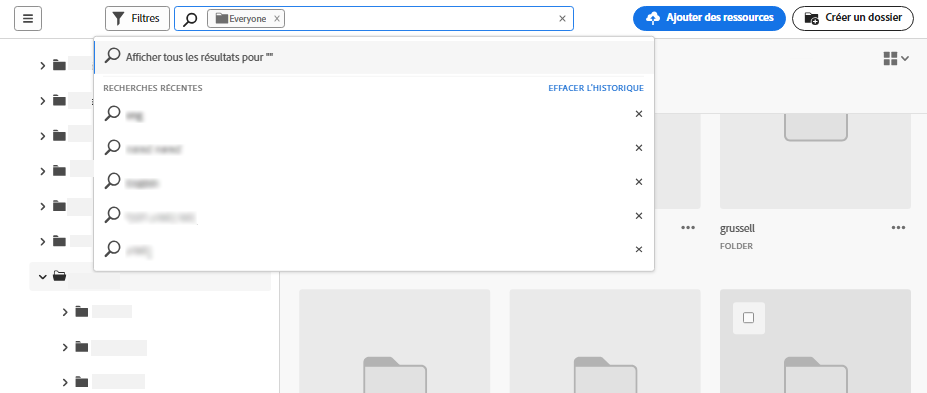
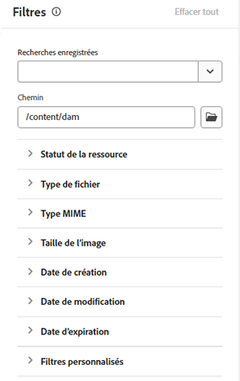
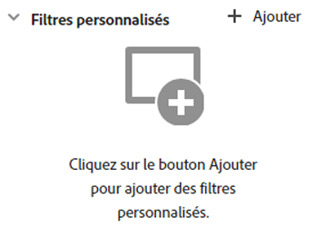
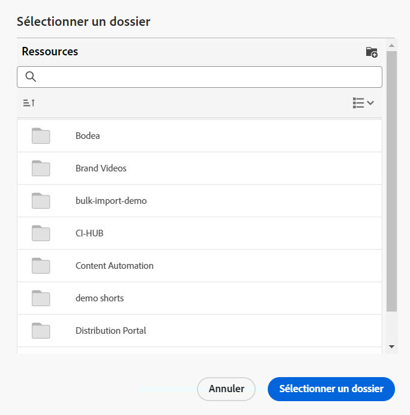
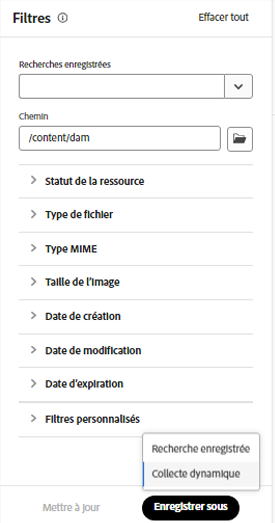

# Recherche de ressources dans [!DNL Assets Essentials] {#search-assets}

>[!CONTEXTUALHELP]
>id="assets_search"
>title="Rechercher des ressources"
>abstract="Recherchez des ressources en entrant un mot-clé dans la barre de recherche ou en filtrant les ressources en fonction de leur statut, type de fichier, type MIME, taille, création ou date de modification/d’expiration. Outre les filtres standard, vous pouvez également appliquer des filtres personnalisés. Vous pouvez enregistrer les résultats filtrés sous la forme d’une recherche enregistrée ou d’une collecte dynamique."
>additional-url="https://experienceleague.adobe.com/docs/experience-manager-assets-essentials/help/manage-collections.html?lang=fr#manage-smart-collection" text="Créer des collectes dynamiques"

[!DNL Assets Essentials] offre des fonctionnalités de recherche efficaces, qui fonctionnent simplement par défaut. La recherche fonctionne de façon exhaustive car il s’agit d’une recherche de type plein texte. Ses puissantes fonctionnalités de recherche vous permettent de trouver rapidement la ressource appropriée et d’améliorer la vitesse de votre contenu. [!DNL Assets Essentials] fournit une recherche plein texte, ou même des capacités de recherche basées sur les métadonnées telles que les balises intelligentes, le titre, la date de création et le copyright.

Pour rechercher des ressources,

* Cliquez dans la zone de recherche située en haut de la page. Par défaut, la recherche s’effectue dans le dossier que vous êtes en train de parcourir. Utilisez l’une des méthodes suivantes :

  

   * Effectuez une recherche à l’aide d’un mot-clé ou vous pouvez changer de dossier. Appuyez sur Entrée.

   * Commencez à travailler avec une ressource récemment consultée en la recherchant directement. Cliquez dans la zone de recherche et sélectionnez une ressource récemment consultée parmi les suggestions.

## Filtrer les résultats de la recherche {#refine-search-results}

Vous pouvez filtrer les résultats de la recherche en fonction des paramètres suivants.

*Image : filtrage des ressources recherchées en fonction de divers paramètres.*

* Statut de la ressource : filtrez les résultats de recherche à l’aide de `Approved`, `Rejected` ou d’un statut de ressource `No Status`.

* Type de fichier : filtrez les résultats de la recherche selon les types de fichiers pris en charge, à savoir `Images`, `Documents` et `Videos`.
* Type MIME : filtrez un ou plusieurs formats de fichiers pris en charge. <!-- TBD:  [supported file formats](/help/using/supported-file-formats.md). -->
* Taille de l’image : fournissez une ou plusieurs dimensions minimales et maximales pour filtrer les images. Les dimensions sont fournies en pixels et ne correspondent pas à la taille de fichier des images.
* Date de création : date de création de la ressource telle qu’elle figure dans les métadonnées. Le format de date standard utilisé est `yyyy-mm-dd`.
* Date de modification : date de dernière modification des ressources. Le format de date standard utilisé est `yyyy-mm-dd`.

* Date d’expiration : filtrez les résultats de la recherche en fonction du statut d’une ressource `Expired`. En outre, vous pouvez spécifier une période d’expiration pour les ressources afin de filtrer davantage les résultats de votre recherche.

* Filtres personnalisés : [ajoutez des filtres personnalisés](#custom-filters) à l’interface utilisateur d’Assets Essentials. Appliquez ces filtres personnalisés en plus des filtres standard pour affiner les résultats de la recherche.

Vous pouvez trier les ressources recherchées par ordre croissant ou décroissant de `Name`, `Relevance`, `Size`, `Modified` et `Created`. Les ressources recherchées sont triées en fonction de la `Relevance`, par défaut.

## Gestion des filtres personnalisés {#custom-filters}

**Autorisations requises :**  `Can Edit`, `Owner` ou administrateur.

Assets Essentials vous permet également d’ajouter des filtres personnalisés à l’interface utilisateur. Vous pouvez ensuite appliquer ces filtres personnalisés en plus des [filtres standard](#refine-search-results) pour affiner vos résultats de recherche.

Assets Essentials fournit les filtres personnalisés suivants :

<table>
    <tbody>
     <tr>
      <th><strong>Nom de filtre personnalisé</strong></th>
      <th><strong>Description</strong></th>
     </tr>
     <tr>
      <td>Titre</td>
      <td>Filtrage des ressources à l’aide du titre de la ressource. Le titre que vous indiquez dans les critères de recherche sensibles à la casse doit correspondre au titre exact de la ressource à afficher dans les résultats.</td>
     </tr>
     <tr>
      <td>Nom</td>
      <td>Filtrez les ressources à l’aide du nom de fichier de la ressource. Le nom que vous indiquez dans les critères de recherche sensibles à la casse doit correspondre au nom de fichier exact de la ressource à afficher dans les résultats.</td>
     </tr>
     <tr>
      <td>Taille de ressource</td>
      <td>Filtrez les ressources en définissant une plage de taille de fichier, en octets, dans les critères de recherche pour afficher une ressource dans les résultats.</td>
     </tr>
     <tr>
      <td>Balises prédites</td>
      <td>Filtrage des ressources à l’aide de la balise dynamique de ressource. Le nom de balise dynamique que vous indiquez dans les critères de recherche sensibles à la casse doit correspondre exactement au nom de balise dynamique de la ressource à afficher dans les résultats. Vous ne pouvez pas spécifier plusieurs balises dynamiques dans les critères de recherche.</td>
     </tr>    
    </tbody>
   </table>

<!--
   You can use a wildcard operator (*) to enable Assets Essentials to display assets in the results that partially match the search criteria. For example, if you define <b>ma*</b> as the search criteria, Assets Essentials displays assets with title, such as, market, marketing, man, manchester, and so on in the results.

   You can use a wildcard operator (*) to enable Assets Essentials to display assets in the results that partially match the search criteria.

   You can use a wildcard operator (*) to enable Assets Essentials to display assets in the results that partially match the search criteria. You can specify multiple smart tags separated by a comma in the search criteria.

   -->

### Ajout de filtres personnalisés {#add-custom-filters}

Pour ajouter des filtres personnalisés :

1. Cliquez sur **[!UICONTROL Filtres]**.

1. Dans la section **[!UICONTROL Filtres personnalisés]**, cliquez sur **[!UICONTROL Modifier]** ou **[!UICONTROL Ajouter des filtres]**.

   

1. Dans la boîte de dialogue **[!UICONTROL Gestion des filtres personnalisés]**, sélectionnez les filtres à ajouter à la liste de filtres existants. Sélectionnez **[!UICONTROL Filtres personnalisés]** pour sélectionner tous les filtres.

1. Cliquez sur **[!UICONTROL Confirmer]** pour ajouter les filtres à l’interface utilisateur.

### Suppression de filtres personnalisés {#remove-custom-filters}

Pour supprimer des filtres personnalisés :

1. Cliquez sur **[!UICONTROL Filtres]**.

1. Dans la section **[!UICONTROL Filtres personnalisés]**, cliquez sur **[!UICONTROL Modifier]**.

1. Sans la boîte de dialogue **[!UICONTROL Gestion des filtres personnalisés]**, désélectionnez les filtres que vous devez supprimer de la liste des filtres existants.

1. Cliquez sur **[!UICONTROL Confirmer]** pour supprimer les filtres de l’interface utilisateur.

## Rechercher des ressources à l’aide d’[!DNL Adobe Firefly] {#search-firefly}

Vous pouvez rechercher une ressource qui n’est disponible dans aucun des dossiers en utilisant la fonction de recherche de ressources [!DNL Adobe Firefly] dans [!DNL Experience Manager Assets]. Vous pouvez ainsi générer efficacement des ressources en temps réel qui ne sont pas stockées dans les dossiers de ressources.

### Avant de commencer

Vous devez disposer d’un abonnement [!DNL Adobe Express] actif.

### Générer des ressources

Pour générer de nouvelles ressources en utilisant [!DNL Adobe Firefly] :

1. Accédez à l’espace de travail [!DNL AEM Assets].
1. Saisissez le nom de la ressource dans la barre de recherche en haut de la page. 
Par exemple, vous pouvez rechercher une ressource à l’aide du mot-clé `Bugatti Type 57`. Lors de la recherche de la ressource, aucun résultat n’est renvoyé, car la ressource n’est présente dans aucun des dossiers.
1. Tapez le nom de la ressource dans la barre de recherche au milieu de la page et cliquez sur **[!UICONTROL Générer]**.
   
   *Illustration : aucun résultat renvoyé pour Bugatti Type 57 dans le dossier des ressources.* 
Les nouvelles ressources sont générées.
   
   *Illustration : ressources de référence recherchées à l’aide de la fonction de recherche de ressources [!DNL Adobe Firefly].*  
Vous pouvez charger ces ressources dans votre dossier préféré pour un accès facilité.

### Chargement de ressources

Pour télécharger la ressource générée dans le référentiel de ressources :

1. Cliquez sur **[!UICONTROL Charger]**.
1. Sélectionnez le dossier de ressources dans lequel vous devez télécharger la ressource et cliquez sur **[!UICONTROL Sélectionner le dossier]**.
   
   *Illustration : sélectionnez le dossier dans lequel télécharger la ressource.*

## Recherches enregistrées {#saved-search}

La fonctionnalité de recherche est assez facile à utiliser dans [!DNL Assets Essentials]. Dans la zone de recherche, vous pouvez non seulement saisir un mot-clé et appuyer sur Entrée pour afficher les résultats, mais également retrouver rapidement vos mots-clés recherchés récemment en un seul clic.

Vous pouvez également filtrer les résultats de la recherche en fonction de critères spécifiques relatifs aux métadonnées et au type de ressources. Pour les filtres fréquemment utilisés, [!DNL Assets Essentials] permet d’enregistrer les paramètres de recherche afin d’améliorer l’expérience de recherche. Vous pouvez ensuite sélectionner la recherche enregistrée pour l’utiliser et appliquer le filtre, en un seul clic.

Pour créer une recherche enregistrée, recherchez une ressource, appliquez un ou plusieurs filtres, puis cliquez sur **[!UICONTROL Enregistrer sous]** > **[!UICONTROL Recherche enregistrée]** dans le panneau [!UICONTROL Filtres]. Vous pouvez également cliquer sur **[!UICONTROL Enregistrer sous]** et sélectionnez **[!UICONTROL Collecte dynamique]** pour enregistrer les résultats en tant que collecte dynamique. Consultez [Créer une collecte dynamique](manage-collections.md#create-a-smart-collection) pour plus d’informations.

<!-- TBD: Search behavior. Full-text search. Ranking and rank boosts. Hidden assets.
Report poor UX that users can only save a filtered search and not a simple search.
.
Are other supported files fully indexed and support full-text search? Eg. audio/videos files can at best have metadata indexed.
Anything about ranking of assets displayed in search results?

What about temporarily hiding an asset (suspending search on it) from the search results? If an asset is undergoing review collaboration, should it be used by others? Should it be hidden in search?

When userA is searching and userB add an asset that matches search results, will the asset display in search as soon as userA refreshes the page? Assuming indexing is near real-time. May not be so for bulk uploads.
-->

## Utiliser des résultats de recherche {#work-with-search-results}

Vous pouvez sélectionner les ressources qui s’affichent dans les résultats de recherche et effectuer les opérations suivantes :

* **Rechercher une image similaire** : recherchez une ressource d’image similaire dans l’interface utilisateur d’Assets en fonction des métadonnées et des balises intelligentes.

* **Détails** : affichez et modifiez les propriétés de la ressource.

* **Télécharger** : téléchargez une ressource.

* **Ajouter à la collection** : ajoutez la ressource sélectionnée à une collection.

* **Épingler à l’accès rapide**: [Épinglez une ressource](my-workspace.md) pour y accéder plus rapidement lorsque vous en aurez besoin ultérieurement. Tous les éléments épinglés s’affichent dans la section **Accès rapide** de Mon espace de travail.

* **Ouvrir dans Adobe Express** : modifiez une image dans Adobe Express intégré à partir de l’écran Experience Manager Assets.

* **Modifier** : modifiez l’image à l’aide d’Adobe Express.

* **Partager le lien** : [partagez des liens](share-links-for-assets.md) d’une ressource avec d’autres personnes, afin qu’elles puissent y accéder et la télécharger.

* **Supprimer** : supprimez une ressource.

* **Copier** : copiez une ressource vers un autre emplacement de dossier.

* **Déplacer** : déplacez une ressource vers un autre emplacement de dossier.

* **Renommer** : renommez une ressource.

* **Copier vers les bibliothèques** : ajoutez une ressource à la bibliothèque.

* **Affecter des tâches** : affectez des tâches aux utilisateurs et utilisatrices pour une ressource.

* **Surveiller** : [surveillez les opérations](https://experienceleague.adobe.com/fr/docs/experience-manager-cloud-service/content/assets/manage/search-assets) effectuées sur une ressource.

## Configurer la page d’accueil axée sur la recherche {#configuring-search-first-homepage}

Assets Essentials vous permet de sélectionner la page de destination par défaut de votre organisation. Lorsque vous utilisez l’approche axée sur la recherche pour votre page d’accueil, vous disposez également d’options pour personnaliser l’image de marque de la page en configurant les images d’arrière-plan et du logo en fonction de votre marque.

Pour configurer la page d’accueil axée sur la recherche, exécutez les étapes ci-dessous :

1. Accédez à **[!UICONTROL Paramètres]** > **[!UICONTROL Paramètres généraux]**.
1. Sélectionnez **[!UICONTROL Approche axée sur la recherche]**. La configuration de l’approche axée sur la recherche s’ouvre. Vous pouvez définir l’[alignement](#setting-alignment-search-bar) ou l’[image de l’arrière-plan et du logo](#setting-background-image-and-logo) de votre page d’accueil.

### Définir l’alignement de la barre de recherche {#setting-alignment-search-bar}

[!DNL Assets Essentials] vous permet de modifier l’alignement de la barre de recherche. Vous pouvez afficher la barre de recherche soit au centre, soit en haut. Sélectionnez l’alignement approprié et cliquez sur **[!UICONTROL Sauvegarder]**.

### Définir l’image d’arrière-plan et le logo de la page d’accueil {#setting-background-image-and-logo}

Vous pouvez ajouter le logo de votre marque et une image d’arrière-plan à votre page d’accueil axée sur la recherche. Procédez comme suit :

1. Accédez à la section **[!UICONTROL Image d’arrière-plan et de logo]** sous **[!UICONTROL Page d’accueil]**.
1. Cliquez sur **[!UICONTROL Remplacer]** pour parcourir les images du référentiel de ressources.
1. Cliquez sur **[!UICONTROL Enregistrer]**. [Prévisualisez](#preview-configured-homepage) vos modifications.

### Prévisualiser la page d’accueil configurée {#preview-configured-homepage}

Vous pouvez prévisualiser votre page d’accueil axée sur la recherche afin d’en vérifier la disposition et le formatage. La fonction d’**[!UICONTROL Aperçu]** permet de corriger la mise en page ou d’apporter des modifications selon les besoins. Pour prévisualiser la page d’accueil configurée, exécutez les étapes ci-dessous :

1. Cliquez sur **[!UICONTROL Paramètres généraux]** et sélectionnez **[!UICONTROL Approche axée sur la recherche]**.
1. Accédez à **[!UICONTROL Personnaliser la page d’accueil axée sur la recherche]** et cliquez sur **[!UICONTROL Aperçu]**. Activez le bouton **[!UICONTROL Thème sombre]** pour prévisualiser la page d’accueil avec un thème sombre ou clair.
1. Cliquez sur **[!UICONTROL Fermer]** pour quitter l’écran d’aperçu.

   

## Recherche contextuelle {#contextual-search}

Vous pouvez également rechercher des ressources disponibles dans le référentiel en définissant des invites de texte. Experience Manager Assets transforme automatiquement ces invites de texte en filtres de recherche et affiche les résultats de la recherche. Vous pouvez afficher et modifier des filtres automatiques à l’aide du volet Filtres pour affiner davantage les résultats de la recherche.

### Accéder à la recherche contextuelle {#access-contextual-search}

Pour accéder à la recherche contextuelle dans Experience Manager Assets :

1. Cliquez sur **[!UICONTROL Rechercher]** dans le volet de gauche.

   

1. Définissez l’invite de texte dans la zone de texte Rechercher et cliquez sur **[!UICONTROL Recherche contextuelle]**.

   

   [!DNL Experience Manager Assets] affiche les résultats de la recherche.

### Filtres pris en charge {#supported-filters}

La recherche contextuelle prend en charge les filtres prêts à l’emploi suivants. Basez vos invites de texte sur ces filtres pour afficher les résultats de recherche appropriés.

* Hauteur de l’image

* Largeur de l’image

* Type de fichier : image, document, vidéo ou dossier.

* Type MIME : JPG, PNG, TIFF, GIF, MP4, PDF, PPTX, DOCX ou XLSX

* Date de création

* Date de modification

* Date d’expiration

* Statut de la ressource : Approuvé, Refusé ou Tout

* Ressources expirées

### Exemples d’invites de texte {#text-prompts-examples}

**Exemple 1**

**Invite de texte** : images créées ce mois-ci.

[!DNL Experience Manager Assets] applique automatiquement les filtres suivants et affiche les résultats de la recherche :

**Exemple 2**

**Invite de texte** : images d’au moins 200 px de haut et 100 px de large avec plage et ciel clair.

[!DNL Experience Manager Assets] applique automatiquement les filtres suivants et affiche les résultats de la recherche :

**Exemple 3**

**Invite de texte** : j’ai besoin d’images de ciel bleu de 1 500 et 2 500 pixels de hauteur, créées au cours du dernier mois et qui ne sont pas expirées ni approuvées.

[!DNL Experience Manager Assets] applique automatiquement les filtres suivants et affiche les résultats de la recherche :

La vidéo suivante illustre le processus de bout en bout, de l’accès à l’interface utilisateur de la recherche contextuelle à la définition d’invites de texte, en passant par l’affichage des résultats de la recherche.

>[!VIDEO](https://video.tv.adobe.com/v/3428407)

### Désactiver la recherche contextuelle {#disable-contextual-search}

Les administrateurs et administratrices ont également la possibilité de désactiver la recherche contextuelle pour les utilisateurs et utilisatrices de votre organisation. Pour cela, procédez comme suit :

1. Accédez à **[!UICONTROL Paramètres]** > **[!UICONTROL Paramètres généraux]**.

1. Dans la section [!UICONTROL Recherche contextuelle], désactivez la fonction **[!UICONTROL Activer la recherche contextuelle pour votre organisation]** pour désactiver la fonction de recherche contextuelle pour toutes les personnes de votre organisation.

### Commentaires sur la recherche contextuelle {#contextual-search-feedback}

Si vous devez fournir des commentaires sur la fonction de recherche contextuelle, cliquez sur l’, puis sur l’icône Commentaires. Sélectionnez le type de commentaire, spécifiez l’objet et la description, puis cliquez sur **[!UICONTROL Soumettre]**.

## Étapes suivantes {#next-steps}

* [Regardez une vidéo pour rechercher des ressources dans Assets Essentials](https://experienceleague.adobe.com/docs/experience-manager-learn/assets-essentials/basics/using.html?lang=fr).

* Faites des commentaires sur le produit en utilisant l’option [!UICONTROL Commentaires] disponible dans l’interface utilisateur d’Assets Essentials.

* Faites des commentaires sur la documentation en utilisant l’option [!UICONTROL Modifier cette page]  ou [!UICONTROL Enregistrer un problème]  disponible dans la barre latérale droite.

* Contactez l’[assistance clientèle](https://experienceleague.adobe.com/?support-solution=General&amp;lang=fr#support).
